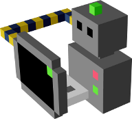
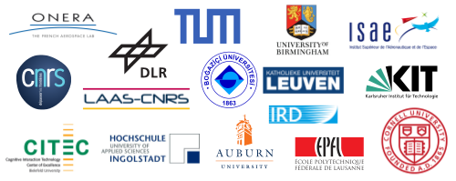
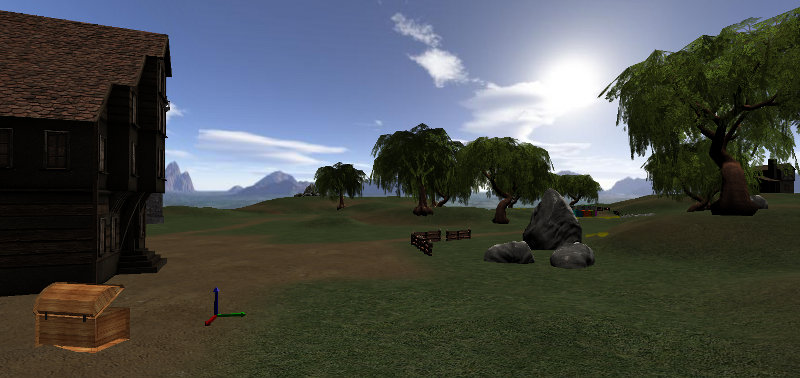

MORSE: the Modular Open Robots Simulator Engine
===============================================

 

[MORSE](http://morse-simulator.github.io/) (Modular OpenRobots Simulation Engine) is
an academic robotic simulator, based on the Blender Game Engine and the Bullet
Physics engine.  It is a BSD-licensed project (cf [LICENSE](LICENSE)).

It is meant to be versatile (simulation of field robotics, indoor
robotics, human robot interaction, multi-robots systems) and allow
simulation at different levels (from raw cameras to high-level
semantics).

The communication with the simulator is middleware independent. At the
moment, MORSE supports the [following
middlewares](http://www.openrobots.org/morse/doc/latest/user/integration.html):

- ROS
- Yarp
- pocolibs
- MOOS
- HLA
- mavlink
- and a generic socket interface (with an intuitive Python API)

Installation
------------

Please read INSTALL or check the [on-line installation
instructions](http://www.openrobots.org/morse/doc/latest/user/installation.html).

Documentation
-------------

The MORSE documentation is available from the doc/ directory.  It is
available as well online, on the [MORSE
website](http://www.openrobots.org/morse/doc).

You can also [subscribe to
morse-users@laas.fr](https://sympa.laas.fr/sympa/subscribe/morse-users).

How to contribute
-----------------

Even if the code-base is not stabilized yet, contribution to MORSE are
more than welcome.

You can contribute new robot models, new sensors, we have a TODO list
for the Blender game engine itself...

Feel free to [subscribe to
morse-dev@laas.fr](https://sympa.laas.fr/sympa/subscribe/morse-dev) and ask!

Code is available on [GitHub](https://github.com/morse-simulator/morse).

Feel free to fork, pull request or submit issues to improve the project!

Credits
-------

Copyright (c) 2009-2010 ONERA
Copyright (c) 2009-2016 LAAS-CNRS
Copyright (c) 2015-2016 ISAE-SUPAERO
Copyright held by the MORSE authors or the institutions employing them, refer
to the AUTHORS file for the list. The list of the contributors to each file
can be obtained from the commit history ('git log <file>').

MORSE is developped by a large community of academics, with contributions from
more that 15 universities world-wide.

The initial development of MORSE has been partially funded by the Fondation RTRA
within the ROSACE project framework, and by DGA <http://www.defense.gouv.fr/dga>
through the ACTION <http://action.onera.fr> project.

