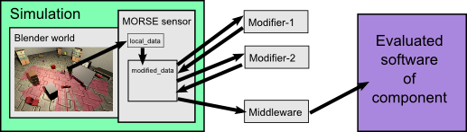

Components library
==================

MORSE offers an extended set of predefined sensors and actuators that cover 
reasonably well common simulation needs in robotics. It proposes also some 
fully equipped robots.

Available components
--------------------

Robots and robotic bases
++++++++++++++++++++++++

.. gallery:: robots

.. toctree::
    :glob:
    :maxdepth: 1

    user/robots/*

Sensors
+++++++

.. gallery:: sensors

.. toctree::
    :glob:
    :maxdepth: 1

    user/sensors/*

Actuators
+++++++++

.. gallery:: actuators

.. toctree::
    :glob:
    :maxdepth: 1

    user/actuators/*

Other components
++++++++++++++++

.. gallery:: others

.. toctree::
    :glob:
    :maxdepth: 1

    user/others/*

Working with components
-----------------------

The following diagram shows the data flow from the simulation to the sensor,
then the modifiers and finally the middleware to send the data to external
programs:

.. Component data flow

The data flow is similar for actuators, except that the direction is inverted,
with the data arriving first from the evaluated software via the middleware,
then processed by the modifiers and finally applied in the simulation.

To interact with the outside world, components rely on middlewares connected to
Blender. See also :doc:`the list of supported middlewares and language bindings
<user/integration>` for a further explanation.

Check the :ref:`compatibility-matrix` to see which components are supported for
each middleware.

Modifiers: Post-process your data
---------------------------------

MORSE also provides ways to alter input or output data (like adding noise to
a GPS position) by so-called :doc:`modifiers <user/modifier_introduction>`. 

.. toctree::
    :hidden:
    
    user/modifier_introduction
    
Overlays: Adapt to your architecture
------------------------------------

MORSE features a mechanism called :doc:`component overlays <user/overlays>` to 
easily create pseudo-sensors or actuators that fit your specific architecture.

Adding your own components
--------------------------

To learn how to create new components (sensors, robots...), please refer to the 
:doc:`developer documentation <contributing>`.
