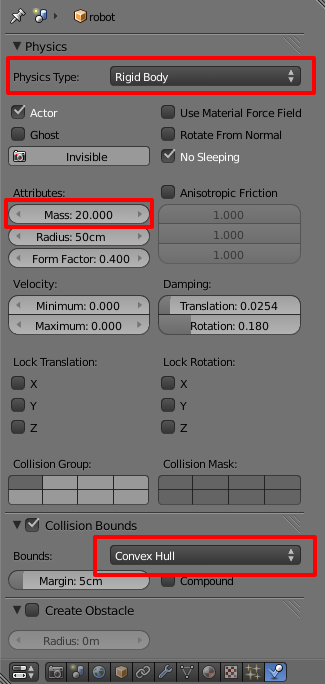

Adding a new robot
==================

Let say you have a 3D model of a robot and you want to use it in MORSE, this
page is what you are looking for. For more on 3D modeling, see `Resources`_.

Low-poly
--------

Blender is a 3D modeling software with both Photo-realistic Rendering and
Game Engine capabilities. In the first case, users want verry detailed models
with high definition textures. In one word, heavy models. Those are not suited
for the Game Engine, where we want to get **real-time** rendering.

MORSE' 3D models need to be light, with compressed textures, and as few polygons as
possible.

Physics
-------

Game Physics: see :doc:`Physics
<../user/blender_tutorials/advanced_blender>` page.

- ``Type`` = "`Rigid body
  <http://wiki.blender.org/index.php/User:Sculptorjim/Game_Engine/Physics/Objects/Rigid_Body>`_"
- ``Mass`` Affects the reaction due to collision between objects,
  more massive objects have more inertia. Will also affect material force fields.
  Will also change behaviors if you are using the suspension and steering portions
  of Bullet physics.
- ``Collision Bounds``: "`Convex Hull
  <http://wiki.blender.org/index.php/Doc:2.6/Manual/Game_Engine/Physics/Collision_Bounds>`_"

See `Blender wiki on Physics Types
<http://wiki.blender.org/index.php/Doc:2.6/Manual/Game_Engine/Physics#Types>`_
for more.

Only one root
-------------

Your model can be composed by different objects, but must have only one root
object, the others being his children.

Builder part
------------

Let say your 3D model is in "``/home/bob/models/wallE.blend``".

The best practice is to set a ``MORSE_RESOURCE_PATH`` environement variable.
Containing a list of path to models accessible by MORSE, separeted by colon
(``:``)::

    export MORSE_RESOURCE_PATH="/home/bob/models:/home/bob/models2012"

Your class must extend :py:class:`morse.builder.morsebuilder.Robot` as:

.. code-block:: python

    from morse.builder import *

    class WallE(Robot):
        def __init__(self):
            Robot.__init__(self, "wallE.blend")

Advanced
--------

Core part
+++++++++

By default, :py:class:`morse.builder.morsebuilder.Robot` use
":py:class:`morse.core.robot.Robot`" classpath.

If you want a specific behaviour, you need to create a class like the ones in
:py:mod:`morse.robots`. This new class must implement
:py:class:`morse.core.robot.Robot` in particular the
:py:meth:`morse.core.object.Object.default_action` method.

And back in your builder script, set the classpath with:

.. code-block:: python

    from morse.builder import *

    class WallE(Robot):
        def __init__(self):
            Robot.__init__(self, "wallE.blend")
            self.properties(classpath="module.in.pythonpath.WallE")

Where ``module.in.pythonpath.WallE`` is a class extending
:py:class:`morse.core.robot.Robot`.

Wheeled robot
+++++++++++++

See :py:class:`morse.builder.robots.morserobots.SegwayRMP400` for builder and
:py:class:`morse.robots.segwayrmp400.SegwayRMP400PhysicsClass` for core examples.

Physics for wheels: Convex Hull, see `Blender wiki on Collision Bounds
<http://wiki.blender.org/index.php/Doc:2.6/Manual/Game_Engine/Physics/Collision_Bounds>`_.

Screencast
----------

See this `playlist of 5 videos on how to build a robot
<http://www.youtube.com/embed/videoseries?list=PLDC1FC34E5AC69429&hd=1&rel=0>`_.

..
    <iframe width="800" height="500" frameborder="0"
    src="http://www.youtube.com/embed/videoseries?list=PLDC1FC34E5AC69429&amp;hd=1&amp;rel=0"
    allowfullscreen>
    </iframe>

Resources
---------

Blender got huge amount of models, you can find some on
`Blendswap <http://www.blendswap.com/>`_. Make sure you look in the
"**low-poly**" category for Game Engine models.

You can also import many 3D format in Blender, for a full list, see the
`Import-Export Blender wiki page
<http://wiki.blender.org/index.php/Extensions:2.6/Py/Scripts/Import-Export>`_.

For more on Blender Game modeling, see `Blender Cookie tutorials
<http://cgcookie.com/blender/category/tutorials/game-development/>`_.

