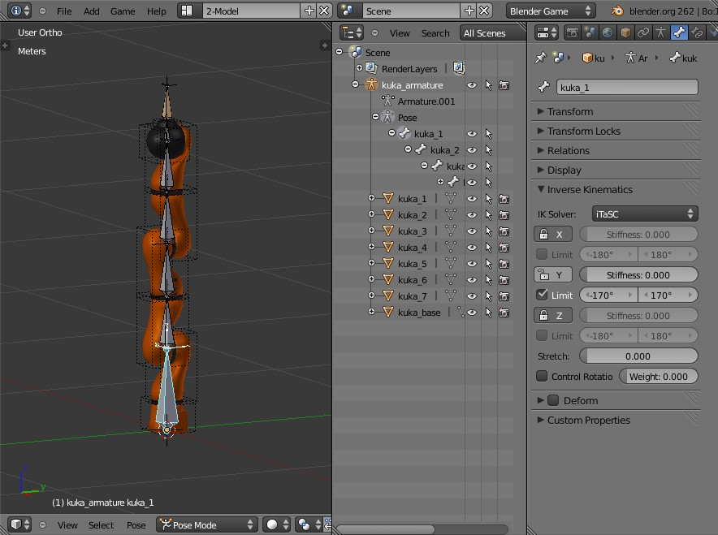

Armatures creation
==================

**Armatures** are the MORSE way to simulate kinematic chains made of a
combination of revolute joints (hinge) and prismatic joints (slider).

They are based on Blender's *armatures*. You may want to read some
background information about them before creating our own *rig*: `How armatures
work? <http://www.blender.org/development/release-logs/blender-240/how-armatures-work/>`_,
`Armature
documentation <http://wiki.blender.org/index.php/Doc:2.6/Manual/Rigging/Armatures>`_.

.. note::

    To make the vocabulary clear: Blender's **armatures** are made of
    **bones**.  The pose of a bone is stored as the bone's **pose channel**. A
    bone is both a **joint** and the rigid segment attached to it. We often use
    the term **joint** (in the documentation and in MORSE code) either for a
    bone or its channel.

One important constraint to follow: to be used in MORSE, each of the joints of
the armature can have at most **one Degree of Freedom (DoF)**. If you need to
model a linkage with two or more degree of freedom, add one joint per DoF.

Besides, the Blender armature need some special configuration,
detailed below.

Setting the IK properties
-------------------------

Every bone *must* have inverse kinematics (IK) properties set: as illustrated
above, the IK solver should be ``iTaSC``.

For every joint, you must *unlock* the main axis of the joint (either rotation
axis for revolute joints, or translation axis for prismatic joints). In the
example above, the axis ``Y`` has been unlocked.

Then, for **revolute joints**, you should specify the angular limits of the
joint (here, -170 deg to + 170 deg), and the ``stretch`` value **must** be set
to 0.

For **prismatic joints**, you **must** set a stretch value different from 0.
This allow MORSE to distinguish between revolute and prismatic joints. The
stretch value must be the maximum translation allowed for this joint.

.. important::

    As of Blender 2.66, Blender's armatures and inverse kinematic (IK) solvers
    do support hinge joints (as constrained spherical joints), but do not
    support prismatic joints. We 'cheat' by using the ``stretch`` value (as
    explained above) to identify prismatic joints, but this will cause an
    undesirable scaling ('stretching') of the joint if you use an IK solver!

Setting the joints tags
-----------------------

If objects are intended to get connected to your armature (typically, an arm),
you need to mark all *Blender objects* belonging to your model as ``internal``
and to mark *one* object as the *end effector* (the slot where other objects
will be appended).

.. image:: ../../media/armatures_properties.jpg
   :width: 633
   :align: center

Use game properties (as shown in the screenshot above) to mark these properties.

.. note::

    This step is not mandatory if your armature is not intended to support objects
    appending.

