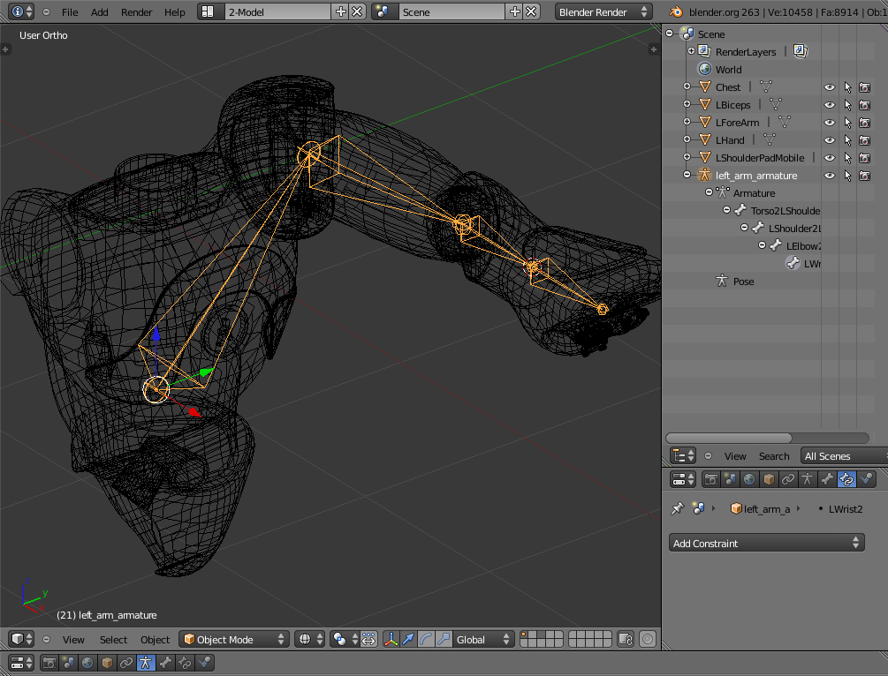

Armatures creation
==================

**Armatures** are the MORSE way to simulate kinematic chains made of a
combination of revolute joints (hinge) and prismatic joints (slider).

They are based on Blender's *armatures*. You may want to read some
background information about them before creating our own *rig*: `How armatures
work? <http://www.blender.org/development/release-logs/blender-240/how-armatures-work/>`_,
`Armature
documentation <http://wiki.blender.org/index.php/Doc:2.6/Manual/Rigging/Armatures>`_.

.. note::

    To make the vocabulary clear: **Kinematic chains** are what Blender calls
    **armatures**. Armatures are made of **bones**.  The pose of a bone is
    stored as the bone's **pose channel**. A bone is both a **joint** and the
    rigid segment attached to it. We often use the term **joint** (in the
    documentation and in MORSE code) either for a bone or its channel.

.. warning::

    Currently, armatures in MORSE have one notable constraint: each of the joints of
    the armature must have at most **one Degree of Freedom (DoF)**. If you need to
    model a linkage with two or more degrees of freedom, add one joint per DoF.

    Since joints in Blender's armatures can **not** have a zero-length, it is
    currently **not possible to represent two DoF with the same origin**.

    Please refer to `issue 382
    <https://github.com/morse-simulator/morse/issues/382>`_ to learn more about
    this problem and possible workarounds.

Besides, the Blender armature need some special configuration,
detailed below.

Creating armatures
------------------

The following procedure should help you to create Blender armatures suitable for
simulation. It assumes you already have a correct mesh for your system (one
independent Blender object for each rigid body).

As example, we will walkthrough the creation of an armature for the left arm of
Nao.

1. Snap the 3D cursor to the center of the armature origin (for Nao, the center
   of the chest, select the chest, then press : kbd:`space` and type ``Snap
   cursor to active``)

2. Add armature (:kbd:`Shift+A` > ``Armature``)

3. Snap the 3D cursor to the center of the rigid body at the end of the link (for
   instance, select the shoulder mesh, and snap the 3D cursor to the center of
   this mesh)

4. Select the last bone of the armature, switch to `Edit Mode` (:kbd:`Tab`),
   select the head, snap the selection to the 3D cursor (:kbd:`space` and ``Snap
   selection to cursor``). This places the bone correctly between the 2 rigid
   bodies. Rename the bone into ``BodyA2BodyB`` (for instance,
   ``Torso2LShoulder``)

5. Extrude the bone (:kbd:`E`)

6. Repeat steps 3,4 and 5 until the armature is complete

7. Select the armature, switch to `Pose Mode`, select the last bone, add a `Bone
   Constraints` of type `Inverse Kinematics`. Check the `Stretch` option if you
   have slider joints in the kinematic chain.

8. Create a new mesh (like a cube) to serve as IK target, and set it accordingly
   in the `Bone Constraints` panel of the last bone. Now, if you move your IK
   target, you should see the whole armature moving accordingly.

.. note::
    You do not need to keep the IK targets or manually create IK targets for
    each of the kinematic chains since they can conveniently be added in your
    `Builder` script. See the documentation of the :doc:`Armature actuator
    <../user/actuators/armature>` for details.

9. For each of your bones, set the correct IK limits from their `Bone > Inverse
   Kinematics` menu. Select the enabled rotation axis and the rotation limits.
   If the joint is a slider (ie, a translation), use the `Stretch` value to set
   the maximum translation allowed, in meters (in that case, you must use the
   `Legacy` IK solver). Setting rotation limits should lead to a nice 3D display
   of reachable position for the joint.

10. Parent meshes to bones: select the mesh, then select the bone you want to
    be attached to the mesh, then add the *armature* to the selection
    (:kbd:`Shift+click` the armature), then :kbd:`Ctrl+P` and select `Set parent
    to... Bone`. Repeat this step for each bone.

11. If necessary, use `Object Constraints` (like `Limit scale` or `Limit
    rotation`) on meshes to get the expected behaviour (for instance, to prevent
    scaling when the `Stretch` IK limit is used, or when a mesh can only rotate
    on one axis of a multi-DoF joint).

Setting the joints tags
-----------------------

If objects are intended to get connected to your armature (typically, an arm
grasping something), you need to mark all *Blender objects* belonging to your
model as ``internal`` and to mark *one* object as the *end effector* (the slot
where other objects will be appended).

Use game properties (as shown in the screenshot above) to mark these properties.

.. note::

    This step is not mandatory if your armature is not intended to support
    objects appending.

