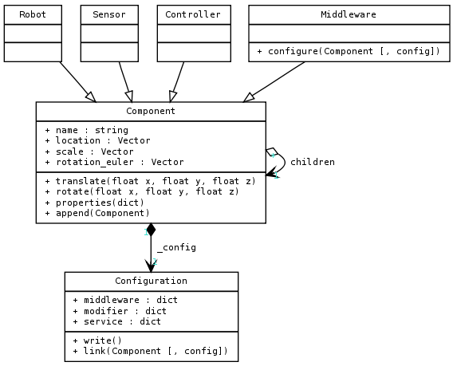

MORSE Builder API
=================

Abstract
--------

The idea is to allow user to write a simulation in few lines of Python, without 
having to learn Python (neither Blender). We want to give the ease of a DSL, 
without its technical complication.

Code organization
-----------------

The following diagram shows the class hierarchy currently used in MORSE-builder.

The point when we want to simplify things, is that we often have to limit the 
freedom of the user. The complexity in simplification is to let user free enough 
to make what he wants without asking him to know every concept behind our 
technologies. The main aim of this API is to build a simulation as simple as 
possible. To do so, we encapsulate the potential complexities of Blender, 
Python or Morse.

To test the API step by step, you can open morse, and in the Blender UI, open 
a Python Console, within which you can import this API 
``from morse.builder.morsebuilder import *``

.. note:: Configuring the environment variables:
    It is necessary to indicate the builder where to look for the installed MORSE
    components in the computer. This is done by specifying the environment variable
    ``$MORSE_ROOT``, which should point to the prefix directory used during MORSE installation.

Classes and methods in the Builder API
--------------------------------------

The AbstractComponent base class
++++++++++++++++++++++++++++++++

All the basis component classes used in the Builder API inherit from a base class
``AbstractComponent``. This class provides the following methods:

 * **name**: change the object name in Blender
 * **translate**: The translation will add (x,y,z) to the current object
   location (default: x=0, y=0, z=0, unit: meter).
 * **rotate**: The rotation is an `euler rotation
   <http://www.blender.org/documentation/blender_python_api_2_57_release/bpy.types.Object.html#bpy.types.Object.rotation_euler>`_
   relative to the object's center (default: x=0, y=0, z=0, unit: radian).
 * **properties**: Allows adding/changing the game properties of the Blender
   objects. It receives a list of named items: ``name``=``value``, separated by
   commas.
 * **append**: Add the object given as an argument as a child of this object.
   The argument is an instance to another component. This method is generally
   used to add components to a robot.

This base class has one concrete subclass that can be use to insert :doc:`static
(passive) objects <../user/others/passive_objects>` to your simulation:

 * :py:class:`morse.builder.morsebuilder.PassiveObject`

.. note::
   When creating instances of this classe, it is necessary to give as
   parameter to the constructor the names of the blender file that 
   contains the desired asset. Path can be absolute or relative to MORSE 
   assets' installation path (typically, ``$PREFIX/share/morse/data``).

The Component classes
+++++++++++++++++++++

The class ``Component`` inherits directly from ``AbstractComponent`` and adds
more functions:

 * **configure_mw**: Do the binding between a component and the method to
   export/import its data. This must be used in general by sensors and
   actuators. A single component can make several calls to this function to add
   bindings with more than one middleware. The parameter can be either the name
   of the middleware, or a list containing the full path to the middleware
   class and methods that the object will use.
 * **configure_service**: Similar to the previous function. Its argument is the
   name of the middleware to be used.
 * **configure_modifier**: Add a modifier specified by its first argument to
   the current object
 * **configure_overlay**: Add a service overlay for a specific service manager
   (as defined for configure_service) to the current object.

These configuration functions make use of a dictionary defined in the file:
``$MORSE_ROOT/src/morse/builder/data.py``. In these dictionaries, the keys are
the names of the middlewares and the values are the default configurations that
should be written in the ``component_config.py`` file.

There are four subclasses of the ``Component`` class that are used to add
components to a scene.  An instance of these classes must be created to insert
a new component

 * :py:class:`morse.builder.morsebuilder.Robot`
 * :py:class:`morse.builder.morsebuilder.Sensor`
 * :py:class:`morse.builder.morsebuilder.Actuator`
 * :py:class:`morse.builder.morsebuilder.Environment`

.. note::
   When creating instances of these classes, it is necessary to give as
   parameters to the constructors the names of the blender files (without the
   *.blend* extension) that contain the required component. These files should
   be present under ``$MORSE_ROOT/share/morse/data/{class}/``.

The Creator classes
+++++++++++++++++++

Another subclass of ``AbstractComponent`` is ``ComponentCreator``. This class
is used to instantiate components without the need of having a .blend file
associated with them. It is limited to generating components with simple
geometry for their meshes, and limited use of the Logic Bricks in their
behaviour.

As with the regular ``ComponentClass``, there are also a number of subclasses
that inherit from this one:

 * :py:class:`morse.builder.creator.SensorCreator`
 * :py:class:`morse.builder.creator.ActuatorCreator`

The actual definitions of the components that can be instantiated in this way
can be found in the files:
``$MORSE_ROOT/srs/morse/builder/sensors.py`` and 
``$MORSE_ROOT/srs/morse/builder/actuators.py``.

To instantiate these kind of objects, you'll need to use the full path of the
class. For example:

.. code-block:: python

  from morse.builder.morsebuilder import *
  import morse.builder.sensors
  import morse.builder.actuators

  atrv = Robot('atrv')

  infrared = morse.builder.sensors.Infrared("MyInfrared")
  atrv.append(infrared)

  v_w = morse.builder.actuators.MotionController("MyVOmega")
  atrv.append(v_w)

Environment class
+++++++++++++++++

This is a special case of component that **MUST** be added to a scene.
When an instance of this class is created, it will do several things to properly
configure the scenario to be used in MORSE.

 * Add the background environment where the robots will be tested
 * Configure the general Game Engine settings
 * Write the configuration files for the simulation, based on the configurations done
    for each component
 * Configure the parameters for the :doc:`multi-node <../multinode>` simulation.

The ``Environment`` class provides these functions:

 * **show_framerate**: Toggle the settings in the Game Engine to display
   framerate and profile information of the simulation.  The parameter is a
   boolean value indicating whether to show or not this information.
 * **show_physics**: Toggle the display of the bounding boxes of objects during
   the simulation.  The parameter is a boolean value indicating whether to show
   or not this information.
 * **show_debug_properties**: Toggle the printing of the value of the Game Properties
   marked.  The parameter is a boolean value indicating whether to show or not
   this information.
 * **aim_camera**: Set the orientation of the default camera. The parameter is
   a list with an euler rotation for the camera. Example: *([1.3300, 0,
   0.7854])*
 * **place_camera**: Set the location of the default camera. The parameter is a
   list with the new 3D coordinates for the camera. Example: *([10.0, -10.0,
   3.0])*
 * **set_gravity**: Set the gravity for the specific scene. The parameter is a
   float defaulting to 9.81.
 * **set_viewport**: Set the default view mode in one of 'BOUNDBOX',
   'WIREFRAME', 'SOLID' or 'TEXTURED'
 * **set_debug**: set the debug bit in blender
 * **set_stereo**: configure to renderer to render image in 'STEREO' using
   anaglyphs, allowing to see them in 3d with special red-cyan glasses.
   Allowed argument is one of 'NONE' (normal 2d mode), 'STEREO' or 'DOME'
 * **configure_multinode**: Provide the information necessary for the node to
   connect to a multi-node server. The parameter is a list of named items.
   The items accepted in as parameters are:
    * **protocol**: Either 'socket' or 'hla'
    * **server_address**: IP address where the multi-node server can be found
    * **server_port**: Used only for 'socket' protocol. Currently it should always be 65000
    * **distribution**: A Python dictionary. The keys are the names of the
      nodes, and the values are lists with the names of the robots handled by
      each node

   Example:

   .. code-block:: python
    
        dala1 = Robot('atrv')
        dala2 = Robot('atrv')
    
        env = Environment('land-1/trees')
        env.configure_multinode(  protocol='socket',
                                  server_address='localhost',
                                  server_port='65000',
                                  distribution={
                                      "nodeA": [dala1.name],
                                      "nodeB": [dala2.name],
                                  })

 * **create()**: Should always be called at the very end of the Builder script.
   It will finalise the building process and write the configuration files.

Note also that the ``configure_service()`` method of the ``Environment`` class
is overloaded: use it to define which middlewares expose the *simulator
internals services* (*i.e.*, the services used to remotely control the
simulator behaviour, cf :doc:`supervision services
<../user/supervision_services>`):

.. code-block:: python

    env = Environement('indoors-1/indoor-1')
    # Set the simulation management services to be available from ROS:
    env.configure_service("ros")

Detailed explanations of class functions
----------------------------------------

Component properties
++++++++++++++++++++

You can modify the game-properties of any components within Python 
(even add them) 

.. code-block:: python

    camera = Sensor('video_camera')
    camera.properties(cam_width = 128, cam_height = 128)

Middleware configuration
++++++++++++++++++++++++

The builder script also permits creating the required ``component_config.py``
for the scene according to the robot and components being inserted. This is
done automatically so that the user does not need to modify said script by
hand.

The middleware controllers required by the configuration will be automatically
added to the scene when the builder script is parsed.

In order to set a component-middleware-method, we have two options, the first
one is simple for the user, but requires some pre-configuration (a dictionary
defined in the file ``src/morse/builder/data.py``). The argument of the 'configure_mw'
method is a string with the name of the middleware.

.. code-block:: python

    motion.configure_mw('ros')
    motion.configure_mw('yarp')

cf. ``morse.builder.data.MORSE_MIDDLEWARE_DICT``

More than one middleware can be configured for the same component, by using
several calls to the component.configure_mw method.

The second one is a bit less simple for the end-user.
It consists of including the description of the middleware binding just as it
would be done by hand in the ``component_config.py`` script:

.. code-block:: python

    motion.configure_mw(['morse.middleware.ros_mw.ROSClass', 'read_twist', 'morse/middleware/ros/read_vw_twist'])

cf. :doc:`hooks <../user/hooks>` and the tutorial on :doc:`manually building a scene
<../user/advanced_tutorials/editing_in_blender>` (in particular the section configuring middleware) for details.

Take a look at an :doc:`example Builder script <builder_example>` to see how
all of this works.
