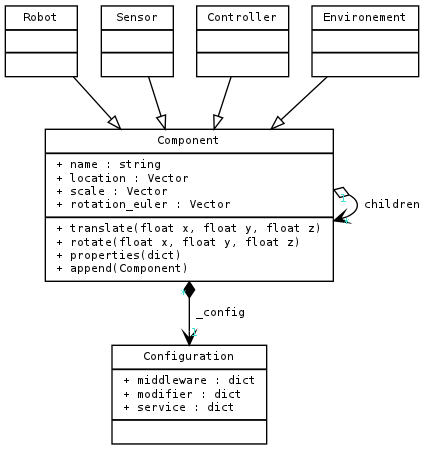

MORSE-builder API
=================

Abstract
--------

The idea is to allow user to write a simulation in few lines of Python, without 
having to learn Python (neither Blender). We want to give the ease of a DSL, 
without its technical complication.

Code organization
-----------------

The following diagram shows the class hierarchy currently used in MORSE-builder.

The point when we want to simplify things, is that we often have to limit the 
freedom of the user. The complexity in simplification is to let user free enough 
to make what he wants without asking him to know every concept behind.

TODOs
-----

With this small set of class / proof of concept, we can imagine some tools 
integrated in the Blender GUI to let user append components easily.

