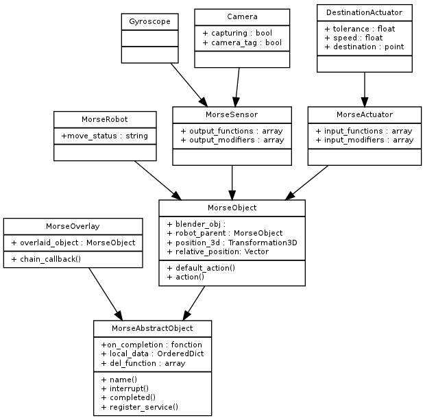

A MORSE organization overview 
=============================

Files hierarchy
---------------

The source code of Morse is organised in the following way :

- addons: it contains various addons for blender, useful for MORSE simulation
- bin: it contains the main entry point of the MORSE simulation
- bindings: it contains some python library to access to MORSE data, through
  the socket middleware
- config: it contains stuff for CMake 
- data: it contains the blender model of sensors / actuators
- doc: the documentation (in DokuWiki format)
- examples: it contains examples about :

  - how to control the simulator (in clients)
  - more or less elaborate test scenarii (in scenarii)
- src: it contains all the python scripts used by the simulator : it is the
  core of the simulator

  - morse/actuators: it contains implementation for various robot actuators
  - morse/blender: it contains some scripts needed at the initialization of
	the game engine
  - morse/builder: it contains the scripts for the API that permits creating a
	simulation scenario from a Python file. See the :doc:`Builder API
	<../user/builder>` documentation
  - morse/core: it contains core classes for the MORSE project (services, base
	objects, sensors, ...) 
  - morse/helpers: it contains various helpers (math transformation)
  - morse/middleware: it contains the code for linking with different middlewares 

    - pocolibs 
    - ros
    - socket
    - text (for logging)
    - yarp
    - moos

  - morse/modifiers: it contains implementation for various modifiers to basic
	components
  - morse/robots: it contains instantiation of different robot classes
  - morse/sensors: it contains implementation for various robot sensors

- testing: it contains "unit"-test for various part of MORSE.
  

Code organization
-----------------

The following diagram shows the class hierarchy currently used in MORSE.

The main entry point for Blender for each component is the method ``action``.
Yet, it is not supposed to be overridden by leaf-classes. To modify the
behaviour of a component, you need to modify the method ``default_action``. The
action of ``action`` depends on whether the component is a sensor or an actuator
(robots don't do anything by themselves). 

MORSE execution loop
--------------------

.. image:: ../../media/simulation_main_loop_overview.png
   :width: 600
   :align: center

Behaviour of a sensor
_____________________

When Blender calls the method ``action`` for a sensor, the following things
happen :

  - update of the position of the sensor
  - call ``default_action``
  - apply in order each function of ``output_modifiers`` (modify the content of the sensor)
  - apply in order each function of ``output_functions`` (output the content of the sensor to different clients)

Behaviour of an actuator
________________________

When Blender calls the method ``action`` for an actuator, the following things
happen :

  - apply in order each function of ``input_functions`` (receive input from different clients)
  - apply in order each function of ``input_modifiers`` (if needed)
  - call ``default_action``

Component internal data
_______________________

The base :py:meth:`morse.core.object.MorseAbstractObjectClass` defines an ordered dictionary
called ``local_data``. This is the place where all sensors and actuators store
the variables with the information that can eventually be share through the
middleware connections.  (for example, it will contain the position for a GPS
sensor, or the destination coordinates given to a motion actuator) The order
in which this variables are defined inside of a component is important, since
it will also be the default order in which the data is exported via the
middlewares (in automatic serialization).

Additionally, component classes can define any other variables internally, but only the
information in them will not be visible outside of MORSE.
