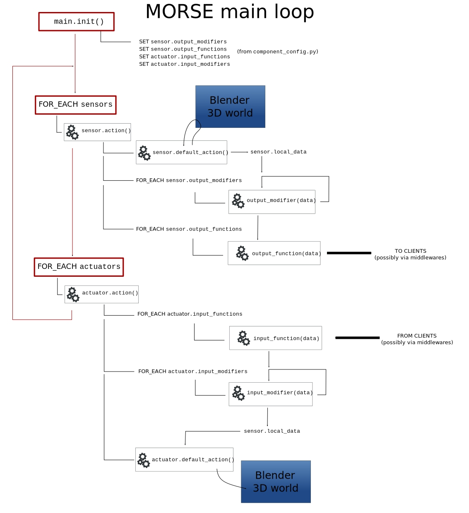

MORSE execution loop
====================

The following figure depicts Morse's general behaviour:

After the initialisation phase described :doc:`here <entry_point>`, the
simulator goes in this big loop, including the execution of each sensor, each
actuator (depending their frequencies), and the handling of services. It is
important to understand that, during each loop execution, every sensor and
actuator is called with the same graphical and physical context (robot positions,
sensor position, etc.).

.. warning::

	The execution order between a scene's various sensors and
	actuators is not defined. So, do not rely on any particular order
	when implementing the behaviour of your component.

.. warning::

	If the behaviour of one component takes too much time, it is the whole
	simulation loop which will slow down (including the physics). Make sure your

	components are fast enough. It is possible to rewrite the logic in C if
	the Python version is too slow.

Behaviour of a sensor
---------------------

When Blender calls the :py:meth:`morse.core.sensor.Sensor.action` method, the
following things happen:

#. the sensor's position is updated
#. the sensor's overridden ``default_action`` is called
#. each of the ``output_modifiers`` functions is applied in order (to
   modify the sensor's content)
#. each of the ``output_functions`` functions is applied in order (to
   output the sensor's content to different clients)

Actuator Behaviour
------------------

When Blender calls the :py:meth:`morse.core.actuator.Actuator.action` method,
the following things happen:

#. each of the ``input_functions`` functions is applied in order (to receive input from
   different clients) 
#. each of the ``input_modifiers`` functions is applied in order (if needed)
#. the actuator's overridden ``default_action`` method is called

.. warning::

	Although it is possible for an actuator to have multiples client, in
        practice, the behaviour is such cases is not well defined, so it
        is better to make sure that you have only one client for each actuator.

Service handling
----------------

This part is explained in detail :doc:`here <services_internal>`.

