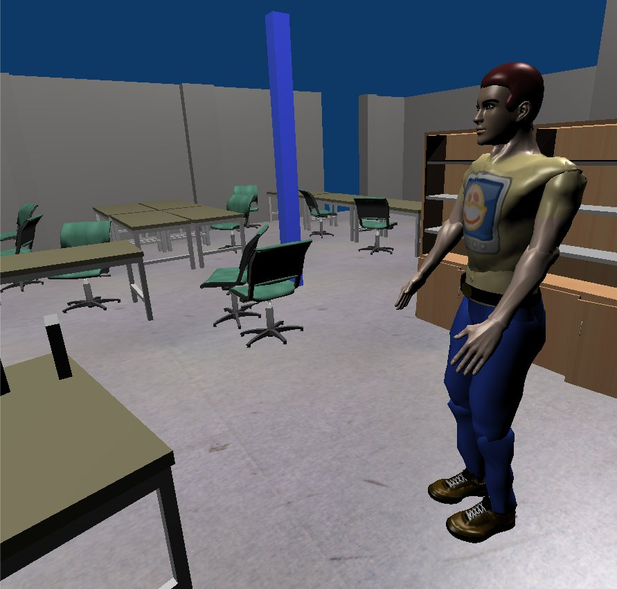

Human-Robot Interaction simulation
==================================

You can add a human model to MORSE to smimulation human-robot interaction.

The human can be controlled directly in the simulator by an user (in first person
perspective), or remotely, via remote services.

.. vimeo:: 27862605
   :width: 400px 

Tutorials
---------

Check the :doc:`HRI tutorial <user/beginner_tutorials/hri_tutorial>`.

Adding a human
--------------

The :doc:`human documentation <user/others/human>` page gives all details regarding
addition and control of a human in a simulation.

Objects manipulation
--------------------

The human model can interact with objects in the simulation.

.. image:: ../media/hri_manipulation_mode.jpg
   :align: center
   :width: 400px

The objects you want to manipulate need to be marked so. See
:doc:`objects<user/others/passive_objects>` documentation for
details.

