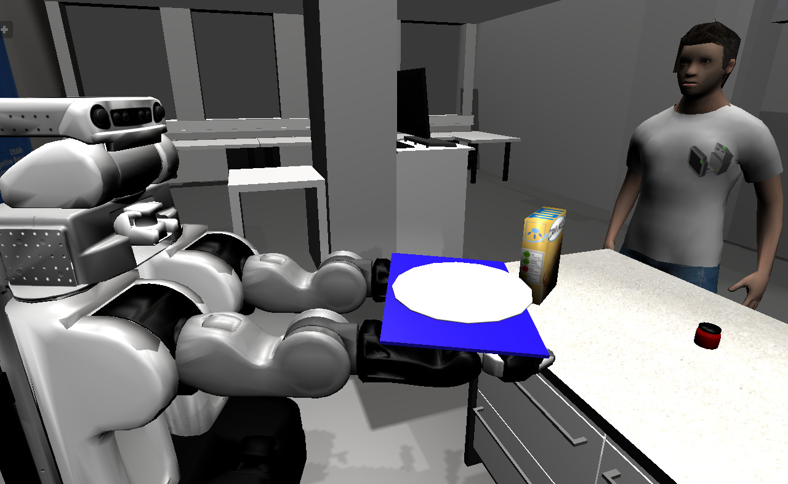

Human-Robot Interaction simulation
==================================

MORSE lets you add human avatars to your scene to simulation human-robot
interaction scenarios.

.. vimeo:: 27862605
   :width: 400px 

Tutorials
---------

Check the :doc:`HRI tutorial <user/beginner_tutorials/hri_tutorial>`.

Adding a human
--------------

The :doc:`human documentation <user/robots/human>` page gives details regarding
how to add and control a human in a simulation.

