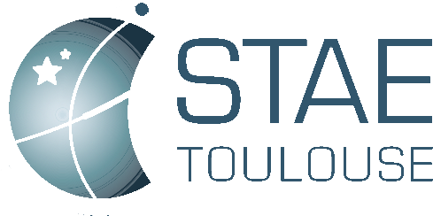
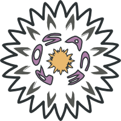
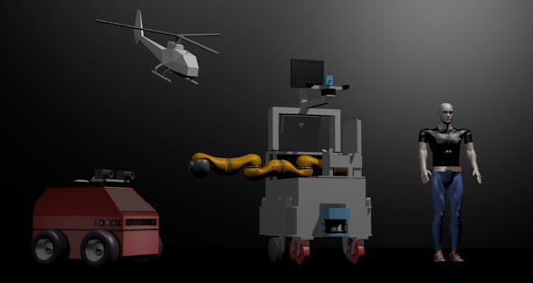

Modular OpenRobots Simulation Engine - Documentation 
====================================================

Welcome to the official documentation for the MORSE project.

For any questions about the use of MORSE or if you have any issues with the
simulator, you can drop a mail to the `morse-users@laas.fr <mailto:morse-users@laas.fr>`_ 
mailing-list. You can subscribe to the mailing-list
`here <https://sympa.laas.fr/sympa/subscribe/morse-users>`_.

Bug reports are always welcome on `our bug-tracker <https://softs.laas.fr/bugzilla/enter_bug.cgi?product=morse>`_.

Quick start
-----------

.. toctree::
    :maxdepth: 1

    user/installation
    user/basic_morse
    user/tutorial

What is MORSE? 
--------------

.. image:: ../media/simu_render_indoors.jpg
   :width: 300
   :align: center
.. Introducing MORSE

- A versatile simulator for **generic mobile robots simulation** (single or
  multi robots),
- Enabling **realistic** and **dynamic** environments (with other interacting
  agents -humans- or objects), 
- Don't reinvent the wheel: critical components reused from other open source
  projects (**Blender** for 3D rendering + UI, **Bullet** for physics
  simulation, dedicated robotic middlewares for communications + robot hardware
  support),
- **Seamless workflow**: since the simulator rely on Blender for both modeling
  and the real time 3D engine, creating and modifying a simulated scene is
  straightforward.
- Entirely scriptable in **Python**,
- Adaptable to various **level of simulation realism** (for instance, we may
  want to simulate exteroceptive sensors like cameras in certain cases and
  access directly to a higher level representation of the world -like labeled
  artifacts- in other cases),
- Currently compatible with **ROS**, **YARP** and the LAAS OpenRobots robotics
  frameworks, 
- easy to debug and integrate to other environments via a simple socket
  interface,
- Fully open source, BSD-compatible.
  
.. image:: ../media/morse_interface.jpg
   :width: 300
   :align: center
.. MORSE interface

MORSE is partially funded by the `Foundation RTRA
<http://www.fondation-stae.net>`_ within the `ROSACE project
<http://homepages.laas.fr/khalil/ROSACE>`_ framework, and by DGA through the
`ACTION project <http://action.onera.fr>`_

                   

Installation
------------

.. toctree::
    :maxdepth: 2
    
    user/installation

The MORSE Workflow 
------------------

How to build a complete simulation scenario, from the creation of a custom
robot with predefined sensors and actuators to the complete scene, including
other robots or humans.

.. toctree::

    user/user_workflow

Simulated components
--------------------

.. The MORSE robots

MORSE offers an extended set of predefined sensors and controllers that cover 
reasonably well common simulation needs in robotics. It proposes also some 
fully equipped robots.

Check the :ref:`compatibility-matrix` to see which components are supported for
each middleware.

The :doc:`component library <user/component_library>` provides the exhaustive list of currently 
available components, their properties and their interfaces.

MORSE features a mechanism called :doc:`component overlays <user/overlays>` to 
easily create pseudo-sensors or actuators that fit your specific architecture.

MORSE also provides ways to alter input or output data (like adding noise to
a GPS position) by so-called :doc:`modifiers <user/modifier_introduction>`. 

.. toctree::
    :hidden:
    
    user/component_library
    user/modifier_introduction

To learn how to create new components (sensors, robots...), please refer to the 
:doc:`developer documentation <dev/summary>`.

Interacting with MORSE
----------------------

Applications have two main ways to interact with the simulator:

1. Using **RPC**-oriented calls, or
2. Using **stream**-oriented interfaces.

RPC calls are typically used to remotely configure the simulator or start
background tasks, while most of data transmissions usually rely on stream-based
interface. Both can be used in MORSE.

Supported middlewares
+++++++++++++++++++++

MORSE relies on **middlewares** to tightly integrate in your robotic architecture.

We currently support a generic socket-based interface, `YARP
<http://eris.liralab.it/yarp/>`_, `ROS <http://www.ros.org>`_ and `pocolibs
<https://softs.laas.fr/openrobots/wiki/pocolibs>`_. More middlewares may be
added in coming versions. Drop us a mail if you have specific needs.

.. note::
  Some components/services may not be supported by a specific middleware. Please check the :ref:`compatibility-matrix`.

Detailled information: 

.. toctree::
    :maxdepth: 3

    user/hooks
    user/supported_middlewares

Simulation supervision
++++++++++++++++++++++

Besides components-specific services and datastream (documented on component's
own documentation page), MORSE provides a set of *supervision services* that
may be used to remotely control the global behaviour of the simulator:

.. toctree::
	:maxdepth: 1

	user/supervision_services

Tutorials 
---------

Beginners
+++++++++

.. toctree::
    :maxdepth: 1
    
    user/tutorial

Intermediate
++++++++++++

These tutorials provide more in-depth explanations of how to setup simulations with specific requirements.

.. toctree::
    :glob:
    :maxdepth: 1

    user/advanced_tutorials/*

Contributing to MORSE
---------------------

As an open-source project driven by the research community, your contributions are very welcome!

Check the :doc:`Developers documentation <dev/summary>`.

.. toctree::
    :maxdepth: 1

    dev/dev_overview
    dev/dev_workflow
    dev/adding_component
    dev/adding_modifier
    dev/services
    dev/new_middleware

Tips and how-tos 
----------------

.. toctree::
    :glob:
    :maxdepth: 1

    user/tips/*

Media
-----

Publications
++++++++++++

- `Modular Open Robots Simulation Engine: MORSE <http://homepages.laas.fr/gechever/Documents/paper-icra.pdf>`_, ICRA 2011::

    @InProceedings{morseICRA2011,
        author = {G. Echeverria and N. Lassabe and A. Degroote and S. Lemaignan}
        title = {Modular OpenRobots Simulation Engine: MORSE}
        booktitle = {Proceedings of the IEEE ICRA},
        year = {2011}
    }

- Presentation of MORSE at the Blender Conference 2010:
  `slides <http://homepages.laas.fr/gechever/BlenderConference/BC_morse.pdf>`_ and
  `video <http://www.youtube.com/watch?v=BGDfbi28s14#t=20m20s>`_
- Presentation at the `European Robotics Forum 2011 <http://www.eurobotics-project.eu/cms/index.php?idcat=40>`_:
  `general overview of MORSE <http://homepages.laas.fr/gechever/Documents/ERF-MORSE-presentation.pdf>`_ and
  `MORSE-ROS implementation <http://homepages.laas.fr/gechever/Documents/morse_ros.pdf>`_

Screenshots
+++++++++++

+------------------------------------------+------------------------------------------+
| .. figure:: ../media/outdoor_example.jpg |  .. figure:: ../media/indoors_sick.jpg   | 
|                                          |                                          |
|    An ATRV in an outdoor scenario.       |     Real-time simulation of a SICK       |
|                                          |     laser range finder in an indoors     |
|                                          |     environment.                         |
+------------------------------------------+------------------------------------------+
| .. figure:: ../media/hri.jpg             |  .. figure:: ../media/morse_interface.jpg| 
|    :width: 422                           |     :width: 422                          |
|                                          |                                          |
|    Simulation of human-robot             |     The MORSE interface (crude Blender   |
|    interaction: the robot tracks the     |     :-) )                                |
|    posture of the human.                 |                                          |
+------------------------------------------+------------------------------------------+

Videos are also available on the `Blender for Robotics Vimeo group <http://vimeo.com/groups/blenderandrobotics>`_.

On the road-map
---------------

The first release of MORSE contains only a subset of the final simulator specification.

Amongst the planned features for future MORSE releases:

- full compatiblity with the ROS robotics framework (other robotics framework are planned as well. Let us know if you want to contribute in this area),
- support for point cloud sensors (stereo-vision, Velodyne, Kinect,...)
- complete support of the Willow Garage's PR-2 robot, along with all the sensors
- Developement of the user interface,
- Scalablity (both in term of simulation capacity and ease of deployment),
- Multi-node simulations (several Blender nodes can be started on several computer and automaticaly synchronise, which should allow simulations of tenth of robots in the same scene),
- Dedicated supervision node that would allow to: observe the simulation, display logs and metrics, start/stop robots, dynamically alter the scene (like moving an obstacle in front of a robot, etc.).

