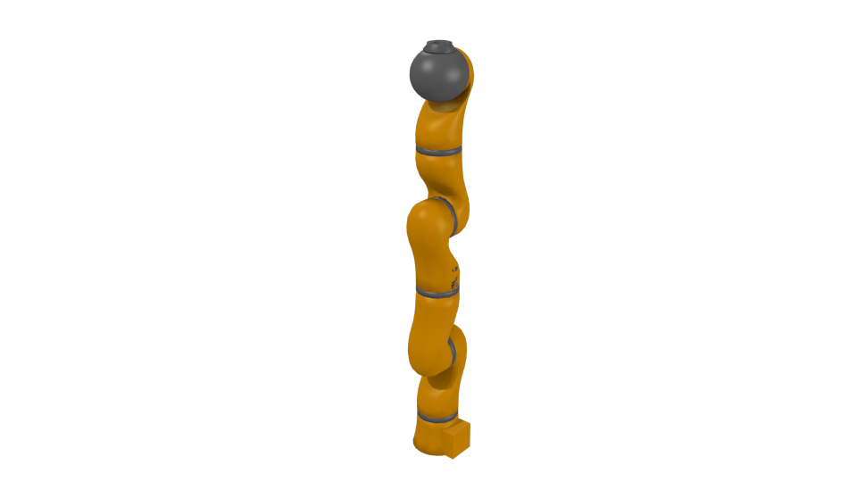
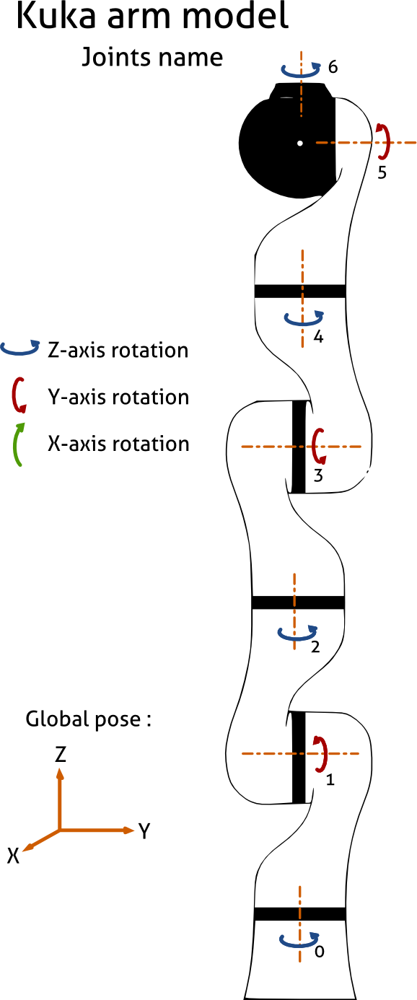

KUKA LWR arm actuator
=====================

This actuator reads a list of angles for the segments of the LWR arm
and applies them as local rotations.
It is a subclass of the :doc:`armature_actuator <armature_actuator>`.
Angles are expected in radians.

To install additional components at the tip of the arm using the
MORSE Builder API, it is necessary to make the additional component as a
child of the arm, and to place the component in the correct position with
respect to the kuka arm.
Example::

    kuka_arm = Actuator('kuka_lwr')
    kuka_arm.translate(x=0.1850, y=0.2000, z=0.9070)
    kuka_arm.rotate(x=1.5708, y=1.5708)
    Jido.append(kuka_arm)

    gripper = Actuator('gripper')
    gripper.translate(z=1.2800)
    kuka_arm.append(gripper)

When the simulation is started any objects that are children of the KUKA arm
will automatically be changed to be children of the last segment of the arm.

Files 
-----

-  Blender: ``$MORSE_ROOT/data/robots/kuka_lwr.blend``

   Unlike other actuators, this one also includes the mesh of the arm
   (composed of 8 segments) and an armature that controls its movement.

-  Python: ``$MORSE_ROOT/src/morse/actuators/kuka_lwr.py``

Local data 
----------

There are 7 floating point values, named after the bones in the armature:

-  **kuka_1**: (float) rotation for the first segment. Around Z axis.
-  **kuka_2**: (float) rotation for the second segment. Around Y axis.
-  **kuka_3**: (float) rotation for the third segment. Around Z axis.
-  **kuka_4**: (float) rotation for the fourth segment. Around Y axis.
-  **kuka_5**: (float) rotation for the fifth segment. Around Z axis.
-  **kuka_6**: (float) rotation for the sixth segment. Around Y axis.
-  **kuka_7**: (float) rotation for the seventh segment. Around Z axis.

These names are generated dynamically, so that if there are more than one arm
in the scene, there will not be any conflicts.

Configurable parameters
-----------------------

No configurable parameters

Applicable modifiers 
--------------------

No available modifiers

Available services
------------------

See the documentation for the :doc:`armature_actuator <armature_actuator>`.
There is also an additional service specific to this armature:

- **set_rotation_array**: (service) Receives an array indicating the angle to give
  to each of the segments of the arm. Angles are expected in radians. The length
  of the array should be equal to 7 or less, where any values not specified will
  be considered as 0.0.

    +------------+--------------------+-----------------+
    | Parameters | ``rotation_array`` | Array of floats |
    +------------+--------------------+-----------------+

    Parameters: ``(rotation_array)``

- **set_rotation**: (service) Makes the indicated segment rotate by the indicated
  angle. Receives the name of the segment to rotate, and the amount in radians.

    +------------+--------------------+--------------------------------------+
    | Parameters | ``channel_name``   | Name of the armature bone to rotate  |
    |            |                    | (see the list above)                 |
    +------------+--------------------+--------------------------------------+
    |            | ``rotation``       | Array of 3 floats, with the angles   |
    |            |                    | to rotate around X, Y, Z.            |
    |            |                    | Note that given the restrictions     |
    |            |                    | imposed on the armature, only one of |
    |            |                    | the rotation angles will be used.    |
    +------------+--------------------+--------------------------------------+

    Parameters: ``(channel_name, rotation)``

Use of the KUKA LWR
-------------------

A sample python script of how to access the KUKA LWR via sockets can be found at:
``$MORSE_ROOT/examples/morse/scenarii/armature_samples/armature_services_tests.py``.

.. warning:: A note for developpers:
    The orientation of the bones in the 'kuka_armature' in the Blender file will
    determine the direction of the rotations.
    To be consistent with the joint rotations of the real arm, the bones must have
    the following ``roll`` value (in the **Bone** panel when in **Edit Mode**):

    - kuka_1: 180
    - kuka_2: 0
    - kuka_3: 0
    - kuka_4: 180
    - kuka_5: 180
    - kuka_6: 0
    - kuka_7: 180

    This is valid for Blender version 2.59
