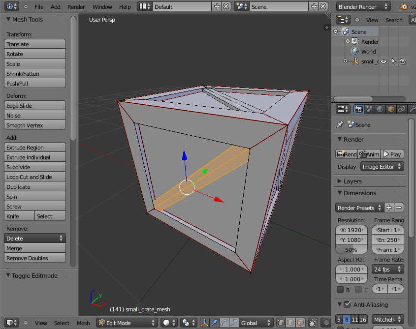

.. role:: python(literal)

A Journey to a New Simulation
=============================

.. note::
  This tutorial will guide you through the development of a complete
  simulation, including the creation of a robot and new actuators from
  scratch.

Chapter Zero
------------

To start this journey, you need a working installation of MORSE. If you
don't yet have MORSE, refer to the :doc:`installation notes <../installation>` first, and come back after!

Chapter One: The Ranger robot
-----------------------------

Let's start by giving a destination to our journey: the **Ranger** robot.

The **Ranger** is a robot developped at EPFL, at the `CHILI
<http://chili.epfl.ch/lang/en/RobotsDailyLife>`_ and `LSRO
<http://lsro.epfl.ch/>`_ labs. The project aims at creating a nice, funny robot
that would help children to tidy up their rooms.

It is basically a wooden box, with two wheels and animated eyes. It can play
sounds and has a large number of LEDs on its faces.

After spending some minutes in the :doc:`MORSE component library
<../../components_library>`, it appears that the
:doc:`../actuators/v_omega_diff_drive` may be a good candidate to control the
wheels.

However, for the eyes and the LEDs, we will need to create something new.

But first, we want to create a 3D model of our robot.

Chapter Two: Making a robot mesh
--------------------------------

Creating a new robot
++++++++++++++++++++

Making a new robot model does not require anything beyond creating a 3D mesh in
`Blender <http://blender.org>`_ (which also means you can import existing meshes
in a variety of formats in Blender).

.. note::
    Creating a realistic robot model may become more complex, especially if you
    need to use :doc:`armatures <../../dev/armature_creation>` to
    represent complex kinematic chains, or if you want to :doc:`create low-poly
    bounding boxes <../tips/bounding_boxes>` for good performance when
    simulating collisions.

In the MORSE data directory (typically, ``/usr/local/share/morse/data``), many 3D
models are available that can be good starting points.

In our case, ``props/crates.blend`` contains three models of wooden box that we can
use as starting point.

But first, let's create a new MORSE project.

Choose a location where you would like to store your simulation, and run::

    $ morse create ranger_sim

This creates a new directory called ``ranger_sim``, containing a file called
``default.py``, and two sub-directories: ``scripts/``, and ``src/`` (initially empty).
The ``scripts/`` directory contains a sample test client; we will return to it in chapter 3.

We can test our simulation immediately::

    $ morse run ranger_sim

After MORSE has loaded, it should display something similar to this:

You can already move the robot (*Morsy*, the MORSE mascot!) with the arrow
keys, and if you drive it to an obstacle it should respond to the collision.

.. note::
  You can control the camera by holding down the :kbd:`Ctrl` key and moving
  the mouse, and with the :kbd:`WASD` keys.

Let's now create our own robot model.

First, ask MORSE to create the templates for a new robot called *ranger*
inside our ``ranger_sim`` simulation::

    $ morse add robot ranger ranger_sim

This creates several new files in ``ranger_sim/``:
``data/ranger_sim/robots/ranger.blend`` contains a default mesh for our robot,
``src/ranger_sim/robots/ranger.py`` describes the behaviour of our simulated
robot (currently, it does nothing in particular), and
``src/ranger_sim/builder/robots/ranger.py`` describes the Ranger's equipment,
initially, a simple motion controller and a position sensor.

To use this new robot in our simulation, open ``ranger_sim/default.py`` with
your favorite editor, and replace the default robot with the *Ranger*: add
:python:`from ranger_sim.builder.robots import Ranger` at the top of the file,
and on line 15 replace :python:`Morsy` with :python:`Ranger`. You can also remove
the lines that add the motion controller, the keyboard controller and the pose
sensor since our robot already includes these as part of its default equipment.

The new ``default.py`` should look like that:

.. code-block:: python

    from morse.builder import *
    from ranger_sim.builder.robots import Ranger

    robot = Ranger()
    robot.translate(1.0, 0.0, 0.0)

    robot.add_default_interface('socket')

    env = Environment('sandbox', fastmode = False)
    env.set_camera_location([10.0, -10.0, 10.0])
    env.set_camera_rotation([1.05, 0, 0.78])

Re-run the simulation with::

    $ morse run ranger_sim

You should see... no differences! The robot template created by MORSE uses the
same mesh as the *Morsy* robot. We will change that now.

Editing the robot mesh in Blender
+++++++++++++++++++++++++++++++++

Open the *Ranger*'s current default mesh with Blender::

    $ cd ranger_sim
    $ blender data/ranger_sim/robots/ranger.blend

Blender opens and should display the *Morsy* wireframe:

You can press :kbd:`z` with the mouse over the 3D view to switch from the
wireframe to the solid model.

Now:

- Select all objects (:kbd:`a`) and delete them (:kbd:`x`)
- Click `File > Append`, then browse into the MORSE ``props`` directory
  (typically, ``/usr/local/share/morse/data/props``), and locate and select ``crates.blend``
- Click on `Group`, then `small_crate`, then validate by clicking on the `Link/Append from Library` button.
- If you do not see the object, check it is not on another layer:

  Here, the object has been imported on the third layer. Click it, select
  everything (:kbd:`a`), then move it to first layer (:kbd:`m`), and switch
  back to the first layer.

- Save your file, quit Blender, and relauch the simulation (``$ morse run ranger_sim``)

It looks better, but we can improve it even more.

Re-open ``ranger.blend`` in Blender and follow these steps:

- Select the crate (right-click on it)

- Switch to `Edit mode` (:kbd:`Tab`)

- Remove one by one the diagonal wood boards by selecting
  one vertex of the board, pressing :kbd:`l` to select the connected vertices,
  and finally :kbd:`x` to delete them.

- Still in `Edit mode`, select the top face...

- ...and extrude (:kbd:`e` followed by :kbd:`z` to constrain extrusion in the Z
  axis) it to create the inner of the box.

- Create the eyes: leave `Edit mode` (:kbd:`tab`), switch to `Quad view` (menu `View > Toggle Quad View`), and
  place the 3D cursor where you want to place the first eye (with a left click)

.. warning:: 
    In MORSE, the X axis is the forward axis: that is not the Blender
    convention. You want to add eyes on the `Right Ortho` face in the Blender
    interface.

- Add a new cylinder (:kbd:`Shift + a`), rotate it by 90 degrees
  on the Y axis (:kbd:`r y 90 <return>`), and scale it (:kbd:`s`). Adjust the
  thickness by scaling again along the X axis (:kbd:`s x`). Name your object
  `right_eye` (by double-clicking it in the outliner).

- Open the `Material` panel, create a new material (with the `+` button), call
  it `Eye`. It should be automatically assigned to your object.

- With the eye selected, switch back to `Edit mode`. Select all the vertices
  (:kbd:`a`), and duplicate the cylinder (:kbd:`Shift + d`). Scale it down and
  place it to create the pupil. Open the `Material` panel. Create a new
  material, name it `Pupil`, change the `Diffuse` color to black, and press
  `Assign` to assign it to the pupil vertices.

- Leave `Edit mode` and apply the scale transformation: :kbd:`Ctrl + a`,
  then `Scale`. Duplicate the eye (:kbd:`Shift + d`) and move it along the Y
  axis (:kbd:`g y`).

Save you file, quit Blender, and run your simulation: that should be enough to
start playing around a bit!

In the next chapter, we'll see how to control the robot's movement from an
external application (your robot controller), and in the following chapter, we
will try to move the eyes (we will have to create a new dedicated actuator to
achieve this).

Chapter Three: Our first robot controller
-----------------------------------------

MORSE is all about integrating simulation as transparently as possible in your
usual workflow: we want you to be able to switch almost transparently from a
real robot to the simulated robot.

To achieve this, MORSE relies on intermediate *middlewares*, like ROS, YARP,
etc. You can get an idea of which features of which middlewares are supported by
MORSE `on this page
<http://www.openrobots.org/morse/doc/stable/user/integration.html>`_.

Sometimes, for quick prototyping, or simply to evaluate what it is actually
possible to simulate, you do not want to use a full middleware, but a more
lightweight interface. MORSE comes with a simple socket-based interface for
that purpose, and also a simple-to-use Python binding that will enable us to
quickly test our robot controller.

Moving the robot
++++++++++++++++

Let write a first test right away. Open your favorite editor and copy and paste
this example:

.. code-block:: python
  :linenos:

  from pymorse import Morse

  print("Use WASD to control the Ranger")

  with Morse() as simu:

    motion = simu.robot.motion

    v = 0.0
    w = 0.0

    while True:
        key = input("WASD?")

        if key.lower() == "w":
            v += 0.1
        elif key.lower() == "s":
            v -= 0.1
        elif key.lower() == "a":
            w += 0.1
        elif key.lower() == "d":
            w -= 0.1
        else:
            continue

        motion.publish({"v": v, "w": w})

Save it somewhere (for instance, as ``ranger_sim/scripts/keyboard_ctrl.py``),
launch the simulation (``$ morse run ranger_sim``), and run your script::

    $ morse run ranger_sim &
    $ python3 ranger_sim/scripts/keyboard_ctrl.py

.. note::
  A client script, very similar to this one, is automatically generated when creating the
  simulation environment. You will find it under
  ``scripts/ranger_sim_client.py``.

.. warning::
    ``pymorse`` the Python bindings for MORSE, require Python 3

Press :kbd:`Ctrl + c` to interrupt the ``keyboard_ctrl.py`` script.
Now let's examine this first example in detail.

On line 1, we import the ``pymorse`` bindings. To use them, on line 5 we create
a *context*: on entering the context, the connection is established with the simulator (by
default, on ``localhost``, but you can `change this
<http://www.openrobots.org/morse/doc/latest/pymorse.html#pymorse.pymorse.Morse>`_),
and when we exit the context, the connections are properly closed. In this
example, the context object is stored in the ``simu`` variable.

On line 7, we retrieve the motion controller *end-point*. The name used to access
it is the same as how we named our components in the simulation script
(``default.py`` and ``ranger.py``).

.. note::
    Here, in ``default.py``, on line 5, we called our robot ``robot`` by simply
    using that name when creating the ``Ranger()`` object:

    .. code-block:: python
        :linenos:

        from morse.builder import *

        from robots import Ranger

        robot = Ranger()

        # The list of the main methods to manipulate your components
        # is here: http://www.openrobots.org/morse/doc/stable/user/builder_overview.html
        robot.translate(1.0, 0.0, 0.0)

        [...]

    If you check ``src/ranger_sim/builder/robots/ranger.py``, you will find that
    the Ranger's motion controller has been called ``motion``. So with
    ``pymorse``, we access the motion controller simply as
    :python:`simu.robot.motion`.

Then, at line 12, we start the main loop: we read a keyboard input, we change the
linear ``v`` and radial ``w`` speeds depending on the user input, and,
in line 26, we send the simulator the new command.

The command is a plain Python dictionary, whose content depends on the
actuator. In our case, we are using a ``MotionVW`` actuator (see
``src/ranger_sim/builder/robots/ranger.py``). The :doc:`documentation of the
component <../actuators/v_omega>` tells us what the actuator expects.

Accessing sensors
+++++++++++++++++

``motion`` is an actuator. If you open ``robots/ranger.py``, you will see the
template also declare a :doc:`Pose sensor <../sensors/pose>`. We can access it
to print the robot's current position. Open ``scripts/keyboard_ctrl.py``
and modify it as follows:

.. code-block:: python
  :linenos:

  from pymorse import Morse

  def pose_received(pose):
      print("The Ranger is currently at %s" % pose)

  print("Use WASD to control the Ranger")

  with Morse() as simu:

    simu.robot.pose.subscribe(pose_received)

    motion = simu.robot.motion

    v = 0.0
    w = 0.0

    while True:
        key = input("WASD?")

        if key.lower() == "w":
            v += 0.1
        elif key.lower() == "s":
            v -= 0.1
        elif key.lower() == "a":
            w += 0.1
        elif key.lower() == "d":
            w -= 0.1
        else:
            continue

        motion.publish({"v": v, "w": w})

Restart the ``scripts/keyboard_ctrl.py`` script::

    $ python3 ranger_sim/scripts/keyboard_ctrl.py

It should start quickly filling your console with the robot's position.
You can still control it with :kbd:`WASD` as you did previously, and you should
see the position values changing.

Chapter Four: Creating a new actuator to move the eyes
------------------------------------------------------

A First Skeleton
++++++++++++++++

Let's now create a new custom actuator for the robot's eyes.

- Add a new actuator template called ``eyes`` to the ``ranger_sim``
  simulation::
  
    $ morse add actuator eyes ranger_sim

MORSE asks you for a short description of your actuator (enter something like
"*Controls the eyes of the EPFL Ranger robot*") , and then create a new set of
templates: ``src/actuators/eyes.py`` defines the behaviour of the actuator (how
the actuator interacts with the simulation), and
``src/builder/actuators/eyes.py`` provides the *Builder API* interface to use
the actuator in simulation scripts.

.. note::
  Unlike with robots, where you are encouraged to modify their *Builder API* to
  define the robot equipment, you usually do not need to change it for
  actuators or sensors.

  The only case where it may be useful is to specify a special 3D mesh for your
  component (like the casing of a laser scanner, etc.)

The default actuator template does not provide any useful behaviour, but it can
already be added to our robot:

- Open ``src/ranger_sim/builder/robots/ranger.py``, and add this ``import`` statement:

.. code-block:: python

    from ranger_sim.builder.actuators import Eyes

and these two lines after the motion controller:

.. code-block:: python

    self.eyes = Eyes()
    self.append(self.eyes)

If you launch the simulation now, MORSE will list the components available on
our robot, including the eyes::

  [...]

  [    0.283] ------------------------------------
  [    0.284] -        SIMULATION SUMMARY        -
  [    0.284] ------------------------------------
  [    0.284] Robots in the simulation:
  [    0.284]     ROBOT: 'robot'
  [    0.284]         - Component: 'robot.pose'
  [    0.285]         - Component: 'robot.keyboard'
  [    0.285]         - Component: 'robot.eyes'
  [    0.285]         - Component: 'robot.motion'

  [...]

Moving the eyes
+++++++++++++++

For our actuator to produce something tangible, we need to complete its definition.

Open ``src/ranger_sim/actuators/eyes.py``, and update its content to match the
following Python script:

.. code-block:: python
  :linenos:

  import logging; logger = logging.getLogger("morse." + __name__)

  from morse.core.actuator import Actuator
  from morse.helpers.components import add_data
  from morse.core import mathutils
  
  class Eyes(Actuator):
      _name = "Eyes"
      _short_desc = "Controls the eyes of the EPFL Ranger robot"
  
      add_data('left', 0.1, 'float', 'Left eye rotation, in radians')
      add_data('right', -0.1, 'float', 'Right eye rotation, in radians')
  
      def __init__(self, obj, parent=None):
          logger.info("%s initialization" % obj.name)
          # Call the constructor of the parent class
          Actuator.__init__(self, obj, parent)
  
          self.left_eye = parent.bge_object.children["left_eye"]
          self.right_eye = parent.bge_object.children["right_eye"]
  
          logger.info('Component initialized')
  
      def default_action(self):
  
          l_orientation = mathutils.Euler([self.local_data['left'], 0.0, 0.0])
          self.left_eye.orientation = l_orientation.to_matrix()
  
          r_orientation = mathutils.Euler([self.local_data['right'], 0.0, 0.0])
          self.right_eye.orientation = r_orientation.to_matrix()
  

Let's explain this script:

.. code-block:: python

  class Eyes(Actuator):
      _name = "Eyes"
      _short_desc = "Controls the eyes of the EPFL Ranger robot"

When creating a component, always provide a name and short description. These are used
to generate the component documentation for instance.

.. code-block:: python
  
      add_data('left', 0.1, 'float', 'Left eye rotation, in radians')
      add_data('right', -0.1, 'float', 'Right eye rotation, in radians')
 
These two lines define the *data interface* of our actuator. For the eyes, we
need to provide to the actuator with two angles, one per eye.

We first set the name of the data field, then its default value, its type and a
short description.

The data set by the simulator clients can be later accessed through the
``local_data`` dictionary (see below).

.. code-block:: python

    def __init__(self, obj, parent=None):
          logger.info("%s initialization" % obj.name)
          # Call the constructor of the parent class
          Actuator.__init__(self, obj, parent)
  
          self.left_eye = parent.bge_object.children["left_eye"]
          self.right_eye = parent.bge_object.children["right_eye"]
  
          logger.info('Component initialized')
 

The class constructor has nothing special. :python:`self.left_eye` and
:python:`self.right_eye` are set to point to the Blender objects for the eyes
(``parent`` is the robot body, ``parent.bge_object`` represents the Blender
mesh of the robot body, ``parent.bge_object.children`` contains all the
robot mesh's children).

.. code-block:: python

    def default_action(self):
  
          l_orientation = mathutils.Euler([self.local_data['left'], 0.0, 0.0])
          self.left_eye.orientation = l_orientation.to_matrix()
  
          r_orientation = mathutils.Euler([self.local_data['right'], 0.0, 0.0])
          self.right_eye.orientation = r_orientation.to_matrix()

:python:`default_action()` is a component's most important method. It is
called at each simulation step. The behaviour of the actuator is implemented
here.

For our eyes, we simply apply a rotation along the ``X`` axis (Blender uses
rotation matrices, so we first create the rotation matrix from a vector of
Euler angles).

To test the eyes, we must complete our test client.

Re-open ``scripts/keyboard_ctrl.py``, and change it to this:

.. code-block:: python

    from pymorse import Morse

    print("Use WASD to control the Ranger")

    with Morse() as simu:

        motion = simu.robot.motion
        eyes = simu.robot.eyes

        v = 0.0
        w = 0.0

        left = 0.0
        right = 0.0

        while True:
            key = input("WASD (eyes:RFTG)?")

            if key.lower() == "w":
                v += 0.1
            elif key.lower() == "s":
                v -= 0.1
            elif key.lower() == "a":
                w += 0.1
            elif key.lower() == "d":
                w -= 0.1

            elif key.lower() == "r":
                left += 0.1
            elif key.lower() == "f":
                left -= 0.1
            elif key.lower() == "t":
                right += 0.1
            elif key.lower() == "g":
                right -= 0.1

            else:
                continue

            motion.publish({"v": v, "w": w})
            eyes.publish({"left": left, "right": right})

Besides ``(v, w)``, we now also publish on the ``eyes`` channel a pair ``(left, right)``.

Run the simulation and launch your client::
    
    $ morse run ranger_sim &
    $ python3 ranger_sim/scripts/keyboard_ctrl.py

You should now be able to move the eyes:

.. raw:: html

    <video class="align-center" width="320" height="240" controls>
        <source src="../../_static/ranger.webm" type="video/webm">
        Your browser does not support WebM videos :-(
     </video> 

Chapter Five - The simulation environment
-----------------------------------------

To be done!

Chapter Six - Creating an advanced actuator: the LED arrays
-----------------------------------------------------------

To be done!

