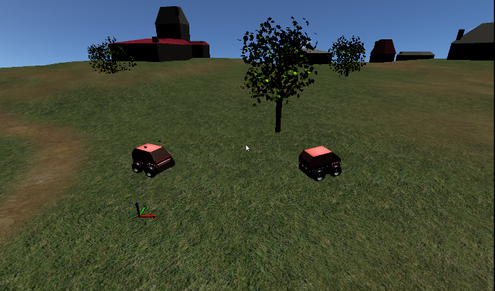

Cat and mouse game tutorial :tag:`builder` :tag:`socket`
========================================================

This tutorial will provide a more complex scenario, with a clear objective to
accomplish for a robot, and that will show how to "close the loop" of sensors
and actuators simulated in MORSE.

We will make a chase game, where a robot controlled by a human (the mouse) will
be chased by a second robot (the cat) that is running software external to
MORSE.  This will be accomplished by the use of sensor and actuators configured
properly.

Pre-requisites
--------------

- You must have completed the :doc:`first tutorial <../beginner_tutorials/tutorial>`.

Creating the scenario
---------------------

We'll use the Builder API to configure the robots in the scenario.
First we will configure the *mouse* robot, which is a lot simpler.

- Create a new ATRV robot, the *mouse*:

  .. code-block:: python

    from morse.builder import *

    mouse = ATRV()
    mouse.translate(x=1.0, z=0.2)

- We will give it some special properties, so that it can be recognised by the
  semantic camera sensor:

  .. code-block:: python

    mouse.properties(Object = True, Graspable = False, Label = "MOUSE")

- Next we make it controllable by the keyboard, using the correct actuator.
  Also, we change the default speed, to make it more agile

  .. code-block:: python

    keyboard = keyboard()
    keyboard.properties(Speed=3.0)
    mouse.append(keyboard)

Now we'll create the *cat* robot, with a sensor to detect the mouse, and an
actuator to follow it.

- Create another ATRV robot, the *cat*:

  .. code-block:: python

    cat = ATRV()
    cat.translate(x=-6.0, z=0.2)

- Next add two :doc:`semantic cameras <../sensors/semantic_camera>` to the
  robot. This will provide us with an easy way to follow our target.
  One is placed right and one left, to provide a fake stereo vision:

  .. code-block:: python

    semanticL = SemanticCamera()
    semanticL.translate(x=0.2, y=0.3, z=0.9)
    cat.append(semanticL)

    semanticR = SemanticCamera()
    semanticR.translate(x=0.2, y=-0.3, z=0.9)
    cat.append(semanticR)

- Add also a :doc:`v, omega actuator <../actuators/v_omega>` that will make
  the robot move:

  .. code-block:: python

    motion = MotionVW()
    cat.append(motion)

- We configure these two components to use the :doc:`sockets middleware <../middlewares/socket>`:

  .. code-block:: python

    motion.add_stream('socket')
    semanticL.add_stream('socket')
    semanticR.add_stream('socket')

And finally we complete the scene configuration:

  .. code-block:: python

    env = Environment('land-1/trees')
    env.place_camera([10.0, -10.0, 10.0])
    env.aim_camera([1.0470, 0, 0.7854])
    env.select_display_camera(semanticL)

The last line indicates to MORSE that you want the images seen from the left
camera to be displayed on the HUD screen, visible when you press :kbd:`v`
during the simulation.
You can easily change it to display the view of the right camera.

The complete script can be found at: ``$MORSE_SRC/examples/tutorials/cat_mouse_game.py``.

Control program
---------------

As a very simple example of how to use the data from a sensor to drive the
robot, we'll create a Python script to connect to MORSE and provide the
"reasoning" of the *cat* robot.

The whole program can be found at: ``$MORSE_SRC/examples/clients/atrv/cat_script.py``
Here we'll explain the main parts of it:

- The function ``is_mouse_visible`` will use the specified semantic camera to
  check if the *mouse* robot is anywhere in front:

  .. code-block:: python

    def is_mouse_visible(semantic_camera_stream):
        """ Read data from the semantic camera, and determine if a specific
        object is within the field of view of the robot """
        data = semantic_camera_stream.get()
        visible_objects = data['visible_objects']
        for visible_object in visible_objects:
            if visible_object['name'] == "MOUSE":
                return True
        return False

- The main decision to move is made based on the information from the
  semantic cameras.
  There are four cases possible: The *mouse* can be seen by both cameras at
  once, only by the right, only by the left or by none of them.
  The *cat*'s logic is very simple, it will move forward when the *mouse*
  is seen by both cameras, turn to the side of the only camera that sees the
  target or turn in place until it sees the target ``MOUSE``.

  .. code-block:: python

    def main():
        """ Use the semantic cameras to locate the target and follow it """
        with Morse() as morse:
            semanticL = morse.cat.semanticL
            semanticR = morse.cat.semanticR
            motion = morse.cat.motion

            while True:
                mouse_seen_left = is_mouse_visible(semanticL)
                mouse_seen_right = is_mouse_visible(semanticR)
                if mouse_seen_left and mouse_seen_right:
                    v_w = {"v": 2, "w": 0}
                elif mouse_seen_left:
                    v_w = {"v": 1.5, "w": 1}
                elif mouse_seen_right:
                    v_w = {"v": 1.5, "w": -1}
                else:
                    v_w = {"v": 0, "w": -1}
                motion.publish(v_w)

Running the game
----------------

Run morse with the builder script to create the scenario. You will be 
able to control the *mouse* robot with the arrow keys on the keyboard::

  $ cd MORSE_SRC/examples/tutorials
  $ morse run cat_mouse_game.py

On the terminal you will get messages indicating the components, the
available services and the datastream interfaces::

    [    0.171] ------------------------------------
    [    0.172] -        SIMULATION SUMMARY        -
    [    0.172] ------------------------------------
    [    0.172] Robots in the simulation:
    [    0.172]     ROBOT: 'cat'
    [    0.172]         - Component: 'cat.semanticR'
    [    0.172]         - Component: 'cat.semanticL'
    [    0.172]         - Component: 'cat.motion'
    [    0.172]     ROBOT: 'mouse'
    [    0.172]         - Component: 'mouse.keyboard'
    [    0.172] Available services:
    [    0.172]     - Interface morse.middleware.socket_request_manager.SocketRequestManager
    [    0.173]         - communication: ['distance_and_view']
    [    0.173]         - simulation: ['terminate', 'get_all_stream_ports', 'get_stream_port', 'activate', 'details', 'restore_dynamics', 'list_streams', 'quit', 'deactivate', 'list_robots', 'reset_objects', 'suspend_dynamics']
    [    0.173] Modifiers in use:
    [    0.173]     None
    [    0.173] 
    [    0.173] Datastream interfaces configured:
    [    0.173]     - 'morse.middleware.socket_datastream.Socket'

Then run the Python control script from another terminal. The *cat* will start
moving and using the data from the semantic cameras to chase after the *mouse*::

  $ python3 cat_script.py

Note: *The following consideration is deprecated but you may find it useful.* 
As we use sockets for the introduced actuators and sensors, you can connect these
ports using the ``telnet`` program on another terminal and you will seee the datastream 
of object visibility coming from the cameras. 
The socket port numbers are usually 60000+ (e.g. 60001 or 60002...)::

  $ telnet localhost 60001

For more information about sockets in MORSE, see the
`services tutorial<advanced_tutorials/request_tutorial>`.

Going further
-------------

This example is very basic, but already provides a test of how the use of
sensor data can help drive a robot.  You can substitute the simple Python
client that controls the *cat* for a more complex piece of software,
implemented in other languages and middlewares.  Here are some ideas of what
you could do to improve the "intelligence" of the *cat*.

- Use a single semantic camera and a :doc:`Pose sensor <../sensors/pose>` to
  follow the mouse. You don't really need two semantic cameras, since among the
  data one provides is the location of the detected object. Using that and the
  current position of the *cat*, it will be possible to chase, but you need
  to do some calculations to determine in which direction to turn. 

- Use other kinds of robots, like in the :doc:`flying cat and mouse tutorial <./flying_cat_and_mouse>` 

- Use a :doc:`Laser Scanner<../sensors/laserscanner>` to make the *cat* detect and
  avoid obstacles. This is more complex, since you have to handle a lot of data
  that is streamed by the Sick.

- The target could hide behind an obstacle, so you could implement a strategy
  to move around the area searching for it.
