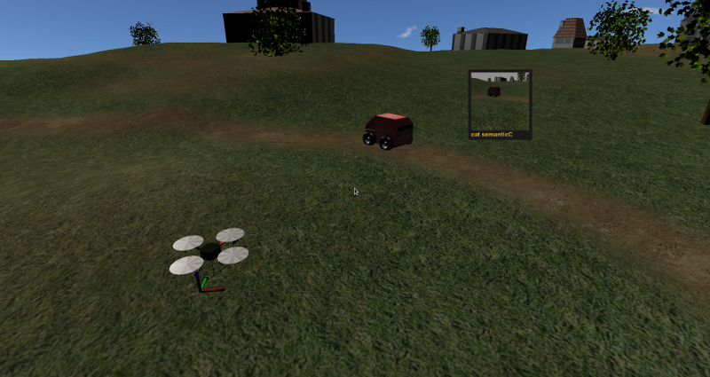

Flying cat and mouse game tutorial :tag:`builder` :tag:`socket` :tag:`pymorse`
==============================================================================

This tutorial is a complement of :doc:`cat and mouse tutorial <./cat_and_mouse>` 
and provides a similar scenario, with a clear objective to accomplish 
for an autonomous flying robot (namely a quadrotor) : to chase another 
human-controlled robot. 
It will show how to "close the loop" of sensors and actuators simulated in MORSE
and provides example of how to simply control a quadrotor.

We will make a variant of the previous chase game, where a ground robot 
controlled by a human (the mouse) will be chased by a second autonomous 
*flying* robot (the cat) that is running software external to MORSE. 
This will be accomplished by the use of sensor and actuators configured
properly.

Pre-requisites
--------------

- You must have completed the :doc:`first tutorial <../beginner_tutorials/tutorial>`.
- It is recommended to have completed the :doc:`cat and mouse tutorial <./cat_and_mouse>`.

Creating the scenario
---------------------

We'll use the Builder API to configure the robots in the scenario.
First we will configure the *mouse* robot, which is a lot simpler.

- Create a new ATRV robot, the *mouse* and place it in the world :

  .. code-block:: python

    from morse.builder import *

    from math import pi

    mouse = ATRV()
    mouse.translate (x=-4.0,y=6.5, z=0.1)
    mouse.rotate(z=0.70*pi)

- Next we make it controllable by the keyboard, using the correct actuator.
  Also, we change the default speed, to make it more agile.

  .. code-block:: python

    keyb = Keyboard()
    keyb.properties(Speed=4.0)
    mouse.append(keyb)

Now we'll create the *cat* robot, with a sensor to see the mouse, another
to know its position, and an actuator to follow it.

- Create a quadrotor robot, the *cat*:

  .. code-block:: python

    cat = Quadrotor()
    cat.translate(x=-7.0, z=1.0)
    cat.rotate(z=pi/3)

- Next add one :doc:`semantic camera <../sensors/semantic_camera>` to the
  robot. This will provide us the cat vision, to appreciate how good it
  follows our target. Note that compare the classical cat and mouse tutorial,
  the vision is not used to find the target but only to appreciate the 
  outcome of the chase. (It is a visual feedback.) 
  ``Vertical_Flip=False`` allows to correctly display the image stream
  (otherwise the images are upside-down).

  .. code-block:: python

    semanticC = SemanticCamera()
    semanticC.translate(x=0.3, z=-0.05)
    semanticC.rotate(x=+0.2)
    cat.append(semanticC)
    semanticC.properties(Vertical_Flip=False)

- To move our cat robot, we will not directly control the quadrotor (using the
  roll, pitch, yaw and thrust like :doc:`here  <../actuators/rotorcraft_attitude>`)
  but rather used :doc:`waypoints commands <../actuators/rotorcraft_waypoint>`)
  (x,y,z,yaw) and let the actuator manage the roll, pitch and thrust automatically. 
  We configure this component to use the :doc:`sockets middleware <../middlewares/socket>`:

  .. code-block:: python

    waypoint = RotorcraftWaypoint()
    cat.append(waypoint)
    waypoint.add_stream('socket')

- We also want to know where the cat is, and thus we will use a 
  :doc:`pose sensor <../sensors/pose>`). You can think about it like 
  GPS + gyroscope sensor. It will also use socket. 

  .. code-block:: python

    catPose = Pose()
    cat.append(catPose)
    catPose.add_stream('socket')

Now we want the cat to be able to "see" the mouse. Whereas in the
cat and mouse tutorial the tracker robot uses stereo semantic vision 
to look after the target, here we will *cheat* and also use a pose sensor
on the mouse (which will be used by the cat!) Imagine it's a *"super-ultra
mouse detector"*, or a cookie. 

  .. code-block:: python

    mousePose = Pose()
    mouse.append(mousePose)
    mousePose.add_stream('socket')

And finally we complete the scene configuration:

  .. code-block:: python

    env = Environment('land-1/trees')
    env.place_camera([10.0, -10.0, 10.0])
    env.aim_camera([1.0470, 0, 0.7854])
    env.select_display_camera(semanticC)

The last line indicates to MORSE that you want the images seen from the cat 
camera to be displayed on the HUD screen, visible when you press :kbd:`v`
during the simulation.

The complete script can be found at: ``$MORSE_SRC/examples/tutorials/flying_outdoor_cat_mouse_game.py``.

Control program
---------------

As a very simple example of how to use the data from a sensor to drive the
robot, we'll create a Python script to connect to MORSE and provide the
"reasoning" of the *cat* robot.

The whole program can be found at: ``$MORSE_SRC/examples/clients/quadrotor/Cat_waypoints_pymorse_socket_script.py``
Here we'll explain the main parts of it:

- We import pymorse to easily handle the sockets :

  .. code-block:: python

    from pymorse import Morse
    
- The function ``where_is`` will use the specified pose sensor to
  know where is the *mouse* / *cat* robot :

  .. code-block:: python

    def where_is(agentPose_stream):
        """ Read data from the [mouse|cat] pose sensor, and determine the position of the agent """
        pose = agentPose_stream.get()
    
        return pose

- The main decision to move is made based on the information from the
  pose sensors. The cat moves behind the mouse (a few meters behind), 
  and adjusts its yaw to watch the mouse with its camera.  

  .. code-block:: python

    import math

    """ The minimal distance to maintain between the mouse and the cat. """
    minDist = 5.0

    """ The height for the flying cat. """
    height= 3.5 

  .. code-block:: python

    catPosition = where_is(catPose)
    mousePosition = where_is(mousePose)
    
    if mousePosition and catPosition:
        # go behind the mouse
        waypoint = {    "x": mousePosition['x'] - minDist*math.cos(mousePosition['yaw']), \
                        "y": mousePosition['y'] - minDist*math.sin(mousePosition['yaw']), \
                        "z": height, \
                        "yaw": catPosition['yaw'], \
                        "tolerance": 0.5 \
                    }
    
        # look at the mouse
        if mousePosition['x']==catPosition['x']:
             waypoint['yaw']= math.sign(mousePosition['y']-catPosition['y']) * math.pi
        else:
            waypoint['yaw']= math.atan2(mousePosition['y']-catPosition['y'],mousePosition['x']-catPosition['x'])
        
        # send the command through the socket
        motion.publish(waypoint)

Running the game
----------------

Run morse with the builder script to create the scenario. You will be 
able to control the *mouse* robot with the arrow keys on the keyboard::

  $ cd MORSE_SRC/examples/tutorials
  $ morse run flying_outdoor_cat_mouse_game.py

On the terminal you will get messages indicating the components, the
available services and the datastream interfaces::

    [    0.269] ------------------------------------
    [    0.269] -        SIMULATION SUMMARY        -
    [    0.269] ------------------------------------
    [    0.269] Robots in the simulation:
    [    0.269]     ROBOT: 'cat'
    [    0.269]         - Component: 'cat.catPose'
    [    0.269]         - Component: 'cat.semanticC'
    [    0.269]         - Component: 'cat.waypoint'
    [    0.269]     ROBOT: 'mouse'
    [    0.269]         - Component: 'mouse.mousePose'
    [    0.269]         - Component: 'mouse.keyb'
    [    0.269] Available services:
    [    0.269]     - Interface morse.middleware.socket_request_manager.SocketRequestManager
    [    0.270]         - communication: ['distance_and_view']
    [    0.270]         - simulation: ['terminate', 'get_all_stream_ports', 'get_stream_port', 'activate', 'details', 'restore_dynamics', 'list_streams', 'quit', 'deactivate', 'list_robots', 'reset_objects', 'suspend_dynamics']
    [    0.270] Modifiers in use:
    [    0.270]     None
    [    0.270] 
    [    0.270] Datastream interfaces configured:
    [    0.270]     - 'morse.middleware.socket_datastream.Socket'

Then run the Python control script from another terminal. The *cat* will start
moving and using the data from the pose sensors to chase after the *mouse*::

  $ python3 Cat_waypoints_pymorse_socket_script.py

Note: *The following consideration is deprecated but you may find it useful.* 
As we use sockets for the introduced actuators and sensors, you can connect these
ports using the ``telnet`` program on another terminal and you will seee the datastream 
of object visibility coming from the cameras and of poses from the pose sensors. 
The socket port numbers are usually 60000+ (e.g. 60001 or 60002...)::

  $ telnet localhost 60001

Going further
-------------

This example is very basic, but already provides a test of how the use of
sensor data can help drive a robot.  You can substitute the simple Python
client that controls the *cat* for a more complex piece of software,
implemented in other languages and middlewares.  Here are some ideas of what
you could do to improve the "intelligence" of the *cat*.

- Control the orientation of the semantic camera :doc:`Pose sensor <../sensors/pose>` 
  to maintain a viewline to the mouse. You can use the label ``MOUSE`` 
  (see the cat and mouse tutorial).
 
- Adapt the height of the quadrotor to the field. Until there the height is constant
  and is related to the ``z=0`` plan. Problem is when the field is higher than the
  quadrotor height (imagine a big hill). 
  You may use a :doc:`Laser Scanner<../sensors/laserscanner>` to make the *cat* detect 
  the current elevation and keep a constant relative height to the field (instead of
  a constant absolute height).

- Use a :doc:`Laser Scanner<../sensors/laserscanner>` to make the *cat* detect and
  avoid obstacles. This is more complex, since you have to handle a lot of data
  that is streamed by the Sick.

- The target could hide behind an obstacle, so you could implement a strategy
  to move around the area searching for it.
