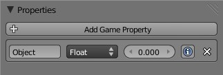

Human-Robot interaction tutorial
================================

This tutorial shows how to build a simulation with a robot and a human that
is interactively controlled by the simulation user.

In this simple scenario, the robot is ordered to follow the human.

Pre-requisites
--------------

- You must have completed the :doc:`first tutorial <../tutorial>`.
- In this tutorial, we use ROS as middleware. We assume you have a functionnal 
  ROS installation (you should only need the core ROS tools). If you need to
  install ROS, please refer to `ROS installation instruction <http://www.ros.org/wiki/ROS/installation>`_.

.. warning:: You need at least MORSE 0.3 to have ROS  support.

Setup the scene
---------------

Launch MORSE. We will use the default indoor scene, so we can keep it as it appears.

We first want to add a human:

#. With the mouse over the 3D view in Blender, press :kbd:`Ctrl-Alt-O` to open the Load Library browser
#. Navigate to the directory ``$MORSE_ROOT/data/morse/humans``
#. Press :kbd:`Left Mouse Click` over the file ``default_human.blend``
#. Press :kbd:`Left Mouse Click` over the item ``Object``
#. Press :kbd:`Right Mouse Click` and drag over the names of all the objects listed, to select them all
#. Press the button **Link/Append from Library**. You'll return to the 3D View, and the newly added 
   human is selected.
#. Convert the objects to local: without de-selecting the object, press :kbd:`l` then hit :kbd:`enter`

.. image:: ../../../media/hri_import_human.jpg
   :align: center

Controlling the human
---------------------

To avoid keyboard mapping issues, remove the ``CameraFP`` object by selecting it in the scene outliner, and
pressing :kbd:`del`. Set the human camera as the new *main* camera: select it and press :kbd:`Ctrl-Numpad 0`
(or menu ``View > Cameras > Set Active Object As Camera``).

You can control the human with the :kbd:`W`, :kbd:`A`, :kbd:`S`, :kbd:`D`  keys.

Press :kbd:`P` to start the simulation and move around. When moving the mouse, you displace the yellow IK
target of the head. This allows you to control the head direction.

Picking objects
---------------
Our human can pick and release objects. Let's add a new cube on one of the tables: switch to the ortho
view (:kbd:`Numpad 5`), and using the front view (:kbd:`Numpad 1`) and top view (:kbd:`Numpad 7`), place
the 3D cursor on the top of a table:

.. image:: ../../../media/place_3dcursor.jpg 
  :align: center

Push :kbd:`space` and type ``Add cube`` followed by :kbd:`enter`. Using ``Scale`` (:kbd:`S` key) and
``Translate along Z`` (:kbd:`G` fllowed by :kbd:`Z`), turn the box into a reasonably sized object:

.. image:: ../../../media/place_cube.jpg 
  :align: center

To allow this object to be grasped, add a custom game property (of any type) to your box named ``Object``:

Start again the simulation, and press the :kbd:`X` key to switch to the manipulation mode. You can control
the hand with the mouse and the scroll wheel. Press the :kbd:`Left Mouse Button` when near an object to
pick it, and release the button to place the object.

.. image:: ../../../media/hri_pick_object.jpg 
  :align: center

Check the :doc:`human component <../others/human>` documentation for more details on what can be done
with the human component.

.. note:: The box has currently no physical properties. If you set it to be a ``Rigid Body`` with the default
    collision bounds, the box will fall down when you release it.

Exporting the human position
----------------------------

As a first step, we would like to export the position of the human in the world. To do so, we need the
:doc:`GPS sensor <../sensors/gps>`. You can find it in ``$MORSE_ROOT/data/morse/sensors/gps.blend``.

If you're not sure how to add the GPS to the human, please see the :ref:`Link a gyroscope <link-gyroscope-sensor>`
section in the MORSE Quick tutorial.

Import only the ``GPS`` object (we don't need the ``GPS_box``), place it on the ground, between the human legs,
and parent it the the human (with :kbd:`Ctrl-P`). Rename it as well to ``HumanPosition`` (you can change the name by
pressing :kbd:`N` in the 3D view and scrolling down to the item name field).

Import as well the socket middleware in ``$MORSE_ROOT/data/morse/middleware/socket_mw.blend``.

Open the Blender text editor, and modify ``component_config.py``:

.. code-block:: python

   component_mw = {
      "HumanPosition": [["Socket", "post_message"]],
   }

   component_modifier = {}

This instruct MORSE to stream the human position on a raw socket.

We can now display it with this simple Python (for Python 3.x) code:

.. code-block:: python

  import sys, socket, pickle

  host= "localhost"
  port = 60000

  def read_data(simu):
    done = False
    data_in = ''

    while not done:
      try:
        data_in = simu.recv(1024)
      except socket.error:
        done = True

    return data_in
  
  simu = socket.socket(socket.AF_INET, socket.SOCK_DGRAM)
  simu.setblocking(0)
  simu.connect((host, port))
  
  while True:
    raw = read_data(simu)
    if raw:
      data = pickle.loads(read_data(simu))
      print(str(data))

