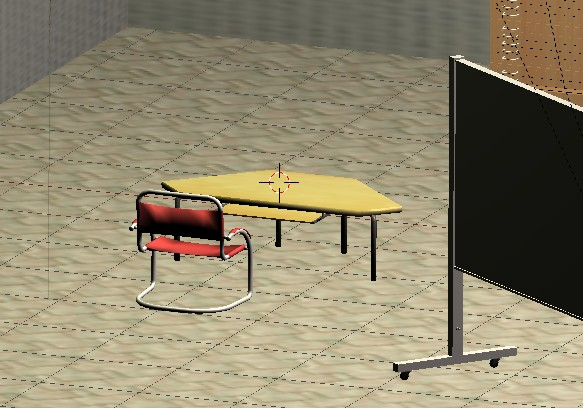
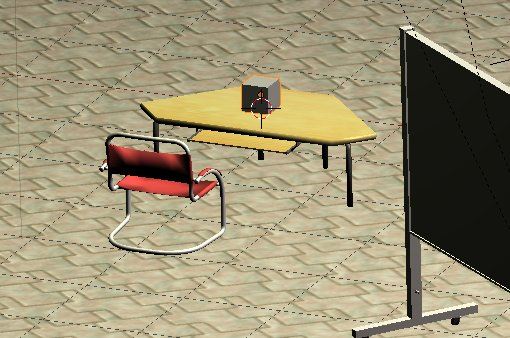
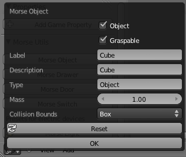

Human-Robot interaction tutorial
================================

This tutorial shows how to build a simulation with a robot and a human that
is interactively controlled by the simulation user.

In this simple scenario, the robot is ordered to follow the human.

.. note::
    This tutorial uses the Blender interface to create and edit the scenario. If it is
    your first experiments with MORSE, we recommend you to visit first the :doc:`Builder API
    version <../beginner_tutorials/hri_tutorial>` of this tutorial.

Pre-requisites
--------------

- You must have completed the tutorial on :doc:`Editing scenarii within Blender interface <../advanced_tutorials/editing_in_blender>`.
- In this tutorial, we use ROS as middleware. We assume you have a functional 
  ROS installation (you should only need the core ROS tools). If you need to
  install ROS, please refer to `ROS installation instruction <http://www.ros.org/wiki/ROS/installation>`_.

Setup the scene
---------------

Launch MORSE. We will use the default indoor scene, so we can keep it as it appears.

We first want to add a human:

#. With the mouse over the 3D view in Blender, press :kbd:`Ctrl-Alt-O` to open the Load Library browser
#. Navigate to the directory ``$MORSE_ROOT/data/robots``
#. Press :kbd:`Left Mouse Click` over the file ``human.blend``
#. Press :kbd:`Left Mouse Click` over the item ``Group``
#. Press :kbd:`Left Mouse Click` over the item ``Human``
#. Press the button **Link/Append from Library**. You'll return to the 3D View, and the newly added 
   human is selected.

.. image:: ../../../media/hri_import_human.jpg
   :align: center

Controlling the human
---------------------

Press :kbd:`p` to start the simulation and move around. When moving the mouse, you displace the yellow IK
target of the head. This allows you to control the head direction.

You can control the human with the :kbd:`w`, :kbd:`a`, :kbd:`s`, :kbd:`d`  keys.

Picking objects
---------------

Our human can pick and release objects. Let's add a new cube on one of the
tables: exit the simulation (:kbd:`Esc`), switch to the orthogonal view
(:kbd:`Numpad 5`), and using the front view (:kbd:`Numpad 1`) and top view
(:kbd:`Numpad 7`), place the 3D cursor on the top of a table:

Press :kbd:`Shift-A` and select ``Mesh > Cube``. Using ``Scale`` (:kbd:`s` key) and
``Translate along Z`` (:kbd:`g` followed by :kbd:`z`), turn the box into a reasonably sized object:

Easiest way to allow this object to be grasped is using the addon ``morse_object_utils.py``. Use the 
``Morse Object`` button (see :doc:`Setting up a Scene with MORSE Utils <../addons/morse_utils>`):

Start again the simulation (:kbd:`p`), and press the :kbd:`x` key to switch to the **manipulation mode**. You can control
the hand with the mouse while holding :kbd:`Middle Mouse Button`. Press the :kbd:`Left Mouse Button` with 
the crosshairs over an object to pick it, and press :kbd:`Right Mouse Button` to drop the object.

.. image:: ../../../media/hri_pick_object2.jpg 
  :align: center

Check the :doc:`human component <../others/human>` documentation for more details on what can be done
with the human component.

.. note:: The box has currently no physical properties. If you set it to be a ``Rigid Body`` with the default
    collision bounds, the box will fall down when you release it.

.. image:: ../../../media/hri_pick_object.jpg 
  :align: center

Exporting the human position
----------------------------

As a first step, we would like to export the position of the human in the world. To do so, we need the
:doc:`Pose sensor <../sensors/pose>`. You can find it in ``$MORSE_ROOT/data/morse/sensors/pose.blend``.

If you're not sure how to add a pose sensor to the human, please see the
:doc:`Append a pose sensor <../beginner_tutorials/tutorial>` section in the
MORSE Quick tutorial.

Import only the ``Pose`` object (we don't need the ``Pose_mesh``), place it on the ground, between the human legs,
and parent it the the human (with :kbd:`Ctrl-P`). Rename it as well to ``HumanPosition`` (you can change the name by
pressing :kbd:`n` in the 3D view and scrolling down to the item name field).

Import as well the socket middleware in ``$MORSE_ROOT/data/morse/middleware/socket_mw.blend``.

Open the Blender text editor, and modify ``component_config.py``:

.. code-block:: python

   component_mw = {
      "HumanPosition": [["Socket", "post_message"]],
   }

   component_modifier = {}

This instruct MORSE to stream the human position on a raw socket.

Reading the position outside of MORSE
-------------------------------------

We can retrieve the pose of the human from a regular Python script:

.. code-block:: python

  import time
  import pymorse

  morse = pymorse.Morse("localhost", 4000)

  # The callback function: when the human pose is updated, we print it
  def printer(data):
      print("Pose=" + str(data))

  try:
    pose = morse.stream("HumanPosition")

    # Asynchronous read of the pose
    pose.subscribe(printer)

    # Listen to pose updates for 10 sec
    time.sleep(10)

  except MorseServerError as ose:
    print('Oups! An error occured!')
    print(ose)

  finally:
    morse.close()

You can run this script from any terminal, on the same machine as MORSE (or on
a distant one, just replace ``localhost`` by the appropriate host).

.. note:: the script above uses the ``pymorse`` API which hides the socket interface.
  You could achieve roughly the same result with a direct socket connection:
      
    .. code-block:: python

      import sys, socket, json

      host = "localhost"

      # Port of the 'stream' of the pose sensor. By default,
      #starts at 60000 and increments for each sensor. You can have a look to
      #MORSE console output to know exactly which port is used by which sensor.
      port = 60000

      def read_data(simu):
        done = False
        data_in = ''

        while not done:
          try:
            data_in = simu.recv(1024)
          except socket.error:
            done = True

        return data_in
      
      simu = socket.socket(socket.AF_INET, socket.SOCK_DGRAM)
      simu.setblocking(0)
      simu.connect((host, port))
      
      while True:
        raw = read_data(simu)
        if raw:
          data = json.loads(read_data(simu))
          print(str(data))

