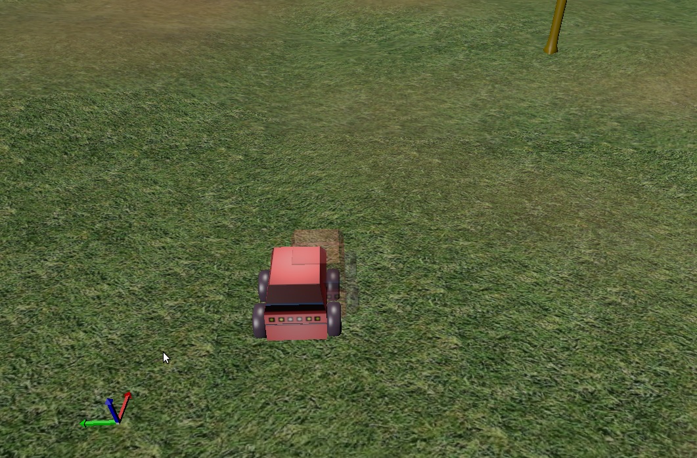

Noise and ghost tutorial :tag:`builder` :tag:`pymorse`
======================================================

This tutorial will show how to add and configure noise modifiers
to your components, and will illustrate the use of ``ghost`` robots.

Pre-requisites
--------------

- You must have completed the :doc:`first tutorial <../beginner_tutorials/tutorial>`.
- It is also advised to have completed the :doc:`cat and mouse tutorial <cat_and_mouse>`.

Creating the scenario
---------------------

We'll use the Builder API to configure the robots in the scenario.
First we will configure the real ATRV robot.

- Create a new ATRV robot:

  .. code-block:: python

    from morse.builder import *

    robot = ATRV()

- We will add a pose sensor to it, and make the data available through the socket interface:

  .. code-block:: python
    
    pose = Pose()
    robot.append(pose)
    pose.add_stream('socket')

- Next we make it controllable by the keyboard, using the correct actuator:

  .. code-block:: python

    keyboard = Keyboard()
    robot.append(keyboard)

- Finally we alter the initial pose data with a Gaussian noise:

  .. code-block:: python
    
    pose.alter('Noise', pos_std=.5, rot_std=0, _2D=True)
    
  .. note::
  
    The noise parameters are documented in the :doc:`Noise modifier <../modifiers/pose_noise>`.

Now we'll create the ghost robot: it is aimed to represent some
external computation, without conflicting with the simulated robots.

- Create another ATRV robot, the *ghost*:

  .. code-block:: python

    ghost = ATRV()

- Next we add a :doc:`Teleport <../actuators/teleport>` actuator to control it:

  .. code-block:: python

    teleport = Teleport()
    ghost.append(teleport)

- Finally, we make the robot a ghost, and add the socket interface to it:

  .. code-block:: python

    ghost.make_ghost()
    ghost.add_default_interface('socket')

And finally we complete the scene configuration:

.. code-block:: python

  env = Environment('land-1/trees')
  env.create()

The complete script can be found at: ``$MORSE_SRC/examples/tutorials/noise_ghost_tutorial.py``.

Ghost is noise script
---------------------

As a very simple example of how to use the ghost robot, we'll create
a Python script to connect to MORSE and display the noisy position:

.. code-block:: python

    import pymorse
    import time
    
    with pymorse.Morse() as morse:
      while True:
        pose = morse.robot.pose.get()
        morse.ghost.teleport.publish(pose)
        time.sleep(.1)
    
The whole program can be found at: ``$MORSE_SRC/examples/clients/atrv/ghost_noise_script.py``

Run morse with the builder script to create the scenario. You will be 
able to control the robot with the arrow keys on the keyboard::

  $ cd $MORSE_SRC/examples/tutorials
  $ morse run noise_ghost_tutorial.py

Then run the Python noise display script from another terminal. The ghost
position will show the noisy robot position as altered by the Noise modifier.::

  $ cd $MORSE_SRC/examples/clients/atrv
  $ python3 ghost_noise_script.py

Ghost is filtered script
------------------------

Using the ghost robot to show the noise applied to the position data
is actually not very interesting. In this script, we will see how we can
use the ghost to display more useful information, for instance the
robot position estimated from the noisy position.

For this script, you need to install the ``numpy`` and ``scipy`` python packages::

  $ sudo apt-get install python3-numpy python3-scipy
  
or::

  $ sudo easy_install3 numpy scipy
  
The whole program can be found at: ``$MORSE_SRC/examples/clients/atrv/ghost_estimation_script.py``

It differs from the previous one in the fact that the robot position
is estimated from the measured noisy position of the robot, by using an unknown input Kalman filter.
To this end, a very simple extended autonomous state-space dynamic model of the robot has 
been considered:

.. math::
   
    X_{ext} &= \begin{pmatrix} x & ux & y & uy\end{pmatrix}^T \\
    A_{ext} &= \begin{pmatrix}
             0 & 1 & 0 & 0\\
             0 & 0 & 0 & 0\\
             0 & 0 & 0 & 1\\
             0 & 0 & 0 & 0
            \end{pmatrix}\\
    \dot{X}_{ext} &= A_{ext} * X_{ext}
    
where ``x``, ``ux``, ``y``, ``uy`` are the position and control variables along the
``x`` and ``y`` axis, respectively.            
The x-y positions of the robot are subject to a white Gaussian noise (with zero mean). Thus,
following the dynamic model notations, the measured vector is

.. math::

    Y_{meas} &= C_{ext} * X_{ext} + w \\
    C_{ext} &= \begin{pmatrix}1 & 0 & 0 & 0\\
                          0 & 0 & 1 & 0\end{pmatrix}

where ``w`` stands for the white noise.
Grounded on the above model, the derivation of the Kalman filer is obtained by solving 
the following Riccati equation, using the ``solve_continuous_are`` function,
where, the symmetric matrices ``Q`` and ``R`` are the design variables providing the confidence one
have on the measurement and the model (typically, the trade-off is catched by tuning the ratio ``Q/R``,
available in the script through the ``measure_confidence`` variable).
The solution of the Riccati equation is then used to compute the Kalman gain ``L`` as follows:

.. math::
    
    L = P * C_{ext}^T * (R / I)

The discrete-time Kalman observer state-space matrices are simply obtained using a backward 
discretization:

.. math::

    A &= I + (A_{ext} - L * C_{ext}) * dt\\    
    B &= L * dt\\    
    C &= C_{ext}

where ``dt`` is the discretization period. 

To run it, just launch this script instead of the previous one::

  $ python3 ghost_estimation_script.py

