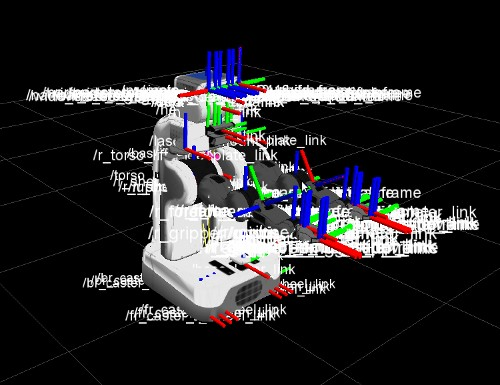
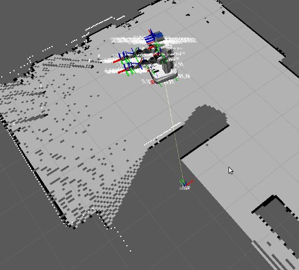

ROS navigation tutorial :tag:`ros`
==================================

This tutorial shows how to use the ROS navigation stack to build a map and make
your robot navigate in MORSE.

.. note::
    All the scripts, nodes and launch files mentioned in this tutorial are
    available in
    ``$MORSE_PREFIX/share/morse/examples/tutorials/ros_navigation``. If you
    wish to directly reuse the ROS nodes, do not forget to add this path to
    your ``$ROS_PACKAGE_PATH``.

Prerequisites
-------------

You should be familiar with the basic usage of ROS and how to use TF and
the ROS navigation stack. You should also know about launchfiles and topic
remapping as well as the robot state publisher. Also experiences with RVIZ are
of advantage. Tutorials on all of those topics can be found on
http://www.ros.org/wiki/ROS/Tutorials.

We also assume you know how to use the MORSE Builder API to equip your robot
with components. If not, please follow first the :doc:`ROS and MORSE tutorial
<../beginner_tutorials/ros_tutorial>`.

Environment setup
-----------------

You need to have a working installation of ROS and also have the
python3-compatible stacks for MORSE-ROS installed. You can find information
about this in the :doc:`installation notes <../installation/mw/ros>`

.. note::
    We base the tutorial on ROS Fuerte. The tutorial should however also be
    compatible with ROS Diamondback, ROS Electric and ROS Groovy.

If you are running Ubuntu, you can simply install the packages
``ros-fuerte-pr2-navigation`` and ``ros-fuerte-visualization``. They will
install all required dependencies (but you still need to install ``rospkg``
for Python 3, see the installation notes linked above).

You also need MORSE installed with ROS support: check that the
``BUILD_ROS_SUPPORT`` CMake option is enabled when building MORSE.

Bringing up your robot in RVIZ
------------------------------

Our first step is to get a robot to show up in RVIZ. In this tutorial, we
will use the PR2 robot, but any robot (with an URDF file to describe it
to RVIZ) would do.

Let's create a first simple scenario script (``scenario.py``): a PR2 in a
kitchen environment, a keyboard actuator to move it around, and an
:doc:`Odometry sensor <../sensors/odometry>` to get some odometry feedback.

.. code-block:: python

    from morse.builder import *

    # A 'naked' PR2 robot to the scene
    james = BarePR2()
    james.translate(x=2.5, y=3.2, z=0.0)

    # An odometry sensor to get odometry information
    odometry = Odometry()
    james.append(odometry)
    odometry.add_interface('ros', topic="/odom")

    # Keyboard control
    keyboard = Keyboard()
    james.append(keyboard)

    # Set the environment
    env = Environment('tum_kitchen/tum_kitchen')
    env.aim_camera([1.0470, 0, 0.7854])

.. note::

    ``odometry.add_interface('ros', topic='/odom')`` tells MORSE to stream the
    odometry information on the ``/odom`` topic, using the default
    serialization method for the pair (odometry, ROS), as defined in `Builder
    data.py
    <http://www.openrobots.org/morse/doc/latest/_modules/morse/builder/data.html>`_.
    If you do not specify a topic name, one is created automatically (here,
    it would be ``/james/odometry``).

    If you like, you can also add a ``odometry.add_interface('socket')`` to add
    another output on a socket.

Run it by first starting a ROS core (``roscore``) and then ``morse run
scenario.py``.

.. note::

    You can move the camera around with WASD + RF (up-down). To rotate it,
    press Ctrl while moving the mouse.

The odometry sensor automatically publishes the TF transformation between the
``/odom`` and ``/base_footprint`` frames, so you actually do not need anything
more to display than the ``/base_footprint`` of your robot in RVIZ. Launch RVIZ
(``rosrun rviz rviz``), select ``/odom`` as *Fixed frame*, and add a TF
display. You should see the frames ``/odom`` and ``/base_footprint`` connected
together, on a black background.

We will soon build and add a map, but in the meantime, we want to display the
full robot TF tree (it is needed by the ROS localization stack to know where
the laser scanner is).

To do that, we need to publish the TF tree with the ``robot_state_publisher``
module. This module takes the robot joint state (exported by the
:doc:`armature_pose sensors <../sensors/armature_pose>` of the arms, head and
torso in our case) and the URDF file of our robot as input.

First complete the ``scenario.py`` script by replacing the ``BarePR2`` by the ``BasePR2``:

.. code-block:: python

    from morse.builder import *

    # A PR2 robot to the scene
    james = BasePR2()
    james.add_interface('ros')
    james.translate(x=2.5, y=3.2, z=0.0)

    [...]

.. note::

    The ``BasePR2`` PR2 model has predefined actuators and sensors for the
    arms, torso and head. These are needed to export the full robot joint
    state. Check the `PR2 Builder script source
    <http://www.openrobots.org/morse/doc/latest/_modules/morse/builder/robots/pr2.html>`_
    to know how it is done, or read the :doc:`PR2 documentation
    <../robots/pr2>` to know which other PR2 models are available.

Then, to make our lives easier, we create a new ROS package and a launch file that will
start the ``robot_state_publisher`` for us::

  $> mkdir morse_2dnav && cd morse_2dnav
  $> touch manifest.xml
  $> touch nav.launch
  $> export ROS_PACKAGE_PATH=$ROS_PACKAGE_PATH:`pwd`/..

Edit ``manifest.xml`` and copy-paste the code below:

.. code-block:: xml

    <package>
        <description brief="morse_2dnav">
            morse_2dnav is a sample ROS node used to demo
            2D planar navigation in the MORSE simulator.
        </description>
        <author>MORSE Team</author>
        <license>BSD</license>
        <review status="unreviewed" notes=""/>
        <url>http://morse.openrobots.org</url>
        <depend package="move_base"/>
        <depend package="map_server"/>
        <depend package="robot_state_publisher"/>
    </package>

Edit ``nav.launch`` and copy-paste this code:

.. code-block:: xml

    <launch>
        <param name="robot_description" command="cat $(find morse_2dnav)/pr2.urdf"/>
        <node name="robot_state_publisher" pkg="robot_state_publisher" type="state_publisher" />
    </launch>

Lastly, build the ``pr2.urdf`` file in your node by running::

  rosrun xacro xacro.py `rospack find pr2_description`/robots/pr2.urdf.xacro > pr2.urdf

Restart the MORSE simulation and launch your new ROS node with
``roslaunch morse_2dnav nav.launch``.

In RVIZ, set the *Fixed frame* to ``/odom``. You should now see the full
PR2 TF tree.

.. note::
    You can display the robot geometry by adding a *Robot Model* display in RVIZ.

Creating a map
--------------

The ROS navigation stacks include the powerful ``gmapping`` module that allows us to easily build 2D maps using SLAM techniques.

To do so, we first need to add a laser scanner to our PR2 model.

Edit ``scenario.py`` to add a SICK sensor, configured to approximate the PR2 Hokuyo laser scanners:

.. code-block:: python

    scan = Hokuyo()
    scan.translate(x=0.275, z=0.252)
    james.append(scan)
    scan.properties(Visible_arc = False)
    scan.properties(laser_range = 30.0)
    scan.properties(resolution = 1.0)
    scan.properties(scan_window = 180.0)
    scan.create_laser_arc()

    scan.add_interface('ros', topic='/base_scan')

We can now build a first map of our environment. Restart the simulation with
``morse run scenario.py``.

Start your launch file: ``roslaunch morse_2dnav nav.launch``.

You can now run the ROS GMapping stack:

``rosrun gmapping slam_gmapping scan:=/base_scan _odom_frame:=/odom``

Move around the robot in the simulation using the keyboard to fill the map
(displayed in RVIZ).

When you are satisfied, save it with ``rosrun map_server map_saver``.

This will create a pair ``map.pgm`` and ``map.yaml`` in your home directory
that should be similar to the one provided with the tutorial in
``$MORSE_PREFIX/share/morse/examples/tutorials/ros_navigation/maps/``

Copy the map you have just recorded in your ``morse_2dnav`` node and add the
following line to your launch file to start a map server with your map:

.. code-block:: xml

    <node name="map_server" pkg="map_server" type="map_server" args="$(find morse_2dnav)/map.yaml"/>

You do not need the ``gmapping`` node anymore; you can kill it.

Using ROS localization
----------------------

The ROS navigation stacks provide a Monte-Carlo based module for localisation
estimation called ``amcl``.

We can use it to localize our robot in the map.

Restart the simulation with the map server enabled.

Start the AMCL estimator, passing the laser scans topic as paramter::

  $> rosrun amcl amcl scan:=/base_scan

Now, open RVIZ.  Set the *Fixed Frame* to ``/map``, enable the laser scan
display (topic name is ``/base_scan``) to see the simulated laser scans and set
an initial pose estimate (*ie* an estimate of the pose of the robot in MORSE)
by clicking on the *2D Pose Estimate* button in RVIZ interface.

Now, move the robot in the simulator with the arrow keys. You should see the
localization of the robot in RVIZ improving with time and displacements.

Navigating in the map
---------------------

We can finally get the robot to autonomously navigate in our environment.

First, add AMCL to the launch file:

.. code-block:: xml

    <node name="amcl" pkg="amcl" type="amcl" />

Then, we need to add a motion controller to our robot. Open your ``scenario.py`` and add:

.. code-block:: python

    motion = MotionXYW()
    james.append(motion)
    motion.add_interface('ros', topic='/cmd_vel')

For the navigation, we will use the high-level ``move_base`` ROS module. The
*2D Nav Goal* button in RVIZ interface will allow us to easily send navigation
goals to our robot.

``move_base`` requires numerous settings to be set. Visit
www.ros.org/wiki/move_base for details. The subdirectory ``morse_move_base``
that you can find in
``$MORSE_PREFIX/share/morse/examples/tutorials/ros_navigation/morse_2dnav``
contains standard values for the parameters.  Copy it to to your own ROS node,
and add the following new section to your ``nav.launch`` file:

.. code-block:: xml

    <node pkg="move_base" type="move_base" respawn="false" name="move_base" output="screen" clear_params="true">

        <param name="footprint_padding" value="0.01" />
        <param name="controller_frequency" value="10.0" />
        <param name="controller_patience" value="100.0" />
        <param name="planner_frequency" value="2.0" />

        <rosparam file="$(find morse_2dnav)/morse_move_base/costmap_common_params.yaml" command="load" ns="global_costmap" />
        <rosparam file="$(find morse_2dnav)/morse_move_base/costmap_common_params.yaml" command="load" ns="local_costmap" />
        <rosparam file="$(find morse_2dnav)/morse_move_base/local_costmap_params.yaml" command="load" />
        <rosparam file="$(find morse_2dnav)/morse_move_base/global_costmap_params.yaml" command="load" />
        <param name="base_local_planner" value="dwa_local_planner/DWAPlannerROS" />
        <rosparam file="$(find morse_2dnav)/morse_move_base/dwa_planner_ros.yaml" command="load" />
    </node>

Run your launch script with ``roslaunch morse_2dnav nav.launch``. This should
bring up all needed nodes and topics.

In RVIZ, change the *2D Nav Goal* topic in the *Tool properties* panel, and set
it to ``move_base_simple/goal``.

You can now set a navigation goal by clicking the *2D Nav Goal* button. The
robot should navigate towards that point on the map.

.. note::

    You can add a display ``Path`` (with topic
    ``/move_base/DWAPlannerROS/global_plan``) to display the computed path in
    RVIZ.

If everything worked out fine, it should look something like this:

.. image:: ../../../media/morse_ros_navigation.png
   :align: center
