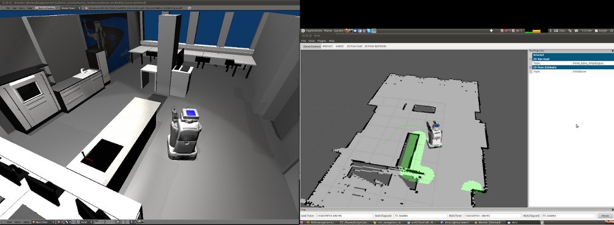

ROS-navigation tutorial
=======================

This tutorial shows how to use the ROS navigation stack to navigate a robot in MORSE.

Setup
-----

You need to have a working installation of ROS Electric (or Diamonback) and also have the python3-compatible stacks for MORSE-ROS installed. You can find
information about this here:  :doc:`installation notes <../installation>`

You should also be familiar with the basic usage of ROS and how to use TF and the ROS navigation stack. You should also know about launchfiles and topic remapping as well as the robot state publisher. Also experience with RVIZ is of advantage. Tutorials on all of those topics can be found on http://www.ros.org.

To create the TF-tree, you have to write a TF-broadcaster that builds a TF-tree from informations about the robot`s pose, velocity and the robot model (in ROS usually given as URDF-file). The TF-tree also needs information about the current configuration of the flexible joints of the robot. You also need to set the parameters of the ROS navigation (local planner, move_base, etc). Detailed information about the ROS navigation-stack can be found here: http://www.ros.org/wiki/navigation.

You can download a ROS-stack including an example implementation for using ROS navigation with the simulated PR2 robot in MORSE using rosinstall:

``rosinstall . ~/ros-py3/  http://ias.cs.tum.edu/~kargm/morse_ros_tutorials.rosinstall``

Assuming your Python3-compatible ROS overlay is located in ``~/ros-py3/``

Alternatively you can git clone the morse_ros stack from ``http://code.in.tum.de/git/morse-ros.git`` and checkout the branch ``tutorials``. If you chose this option, don´t forget that the stack must be placed somewhere in your ROS_PACKAGE_PATH and don`t forget to rosmake it!

Configuring the scenario
------------------------

There is already a completely configured builder-script in ``$MORSE_DIR/morse/share/morse/examples/tutorials/tutorial-1-ros_navigation.py``. Open this file in MORSE by:

``morse run $MORSE_DIR/morse/share/morse/examples/tutorials/tutorial-1-ros_navigation.py``

For the navigation-stack to work, you need your robot (in our example the PR2 robot) equipped with the following components:

#. **Pose sensor** - posts the position of the robot on a ROS topic and will be read to create the TF-tree
#. **IMU** - posts the Velocity of the robot and will be read by ROS navigation 
#. **Motion controller** - receives speeds for translation and rotation of the robot from ROS navigation
#. **Laserscanner** - Perception of the robot for localization and costmaps of ROS navigation
#. **Joint state publisher** - Posts the current state of the joints of the robot (this is needed because we are also working with non-fixed joints here. If the URDF of your robot only has fixed joints, you will not need this component.)

More information about how to equip your robot with those components using builder API can be found in the following tutorial: :doc:`Builder API and ROS middleware  <./tutorial_builder_ros>`. The components in this tutorial are linked using the ROS middleware. 

Linking the MORSE-ROS topics with the ROS navigation stack.
+++++++++++++++++++++++++++++++++++++++++++++++++++++++++++

The ROS navigation stack expects a tf-tree of the robot and the map as well as the pose of the robot and its speed. The morse_ros-package includes a tf-broadcaster that reads the values of the Pose Sensor and the IMU sensor and posts the messages and TF-frames on the topic needed by the ROS navigation stack. It also sets the odom-TF-frame to the initial robot's starting position when starting the Simulation. The TF-tree of the robot is created by the odom frame, the map frame and urdf of the robot posted the robot state publisher. The URDF of the PR2 robot can be found in the ROS package ``morse_tf`` in the folder ``urdf``. The robot state publisher also needs the jointstates of all non-fixed joints of the robot which are exported by the ``pr2_posture`` component.

NOTE: We are not going to deep into the ROS navigation stack, TF and the robot state publisher here. It is strongly recommended to do the tutorials on that topic on http://www.ros.org! 

Starting the navigation
+++++++++++++++++++++++

Now we can finally start our navigation-simulation

#. Hit ``P`` in MORSE to start the simulation
#. Start a roscore by typing ``roscore`` (This step is optional but recommended)
#. Type ``roslaunch morse_2dnav 2dnav_pr2_ias_kitchen.launch``. This should bring up all needed nodes and topics. 
#. You can now start RVIZ in a seperate terminal by ``rosrun rviz rviz`` and see if everything is fine by visualizing for example the map, laserscan, odometry, etc... There is also a default configuration for RVIZ that visualizes everything needed for navigation in the ``morse_2dnav`` ROS-package in the folder ``rviz``.  By using "move_base_simple/goal" as 2D Nav Goal (you can edit the 2D Nav Goal in the Windows "Tool Properties"), you can set a navigation-goal the robot should navigate to by clicking on the map. Your robot should now start to navigate towards that point on the map.

If everything worked out fine, it should look something like this:

Notes
+++++

The morse_2dnav package already includes a 2D gridmap of the environment. This map has been generated by using the simulated SICK-laserscanner in MORSE and ROS GMapping. Watch out for a tutorial soon.

If you have further questions or problems, don't hesitate too write on the mailing-list!
