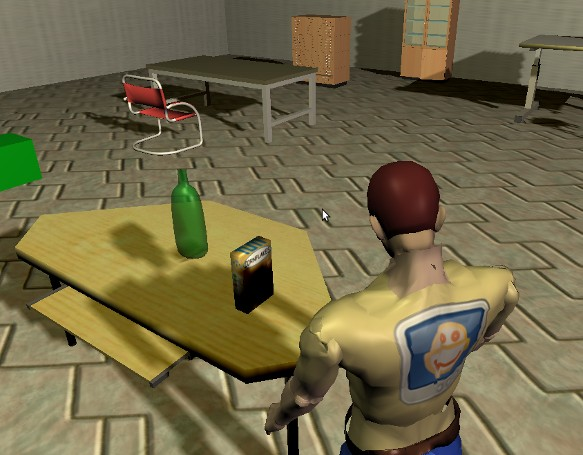

Human-Robot interaction tutorial
================================

This tutorial shows how to build a simulation with a robot and a human that
is interactively controlled by the simulation user.

In this simple scenario, the robot is ordered to follow the human.

Pre-requisites
--------------

- You must have completed the :doc:`first tutorial <tutorial>`.

Initial scene
-------------

We will use the **Builder API** to create our scene.

Create a new scene ``hri.py`` and add these lines:

.. code-block:: python

    from morse.builder import *

    # Import the human model.
    human = Human()

    # Use the standard environment 'indoor-1.blend'. You could use any other.
    env = Environment('indoors-1/indoor-1')

Launch MORSE with this script (``morse run hri.py``).

.. note:: 
    If you are running MORSE on a Unix machine, you can start your script with
    ``#! /usr/bin/env morseexec``.
    
    Mark then your script as executable (``chmod +x hri.py``). You can now quickly
    start your simulation by calling ``./hri.py``.

You can control the human with the :kbd:`w`, :kbd:`a`, :kbd:`s`, :kbd:`d`
keys.

When moving the mouse, you displace the yellow IK target of the head. This
allows you to control the head direction.

Picking objects
---------------

Our human can pick and release objects. Let's add a new object (a cornflakes
box, from the kitchen objects library) on one of the tables. Exit the
simulation (:kbd:`Esc`), and re-open your script.

Add the following lines:

.. code-block:: python

    from morse.builder import *

    human = Human()

    # Import, configure and place a static object from 'kitchen_objects.blend'.
    cornflakes = PassiveObject("props/kitchen_objects", "Cornflakes")
    cornflakes.setgraspable()
    cornflakes.properties(Label = "My cornflakes")
    cornflakes.translate(-7, 3, 1.1)

    env = Environment('indoors-1/indoor-1')

You can learn more on :doc:`passive objects here <../others/passive_objects>`.

Start again the simulation (``morse run hri.py``), and press the :kbd:`x` key
to switch to the **manipulation mode**. You can control the hand with the mouse
while holding :kbd:`Middle Mouse Button`. Press the :kbd:`Left Mouse Button`
with the crosshairs over an object to pick it, and press :kbd:`Right Mouse
Button` to drop the object.

.. image:: ../../../media/hri_cornflakes_pickup.jpg 
  :align: center

Check the :doc:`human component <../others/human>` documentation for more details on what can be done
with the human component.

Exporting the human position
----------------------------

As a first step, we would like to export the position of the human in the world. To do so, we need the
:doc:`Pose sensor <../sensors/pose>`.

Appending a pose sensor to the human is easy:

.. code-block:: python

    from morse.builder import *

    human = Human()

    # Import the pose sensor and attach it to the human.
    pose = Pose()
    human.append(pose)

    # [...]

In this tutorial, we will use sockets to stream the pose out of MORSE:

.. code-block:: python

    from morse.builder import *

    human = Human()

    pose = Pose()
    human.append(pose)

    # Set the pose sensor to use the socket interface to communicate 
    # with modules outside of MORSE.
    pose.add_stream('socket')

    # [...]

You can now re-run the simulation, as usual. The human pose is now exported.

Reading the position outside of MORSE
-------------------------------------

We can retrieve the pose of the human from a regular Python script:

.. code-block:: python

  import time
  import pymorse

  morse = pymorse.Morse("localhost", 4000)

  # The callback function: when the human pose is updated, we print it
  def printer(data):
      print("Pose=" + str(data))

  try:
    pose = morse.stream("Pose")

    # Asynchronous read of the pose
    pose.subscribe(printer)

    # Listen to pose updates for 10 sec
    time.sleep(10)

  except MorseServerError as ose:
    print('Oups! An error occured!')
    print(ose)

  finally:
    morse.close()

You can run this script from any terminal, on the same machine as MORSE (or on
a distant one, just replace ``localhost`` by the appropriate host).

.. note:: the script above uses the ``pymorse`` API which hides the socket interface.
  You could achieve roughly the same result with a direct socket connection:
      
    .. code-block:: python
    
        import sys, socket, json
        
        host = "localhost"
        
        # Port of the 'stream' of the pose sensor. By default,
        #starts at 60000 and increments for each sensor. You can have a look to
        #MORSE console output to know exactly which port is used by which sensor.
        port = 60000
        
        sock = socket.socket(socket.AF_INET, socket.SOCK_STREAM)
        sock.connect((host, port))
        morse = sock.makefile("r")
        
        data = json.loads(morse.readline())
        
        print(str(data))
