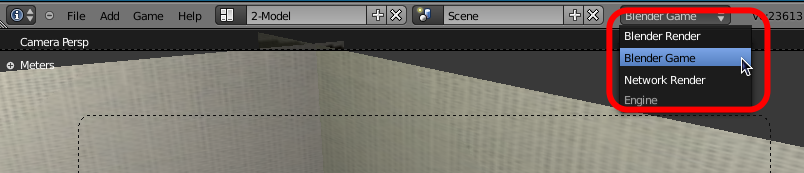
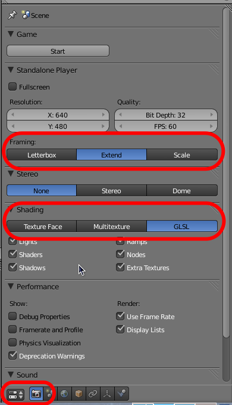
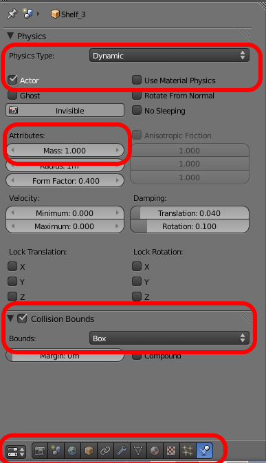

Advanced Blender commands
=========================

This section provides further instructions on how to use Blender to setup
simulation scenarios.

.. note:: The Blender interface is divided in various panels (windows).
    The mouse and keyboard shortcuts used change depending on the panel over
    which the mouse pointer is located.

Viewing the scene
-----------------

Follow these recommendations to better visualise a simulation scenario.
Before launching a simulation:

- Select the **Blender Game** context, on the menu bar at the top of the
  Blender window.  This will affect the information you can change on other
  panels.

- On a **Properties** window, select the **Render** panel. To make sure all
  the screen space in a **3D View** window is used, select the **Extend**
  option for Framing.

- To properly display the textures of objects, and to be able to get images
  from simulated cameras, Blender needs to be set to render using **GLSL**.
  This can be selected in the **Properties** >> **Render** >> **Shading**.

- To maximise the size of a **3D View** window, press :kbd:`Ctrl-Up` while the
  mouse pointer this window.

Physics
-------

Configuring physics properties for objects in a scene can be done in the
**Properties** >> **Physics** panel.  Here it is possible to change the
simulation for the selected object. The most useful settings are:

- **No Collision**: All objects can occupy the same space as this one, and
  will not trigger any kind of event when in contact.
- **Static**: The object will not move even when in contact with other
  objects, but is considered as an obstacle.
- **Dynamic**: The object is subject to forces and collisions, but will not
  turn realistically.
- **Rigid Body**: The object will behave accordingly to its shape.

Another property that can be toggled is the **Actor** flag.  Only objects with
this flag and a **Collision Bound** will be considered by some of the sensors

For Dynamic and Rigid Body objects, it is possible to define further
properties, most importantly their mass and Collision Bounds.  The mass will
determine the force required to make the object move.  Collision Bounds can be
selected from a predefined list of shapes, or set to the convex hull of the
mesh.

Logic Bricks
------------

The **Logic Editor** window can be used to give behaviour to different objects
in the scene. This is done using three different kind of blocks, called
**Sensors**, **Controllers** and **Actuators** (NOTE: This is different to the
robotics components provided by MORSE).
By combining this three types of blocks, objects can react to certain events
and produce an action in response.

An explanation of all the different options available for configuring the
Logic Bricks can be found 
`here <http://www.tutorialsforblender3d.com/GameDoc/index_LogicBricks.html>`_.

In this panel it is also possible to add **Game Properties** to objects, which
are variables that can be accessed by Python scripts during the execution of
the simulation. Properties can be used to store information about objects. In
many cases, MORSE uses these variables to identify different types of objects.

Selecting a robot and all its components
----------------------------------------

This operation is tricky, and is much easier if the Blender interface has at
least a **3D View** and an **Outliner** panel.  Follow these steps:

- Select the robot from the **Outliner** list, using the :kbd:`Left Mouse
  Button`
- Move the mouse over to the **3D View** panel
- Press :kbd:`Shift-G`, then press :kbd:`enter`. This should choose the first
  option: 'Children'
- Move the mouse back to the **Outliner** panel
- Hold the :kbd:`Shift` key, while selecting the robot again with the
  :kbd:`Left Mouse Button`

The two main operations that require selecting the robot and all of its
components are:

- **Delete the robot**: Press :kbd:`X` and then :kbd:`enter`.
- **Duplicate the robot**: Press :kbd:`Shift-D` and then move the new copy
  with the mouse. Select the desired position of the copy by pressing the
  :kbd:`Left Mouse Button`
