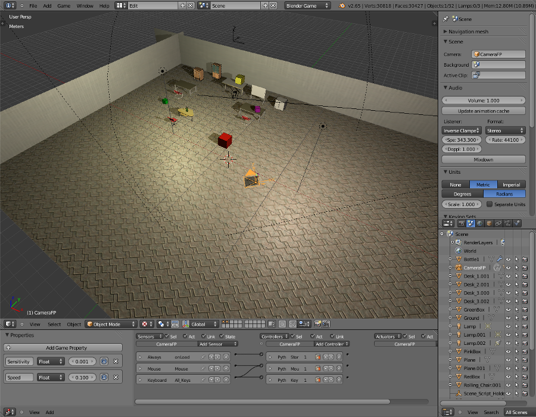
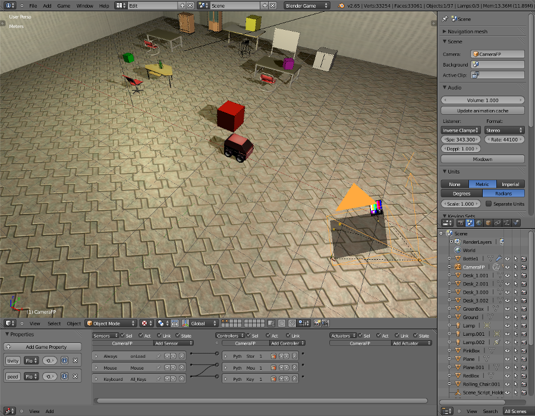

Build your simulations
======================

For a quick list of builder module methods, see the
:doc:`Builder Overview<builder_overview>`.

The Builder API
---------------

The MORSE ``Builder API``, is a set of components and methods to build a simulation
scene. A simulation scene is composed of an environment and one or more robots
composed of sensors and actuators. Each of those components are connected outside
the simulator through middlewares.

A Builder script
----------------

``Builder`` scripts rely on the **Builder API** to define the
components, environments and middlewares that are going to be used in the
simulation. When running MORSE, the simulator interprets the scripts to build
the complete simulation as a Blender scene, configures the components, and starts
the Blender 3D Engine.

Since these scripts are regular Python scripts, you can easily create one
function or class for each of your robots. This way, you can quickly reuse them
in different contexts.

A basic builder script looks like:

.. code-block:: python

    from morse.builder import *
    # [...]
    env = Environment('indoors-1/indoor-1')

- The first line tells MORSE that this is a builder script.
- The second is a comment, it's where you will add robots, sensors and actuators.
- Then we create an environment. The environment instance, here ``env``, will let you
  tune some simulation parameters. See :py:mod:`morse.builder.environment` for a
  list of methods.

If your edit this script in MORSE, you should see the ``'indoors-1/indoor-1'``
scene:

.. MORSE Builder empty

Since there is no robot yet, you won't be able launch the simulation.

The environment comes from the file ``data/environments/indoors-1/indoor-1.blend``,
you could also tell MORSE to load an environment from any location on your system
by adding the ``.blend`` extension. *eg*, ``Environment('../my_house.blend')`` will
load the file ``my_house.blend`` in the parent directory where you run morse from.

You can also set a ``MORSE_RESOURCE_PATH`` environment variable with::

    export MORSE_RESOURCE_PATH="/path/number/one:/path/number/two"

where MORSE will be looking for components. The default place it looks in is
``$MORSE_ROOT/share/morse/data`` (usually '/usr/local/share/morse/data')

An additional option is to place and aim the default camera, by using the methods
:py:meth:`morse.builder.environment.Environment.aim_camera` and
:py:meth:`morse.builder.environment.Environment.place_camera`.

.. code-block:: python

    env = Environment('land-1/trees')
    env.place_camera([-5.0, 5.0, 3.0])
    env.aim_camera([1.0470, 0, -0.7854])

.. note::
    To edit a builder script in MORSE, you must run the following command in a
    terminal: ``morse edit my_builder_script.py``

Adding a robot
++++++++++++++

Let's add a robot to our scene:

.. code-block:: python

    from morse.builder import *

    # Append ATRV robot to the scene
    robot = ATRV()

    env = Environment('indoors-1/indoor-1')

.. MORSE Builder robot (ATRV)

You should see the ``ATRV`` at the center of the scene.

Adding sensors and actuators
++++++++++++++++++++++++++++

A robot needs informations about it's location, and to apply some movements.
There are different way to achieve this, in our example, we will use a ``Pose``
sensor and a ``Motion`` controller 'v-omega'.

.. code-block:: python

    from morse.builder import *

    # Append ATRV robot to the scene
    robot = ATRV()

    # Append an actuator
    motion = MotionVW()
    robot.append(motion)

    # Append a sensor
    pose = Pose()
    pose.translate(z = 0.75)
    robot.append(pose)

    # Configure the robot on the 'socket' interface
    robot.add_default_interface('socket')

    env = Environment('indoors-1/indoor-1')

The last line configure the robot's components on socket, for more information
about services and datastreams, go to `Middleware configuration`_

.. note::
    In this example, the motion controller in your simulation will be named
    ``motion``.

    The name is used by MORSE to refer to the component in the simulator
    interface. Each middleware has it's own naming convention, but for
    instance with the basic ``socket`` interface, you can send a command to
    the motion controller like that::

        $ telnet localhost 4000
        Connected to localhost.
        > req1 motion set_speed [1.0, 0.002]
        req1 OK

Position a component
++++++++++++++++++++

There are 2 transformations you can give to a component: ``translate(x, y, z)``
and ``rotate(x, y, z)``.

* The translation will add (x, y, z) to the current object location
  (default: x=0, y=0, z=0, unit: meter).
* The rotation is an `euler rotation
  <http://www.blender.org/documentation/blender_python_api_2_57_release/bpy.types.Object.html#bpy.types.Object.rotation_euler>`_
  relative to the object's center (default: x=0, y=0, z=0, unit: radian).

.. code-block:: python

    motion.translate(x=.2, z=1)
    atrv.rotate(z=3.14)

Naming of components
--------------------

You can set the name of a component through the setter ``name``::

    mouse = ATRV()
    mouse.name = "jerry"

If you do not explicitely set the name of your components, MORSE name them
automatically (including the Blender objects representing your components)
based on **the name of the variable used in your Builder script**.

In all cases, the components names are automatically **prefixed with their
parents**, to prevent name collision.

Let take an example. Consider this script, with two robots::

    from morse.builder import *

    tom = ATRV()
    lefteye = VideoCamera()
    ptu = PTU()
    righteye = VideoCamera()
    righteye.name = "blindeye"

    tom.append(lefteye)
    ptu.append(righteye)
    tom.append(ptu)

    mouse = ATRV()
    mouse.name = "jerry"
    cam = VideoCamera()
    mouse.append(cam)

    env = Environment('indoors-1/indoor-1')

If you open it in MORSE for edition (with ``morse edit``) and you look at the
outliner, you see that the hierarchy of objects looks like that:

.. code-block:: none

    tom
     |-> tom.lefteye
     |-> tom.ptu
        |-> tom.ptu.blindeye
    jerry
     |-> jerry.cam

``tom`` comes from the variable name, whereas ``jerry`` was manually set.

.. note::
    Automatic renaming only works for components *visible* from your script
    (*ie*, a component declared in a function or class, which is not assigned to
    a variable that belongs to your ``Builder`` script, will not be renamed) or
    components that were appended to a component which is visible.

.. note::
    If name collisions occur anyway, Blender automatically adds an incremental
    suffix like ``.001``, ``.002``, etc.

Component properties
--------------------

You can modify the *game-properties* of any components within Python
(or even add new properties). The documentation for each component
lists the game properties it uses, their type and how they affect
the functioning of the component.

For example, to change the resolution of the images captured by a
video camera sensor, modify its properties like this:

.. code-block:: python

    camera = VideoCamera()
    camera.properties(cam_width = 128, cam_height = 128)

.. note::
    You can also add properties this way: if you refer to a property that does
    not exist, the property is created, and become available in other MORSE
    scripts.

Middleware configuration
------------------------

For usual sensors and actuators, configuring a middleware to access the
component is as easy as::

    motion.add_stream('ros')

One component can be made accessible through several middleware by simply
calling again ``add_stream``::

    motion.add_stream('yarp')

You can check which sensors and actuators are supported by which middleware in
the :doc:`compatibility matrix <integration>`.

.. note::
    Sometimes, you will need to use a specific serialization method.
    This can be achieved by passing more parameters to ``add_stream``::

        motion.add_stream('ros', 'morse.middleware.ros.motion_vw.TwistReader')

    In that case, we instruct MORSE to use ROS with the ``TwistReader`` class
    defined in the :py:mod:`morse.middleware.ros.motion_vw` module.

.. note::
    Configuration for standard sensors and actuators are defined in
    the module :py:mod:`morse.builder.data`.
