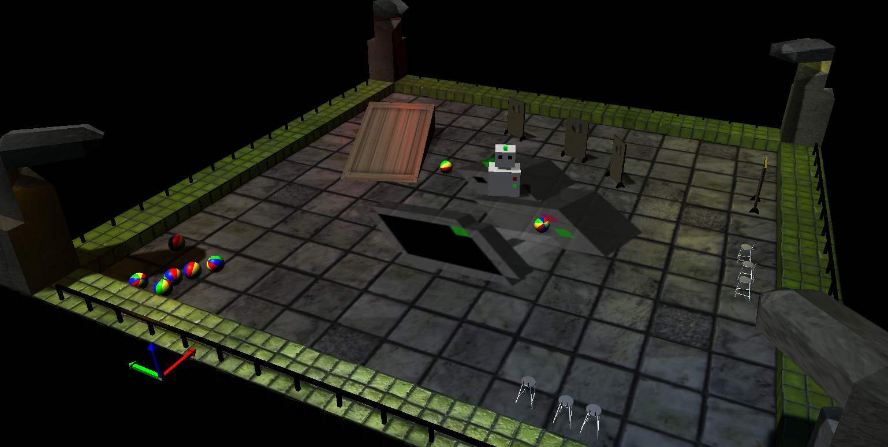

MORSE installation
==================

MORSE in two minutes (if you run Debian/Ubuntu!)
------------------------------------------------

Fire a console, type ``sudo apt-get install morse-simulator`` (or click here:
`install morse-simulator <apt:morse-simulator>`_), then::

 $ morse create my_first_sim
 $ morse run my_first_sim

Here you are!

Installing this package also directly give you full support for :tag:`ros`,
:tag:`yarp`, :tag:`moos`, and in fact, :doc:`all of the middlewares supported by
MORSE <../user/integration>` (with a few corner cases for the :tag:`pocolibs`
middleware that may require manual compilation. Read on).

.. note::
  Automatic installation of middlewares' support requires MORSE >=1.3! **Ubuntu =<
  15.04 and Debian Wheezy/Jessie only ship MORSE 1.2.2**: in that case, you
  still need to install MORSE manually if you want to use MORSE with
  ROS/YARP/MOOS/pocolibs. Read on.

You can now head to the :doc:`Quickstart<../quickstart>` tutorial!

System requirements
-------------------

Supported operating systems
+++++++++++++++++++++++++++

Only Linux (``x86``, ``x86_64``) is currently officially supported. MORSE is
mainly developed on Fedora and Ubuntu, but we don't expect problems on other
distributions.

Other UNIXes systems probably work as well, like FreeBSD or Apple MacOSX.
Limited testing has been performed on OSX 10.8 with success (see
below for the Homebrew recipe).

MORSE does not currently officially support Microsoft Windows, although some
users reported success. Testers/maintainers for Windows are welcome!

Hardware
++++++++

A decent machine is required (typically, with an Intel i5 + 4GB RAM, you
should be comfortable).

To display textures correctly in the simulator, as well as to generate images
using the simulated cameras, you will need to have a graphics card that
supports GLSL shading. The Blender website lists these graphic cards as
compatible with GLSL:

- ATI Radeon 9x00, Xx00, X1x00, HD2x00 and HD3x00 series and newer.  
- NVidia Geforce FX, 6x00, 7x00, 8x00, 9x00 and GTX 2x0 and newer.

If you do not need cameras and OpenGL textures/shaders, you are advised to
run your simulation in ``fastmode`` (:doc:`refer to the simulation's Builder
API <../user/builder>`) for vastly improved loading time and performances.

Packaged versions
-----------------

MORSE is available on Debian >= Wheezy and Ubuntu >= 13.04. You can install
the package ``morse-simulator`` with your favorite software manager::

  $ sudo apt-get install morse-simulator

You can also install the Python bindings with::

  $ sudo apt-get install python3-morse-simulator

.. warning::

  Automatic installation of middlewares' support requires MORSE >=1.3! **Ubuntu =<
  15.04 and Debian Wheezy/Jessie only ship MORSE 1.2.2**: in that case, you
  need to install MORSE manually if you want to use MORSE with
  ROS/YARP/MOOS/pocolibs. Continue to next section.

You can also easily install MORSE with:

.. toctree::
    :glob:
    :maxdepth: 1

    installation/package_manager/*

See their associated documentation for details.

Manual installation
-------------------

.. note::
    The directory where MORSE is installed will be referred to as ``$MORSE_ROOT`` in this document.

Prerequisites
+++++++++++++

- ``cmake``
- Python (3.3 or +)
- ``python-dev`` package
- Blender (>= 2.65) build with Python >= 3.3. You can simply get a binary from
  `Blender website <http://www.blender.org/download/get-blender/>`_

.. note::
    If you plan to build packages for MORSE, please read the notes on packaging below.

Installation
++++++++++++

Clone with ``git`` or download the latest version of the source code::

  $ git clone https://github.com/morse-simulator/morse.git
  
(the lastest revision is always reasonably stable, and we recommend you to use
it. However, if you prefer to use the stable branch, you can checkout the
``1.2_STABLE`` branch or download it `from here
<https://github.com/morse-simulator/morse/releases/latest>`_.

MORSE relies on a standard `CMake` workflow: go to the directory where you
downloaded the MORSE source and type::

  $ mkdir build && cd build
  $ cmake ..
  $ sudo make install

While the default set of options should cover the needs of most users, you can
use ``ccmake ..`` to inspect (and modify) all the available options.

The optional ``$MORSE_BLENDER`` environment variable can be set to let the
simulator know where to look for Blender if it is not accessible from the
path.

You can check your configuration is ok with::

  $ morse check

.. note::
    When updating MORSE to a more recent version, you'll simply have to do::

    $ git pull --rebase https://github.com/morse-simulator/morse.git master
    $ cd build
    $ sudo make install

Time to jump to MORSE's :doc:`Quickstart<../quickstart>` tutorial!

Middleware-specific notes
+++++++++++++++++++++++++

- :tag:`ros` Since MORSE runs with Python 3, you need to install the packages
  ``python3-rospkg``, ``python3-catkin-tools`` and ``python3-yaml``.  If these
  packages are not available for your distribution, :doc:`check the manual
  instructions <installation/mw/ros>`.
- :tag:`yarp` If needed, instructions to install YARP on your system are :doc:`available here <installation/mw/yarp>`.
- :tag:`moos` If needed, instructions to install MOOS on your system are :doc:`available here <installation/mw/moos>`.
- :tag:`pocolibs` ``pocolibs`` support requires specific steps (some bindings require a compilation). Instructions are :doc:`available here <installation/mw/pocolibs>`.

.. note::
    While not officially supported, MORSE is also known to work with `OpenRTM
    <http://www.aisl.ics.tut.ac.jp/RTC/en/morse.html>`_.

Advanced components
-------------------

If you want to distribute your simulation in a multinode infrastructure,
MORSE provides by default a socket service for multinode synchronization. If
you want to use HLA, you have to first install the CERTI and ``PyHLA`` packages:

.. toctree::
    :glob:
    :maxdepth: 1
    
    installation/mw/hla

Notes for packaging
-------------------

By default, MORSE automatically installs support for every supported middlewares
as well as the python bindings ``pymorse``.

To package MORSE, you may want however to split the support for the various
middlewares from the core of the simulator. This can be easily achieved by
passing options to `CMake` like ``-DBUILD_ROS_SUPPORT=OFF`` or
``PYMORSE_SUPPORT=OFF``.

``-DBUILD_CORE_SUPPORT=OFF`` disables the installation of the core of the
simulator. This way, you can easily package separately the support for the various middlewares/bindings.

Installation troubleshooting
----------------------------

In case of problems installing/running MORSE, check the
:doc:`list of Frequently Asked Questions <faq>`.
