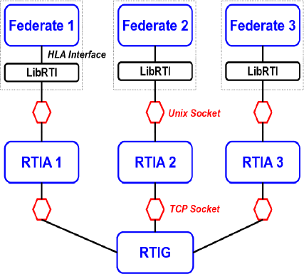

Multi-node Simulation using HLA
===============================

HLA and the Run-Time Infrastructure
-----------------------------------

High Level Architecture
+++++++++++++++++++++++

HLA (High-Level Architecture) is a specification for software architectures
that defines the management and deployment of a global simulation made
of distributed simulators. Each simulator (called a *federate*) is
connected to other simulators thourgh the Run-Time Infrastructure (RTI).

Run-Time Infrastructure
+++++++++++++++++++++++

RTI is the fundamental component of HLA. It provides a set of software services 
that are necessary to support federates to coordinate their operations and data 
exchange during a runtime execution. In other sense, it is the implementation 
of the HLA interface specification but is not itself part of specification. 
Modern RTI implementations conform to the IEEE 1516 and/or HLA 1.3 API 
specifications. These specifications do not include a network protocol for RTI. 
It is up to the implementors of an RTI to create a specification. 

The CERTI
+++++++++

MORSE-HLA uses the `CERTI <http://savannah.nongnu.org/projects/certi>`_, 
an open-source RTI, distrubuted under the GPL/LGPL licence,
that fully supports HLA 1.3, and partly IEEE 1516. The CERTI provides,
among others, HLA implementations for C++ and Python.

The CERTI implementation of HLA is based on a process, the RTIG (RTI Gateway), 
that manages the simulation and transfers messages between federates.
An RTIA process is automatically launched close to each federate, and
manages the interaction between the federates and the RTIG.

   
   The CERTI architecture.

HLA in MORSE
------------

Federation Object Model
+++++++++++++++++++++++

Data exchange in an HLA simulation (called a *federation*)
is specified in a set of tables, that compose a FOM (Federation Object Model).
The two tables that are relevant for the MORSE federation given here-after.

.. table:: Object Class Sructure

    +--------------------+--------------------+
    |                    |  RTIPrivate *(N)*  |
    |  objectRoot *(N)*  +--------------------+
    |                    |  Robot *(PS)*      |
    +--------------------+--------------------+

- *PS* stands for *publishable/subscrible*
- *N* stands for *neither P nor S*

The Object Class Structure describes the objects available in the federation, their
attributes, and their hierarchy.
The only exchangable object of the MORSE federation is **Robot**.

.. table:: Attributes

    +----------+---------------+------------+---------+---------+---------------+---------------+-------+
    |  Object  |  Attribute    |  Datatype  |  Card.  |  Units  |  Update type  |  Update rate  |  U/R  |
    +==========+===============+============+=========+=========+===============+===============+=======+
    |          |  id           |  integer   |  1      |  NA     |  never        |  NA           |  UR   |
    |          +---------------+------------+---------+---------+---------------+---------------+-------+
    |  Robot   |  position     |  sequence  |  3      |  BU     |  periodic     |  BGE rate     |  UR   |
    |          +---------------+------------+---------+---------+---------------+---------------+-------+
    |          |  orientation  |  sequence  |  3      |  BU     |  periodic     |  BGE rate     |  UR   |
    +----------+---------------+------------+---------+---------+---------------+---------------+-------+

- *NA* stands for *Not Applicable*
- *BU* stands for *Blender Unit*
- *BGE* stands for *Blender Game Engine*
- *U* stands for *Update*
- *R* stands for *Reflect*

The attributes table indicates that the **Robot** object is described by an id, a position (a 3D vector)
and an orientation (a 3D vector). Position and orientation are given in the Blender frame 
(hence in Blender Units). They are updated at each execution of the Game Engine, and they are
available for MORSE nodes (i.e. federates) in update (i.e., writable) and reflect (i.e., readable) modes.

The FOM is owned by the RTIG as the ``morse.fed`` file, and allows any federate that complies with this
specification to join the federation without depending on any MORSE data structure. Such a use-case is
described in the `Hybrid Simulation` tutorial.
The ``morse.fed`` file is installed along with MORSE-HLA, and is also available in the source tree.

Node synchronization
++++++++++++++++++++

The HLA multi-node simulation uses the **Best effort** synchronization mode.
*Best effort* is the simplest synchronization mode. Each node provides
its robots' states as fast as it can (once per Blender frame), and updates the
external robots' states as it receives them. The nodes are not really synchronized:
nothing guarantees that the node worlds are the same at any moment.
Moreover, the Blender engines are not constrained: each Blender node runs as fast
as it can, then leading to different simulation rates on each node.
However, if your network is fast enough, and if you do not rely on the Blender logical
time for your simulation, this multi-node simulation mode should be sufficient
for most cases.

*Time synchronization* ensures that all the nodes will have the same time at each
moment. Here, understand *logical time*, or *Blender time*: the number of frames executed
each second on each Blender node will be identical. This simulation mode guarantees
that all the nodes will have the same simulation state at each time step.
The time synchronization integration in MORSE is still work-in-progress.

HLA Multi-node simulation
-------------------------

Environment variables
+++++++++++++++++++++

In order to execute an HLA simulation, you have to configure your system environment.
The `CERTI documentation <http://www.nongnu.org/certi/certi_doc/User/html/execute.html>`_
gives some information about the configurable variables. The environment variables 
that may be relevant to MORSE are described below:

* ``CERTI_HTTP_PROXY``: if you have to use a proxy in order to join the RTIG, you 
  have to indicate it using the ``CERTI_HTTP_PROXY`` variable; if you proxy is already 
  defined in the ``http_proxy`` variable, please, reset it using::
  
  $ export CERTI_HTTP_PROXY=$http_proxy

  The ``http_proxy`` variable is not directly used in MORSE/HLA as, most of the time, it
  causes some simulation mistakes.
  
* ``CERTI_FOM_PATH``: this variable is only relevant for the RTIG. It indicates
  where to find the FOM file, that lists all the messages that can be exchanged
  on the HLA simulation. This FOM file is installed with MORSE, so if you have
  installed MORSE on the computer where you launch the RTIG, you have to
  define this variable as::
  
  $ export CERTI_FOM_PATH=$MORSE_ROOT/share/federations:$CERTI_FOM_PATH
  
  Otherwise, you will have to copy the ``morse.fed`` file from the 
  ``src/morse/middleware/hla`` source directory to your computer and define the
  ``CERTI_FOM_PATH`` variable accordingly. Default directories where the RTIG
  is looking for FOM files are the working directory (from where you launched the RTIG)
  and the ``$CERTI_HOME/share/federations`` path.

HLA in the Builder API
++++++++++++++++++++++

The Builer API provides an ``Environment`` object  that must also be configured 
for HLA multinode simulation::

    env.configure_multinode(protocol="hla", server_address="140.93.0.93", server_port="60400",
                            distribution={
                                "nodeA": ["MyFirstRobot"],
                                "nodeB": ["MySecondRobot"],
                            })
	
- The ``server_address`` is the IP address of the computer hosting the RTIG.
- The ``server_port`` is the TCP port used to connect to the RTIG. By default, the TCP port number is 60400.

If you want to use an other port, you have to specify it in the Builder configuration (as described above),
and set the ``CERTI_TCP_PORT`` environment variable before launching the RTIG.

HLA-related tutorials
---------------------

You can find some multi-node tutorials in ``$MORSE_ROOT/share/morse/examples/tutorials/multinode/``:

.. toctree::
    :glob:
    :maxdepth: 1

    tutorials/*
