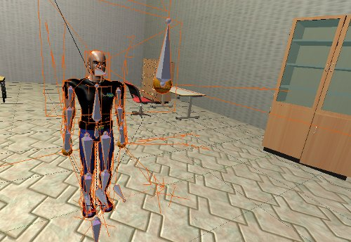
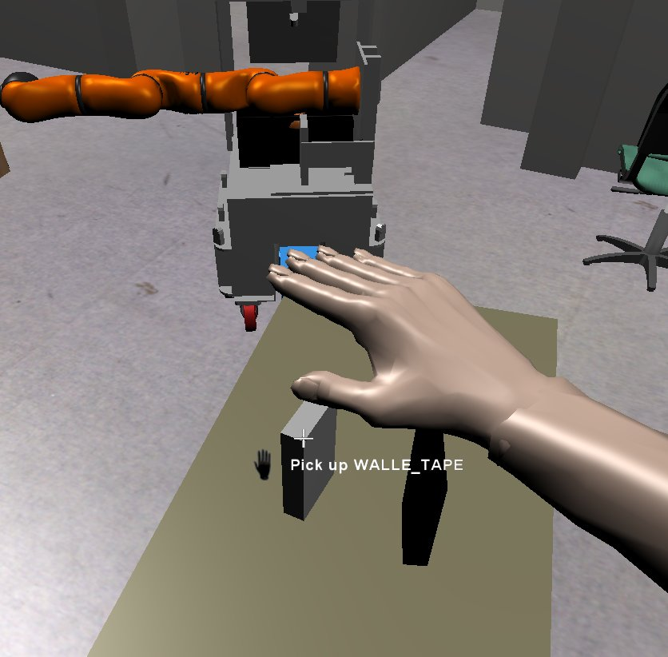

The human component in MORSE
============================

MORSE allows the simulation of humans: you can add a human model in your scene, you can
control it from the keyboard and mouse during the simulation (move it around, sit it 
down, pick and place objects...), and export to your robotic systems various data (currently
only the position and joint state).

The human is handled inside MORSE as a robot, which means it can have sensors and actuators
attached to it.

For a general introduction to human-robot interaction simulation with MORSE, check the
:doc:`HRI main page <../../hri>`.

Files
-----

- Blender: ``$MORSE_ROOT/data/robots/human.blend``
- Python: 

  - ``$MORSE_ROOT/src/morse/robots/human.py``
  - ``$MORSE_ROOT/src/morse/blender/human_interaction/*``

Inserting the human in your scene
---------------------------------

The procedure to insert a human in your simulation is slightly different than for
other assets.

From Blender interface
++++++++++++++++++++++

You can append a human while editing a scenario in Blender by importing the ``Human``
**group** available in ``$MORSE_ROOT/data/robots/human.blend``.

If the model do not appear, it has probably be added to an invisible layer. Check in
the layers panel.

With the Builder API
++++++++++++++++++++

To add a human with the :doc:`MORSE Builder API <../../user/builder>`, you just need
to instantiate the :py:class:`morse.builder.robots.human.Human` class.

.. code-block:: python

   from morse.builder import *
   human = Human()

If you want to use the World Camera initially, add

.. code-block:: python

   human.use_world_camera()

The :doc:`human posture component <../sensors/human_posture>`
can then be accessed through the ``armature`` member.

Usage example:

.. code-block:: python

   #! /usr/bin/env morseexec

   from morse.builder import *

   human = Human()
   human.translate(x=5.5, y=-3.2, z=0.0)
   human.rotate(z=-3.0)

   human.armature.add_stream('pocolibs')

Simulation with multiple Humans
-------------------------------

There are two ways of using multiple Human in one Simulation. The first
one is through the use of actuators. For this you should disable the 
keyboard control for every instance you don't need it for:

.. code-block:: python

    human.disable_keyboard_control()

This way you can control only one Human via keyboard control.

If you need more than one Human that is controlled by a user you can use
a :doc:`Multinode Simulation <../../multinode>`.

.. note::
    You can only control one Human per node with the keyboard control
    so that they can move independently.

Human control
-------------

When starting a simulation with a human, the active camera is automatically
set behind the human, in *immersive* mode (so-called *first-person 
shooter* view). You can switch to another camera with the :kbd:`F9` key.

If you are using the World Camera (``CameraFP``), press :kbd:`F5` to change 
if you want to control the Human or the Camera.

Motion mode
+++++++++++

.. image:: ../../../media/hri_move_mode.jpg
   :align: center
   :width: 400px

The human always starts in so-called **Motion Mode**.

- Move the character with the :kbd:`W`, :kbd:`A`, :kbd:`S`, :kbd:`D` keys

- Move the Camera around the human by moving the Mouse
    
- The direction of the head is controlled with the movement of the camera.

- To make the character sit, press :kbd:`C`.

Manipulation mode
+++++++++++++++++

To toggle in and out of **Manipulation Mode**, press :kbd:`X`.

You can move the hand by holding :kbd:`Middle Mouse Button` and moving the 
``Mouse``. Furthermore you can roll the hand with the :kbd:`Mouse Wheel` while
holding the :kbd:`Left Ctrl` Button.

In manipulation mode, when the hand is close enough of a graspable object (see
:doc:`passive objects <passive_objects>` documentation to know how to define a
graspable object), a label ``Pickup the object`` appears. Press the :kbd:`Left
Mouse Button` to take the item. To lay the item down, press :kbd:`Right Mouse 
Button`. To precisely lay the item down, move the crosshairs over this point. 
If this point is in reach (and the object that the item is to be placed on is 
marked as ``Actor`` in Blender's Physic settings), a green rectangle appears.
Press :kbd:`Right Mouse Button` to lay it down.
If you want to know which objects are graspable hold :kbd:`Alt`. Their respective 
name will appear over every active object.

Furthermore the human can interact with the environment- namely doors, drawers 
and mechanical and electric devices. See :doc:`Setting up a Scene with MORSE Utils <../addons/morse_utils>` 
on how to set up the environment for the human.

To open or close doors and drawers, simply hover the crosshairs over the door.
A label ``Open/Close Door/Drawer`` should appear. Now press :kbd:`Left Mouse Button`.

To use mechanical and electric devices you can interact with switches.
Again press :kbd:`Left Mouse Button` with the crosshairs over the switch. This 
way you can turn the device on and off.

Sensors and actuators
---------------------

Currently (``morse-1.0``), the human component has one sensor already
integrated, which exports the joint state of the human: the :doc:`human posture
sensor <../sensors/human_posture>`.  This sensor is already embedded in the
``human.blend`` file. You don't need to link it from a separate sensor file.

The human model can be controlled using the keyboard, or have a motion
controller attached to it, so that the movement commands can come from an
external software.

Services
--------

- **move**: (Synchronous service) Move the body, or the hand in case of
  manipulation mode. In case of moving the body, the two arguments expected are
  speed and rotation. In case of moving the hand these two arguments should be
  X and Z displacement.

- **move_head**: (Synchronous service) Move the head. Two arguments expected:
  pan and tilt
    
- **grasp_**: (Synchronous service) Grasp and release an object if in
  manipulating mode. Takes one argument: must be "t" to grasp and "f" to
  release
    
- **move_hand**: (Synchronous service) Move the hand in the third direction (
  Y, see above). 
    
- **toggle_manipulation**: (Synchronous service) Switch from and to
  manipulation mode
    
