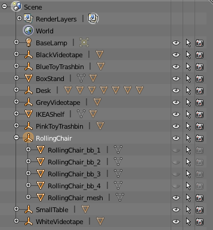

Passive objects
===============

Besides physical interaction and perception via cameras or depth sensors,
passive objects in a simulation can be interacted with in several other ways.

For instance some objects can be set to be graspable by a robot (or a human), 
and specific sensors like the :doc:`Semantic camera <../sensors/semantic_camera>` 
may provide extended facts on a particular object, like its type.

Creating passive objects
------------------------

Passive objects are either plain, regular Blender objects, or a hierarchy
of objects that all share the same prefix.

In the screenshot above (from
``$MORSE/share/morse/data/props/objects.blend``), the ``RollingChair``
hierarchy is made of an empty (the ``RollingChair`` object itself) and
five children (four for the bounding box, one for the actual mesh).

Since all these six Blender objects share the same prefix, they will be
correctly imported together when using the MORSE Builder API.

When imported manually (from Blender interface), it eases the selection
of relevant objects.

.. note::
  
   You can also have a look to the tips to add a :doc:`bounding box around your objects 
   <../tips/bounding_boxes>`.

Passive objects properties
--------------------------

To be set as an **interactive** passive object, you only have to add the (Game)
property ``Object`` to the object, and to set it as a ``True`` boolean property.

Other, **optional**, properties allow to control the behaviour of the object:

- ``Label`` (``String``): the name (or label) of the object [#]_,
- ``Description`` (``String``): a longer description of the object [#]_,
- ``Type`` (``String``): the type of the object [#]_,
- ``Graspable`` (``Boolean``): if the object is graspable or not [#]_.

You can temporarly disable an object by simply setting its ``Object`` property to false.

.. [#] Used to display the object name in :doc:`human's manipulation mode <human>`
   and by the semantic camera sensor as ID of tracked objects.
.. [#] Not used yet.
.. [#] Used by the semantic camera sensor, defaults to ``Object``.
.. [#] Used by the human's manipulation mode and the :doc:`gripper <../actuators/gripper>` 
   actuators.

.. note::
   
   For the manipulation routines to work, the above properties (especially, ``Graspable``)
   must be set on the **object holding the mesh you want to grab**.

Importing passive objects with the MORSE Builder API
----------------------------------------------------

Passive objects can easily get added to a scenario defined with the
:doc:`MORSE Builder API <../../user/builder>`.

The following example imports the ``SmallTable`` Blender object from the
``props/objects.blend`` assets file, set some properties, and place it
in the scene:

.. code-block:: python

    from morse.builder import *

    table = PassiveObject('props/objects.blend','SmallTable')
    table.setgraspable()
    table.translate(x=3.5, y=-3, z=0)
    table.rotate(z=0.2)

As any other property, the game properties can be set using the following command:

.. code-block:: python

  table.properties(Object = True, Graspable = False, Label = "TABLE")

.. warning::
    To set an object to be graspable, you **must** also call the ``setgraspable(..)`` function.
    It adds an internal collision sensor to the object, required for pick and place 
    actions with the human avatar.

The next example shows how to add semi-randomly placed chairs in a
scene:

.. code-block:: python

    import random
    from morse.builder import *

    # Add some randomly placed chairs
    for i in range(3):
        chair = PassiveObject('props/objects.blend','RollingChair')
        chair.translate(x=random.uniform(1.5, 7.0), 
                        y=random.uniform(-5.0, 0.0),
                        z=0.0000)
        chair.rotate(z=random.uniform(0.0, 6.2)) # rotation in radians

Combining passive objects with switches
---------------------------------------

It is possible to create portable devices by combining switches with 
a passive object. The creation of such devices will be explained on 
basis of a flashlight.

First of all we need to create the mesh of our flashlight. After that
create the switch as a seperate object and parent it to the mesh. Next 
add a lamp object and parent it to the mesh. Name those objects so that 
they all share the same prefix. 
Now all that's left is defining the single objects for the use with Morse.
So use the :doc:`Morse Utils <../addons/morse_utils>` Addon to define the 
switch. Add the Logic for the lamp using the ``Morse Light`` preset.
Disable the physics for the switch with the ``Ghost`` option in the Physics
Properties, so that there can't be collisions with the mesh.

You can now import the flashlight using the :doc:`MORSE Builder API <../../user/builder>`
like explained above. You can also import it manually and set the mesh to be 
a passive object using the ``Morse Utils``.

.. warning::
    If you use :doc:`compound bounding boxes <../tips/bounding_boxes>` do not use the ``Compound``
    option on the switch object. Also do not make it a ``No Collision`` 
    object or otherwise you can't use the switch.

The switch works exactly the same as a static one. Use the ``Left Mouse Button``
to turn the device on and off. This does also function while the object
is carried.
