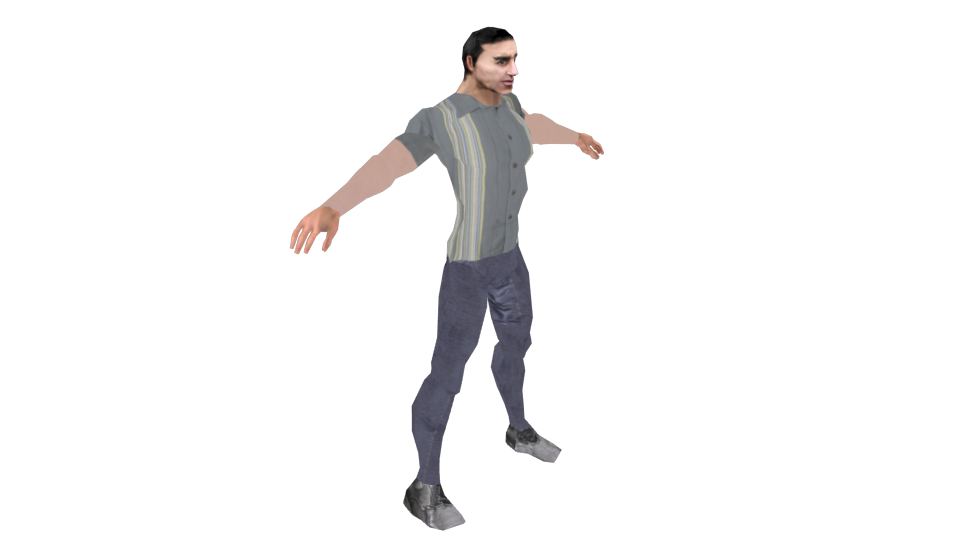

Human victim object
===================

This object is designed for use only in the ROSACE scenarios, where teams of robots must
locate and help injured persons.

This object has three important **Game Properties** that are used in the test scenarios:

- **Victim_Tag**: (boolean) Indicates that this object can be considered as a target for
    the robots, and can be healed
- **Injured**: (boolean) Flag to indicate the victim is in problems. By default it is
    True, and will change to False once a robot has helped it using the
    :doc:`Rosace sensor<../sensors/search_and_rescue>`
- **Severity**: (integer) Indicator of how injured this target is. In simulation, higher
    priority should be given to victims with a larger **Severity** value

Files
-----

- Blender: ``$MORSE_ROOT/data/robots/victim.blend``
- Python: ``$MORSE_ROOT/src/morse/blender/victim.py``
