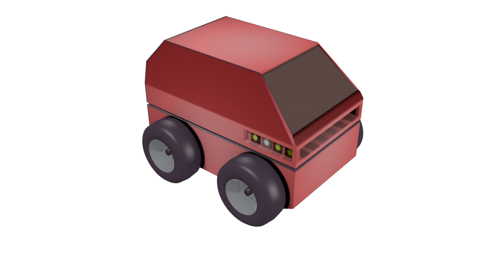

iRobot ATRV platform
====================

The base of the **DALA** robot at LAAS.

Files
-----

- Blender: ``$MORSE_ROOT/data/robots/atrv.blend``
- Python: ``$MORSE_ROOT/src/morse/robots/atrv.py``

Adjustable parameters
---------------------

Use the **Properties >> Physics** panel in Blender to adjust the **Mass** of the robot.

The friction coefficient of the robot can be adjusted in the **Properties >> Material** panel.
