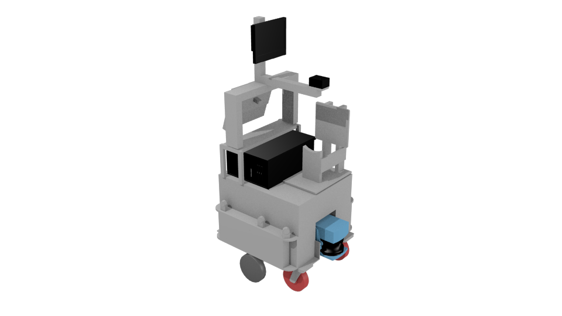

LAAS Jido robot
===============

This robot is build on a NeoBotix base.

Files
-----

- Blender: ``$MORSE_ROOT/data/robots/jido.blend``
- Python: ``$MORSE_ROOT/src/morse/robots/jido.py``

Adjustable parameters
---------------------

Use the **Properties >> Physics** panel in Blender to adjust the **Mass** of the robot.

The friction coefficient of the robot can be adjusted in the **Properties >> Material** panel.
