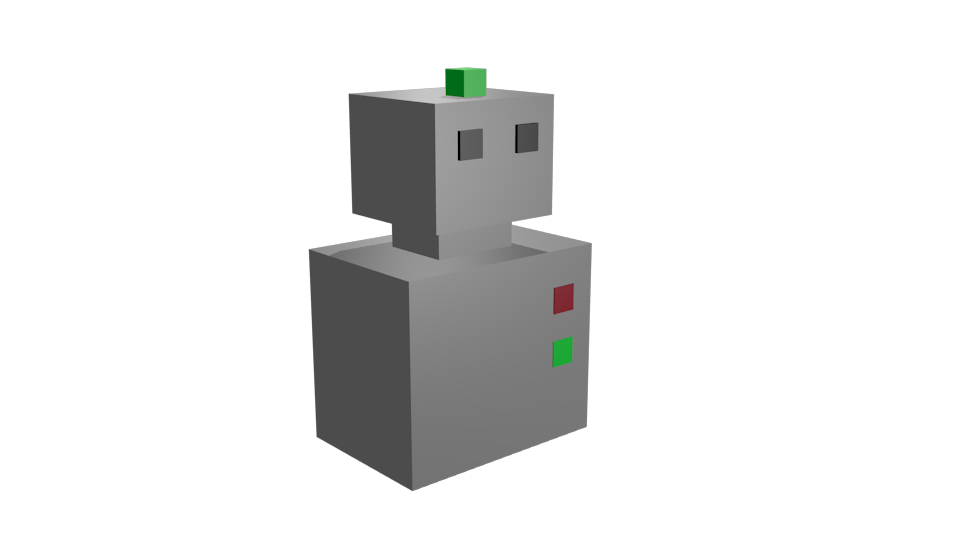

The MORSE Morsy mascot
======================

Morsy is the little mascot of the MORSE project.

The model does not feature any particular behaviour. It's main purpose is for
teaching and examples.

Special methods
---------------

When creating a simulation, you can use `set_color((r,g,b))` to change Morsy's
color.

For instance:

.. code-block:: python

  from morse.builder import *

  robot = Morsy()

  # turns Morsy body in green
  robot.set_color((0.3, 0.4, 0.0))

  env = Environment('sandbox')
