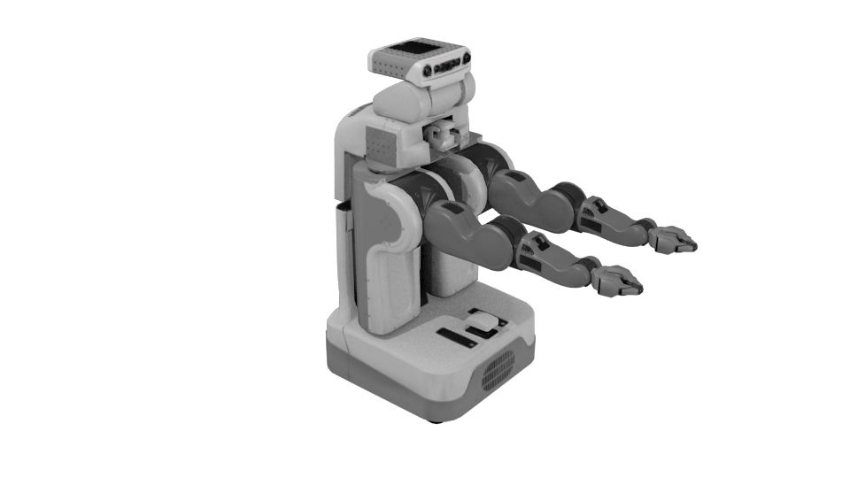

PR2 Robot
=========

The MORSE model of the Willow Garage's PR2 robot.

The PR2 uses the :doc:`armature_actuator <../actuators/armature>` for control of the armatures.



Model Info
----------

The model is imported from a Collada file that is generated from the `PR2 URDF file  <http://www.ros.org/wiki/pr2_description>`_.
The .dae file can be found at:
``$MORSE_ROOT/data/robots/pr2/pr2.dae``
The imported .blend file can be found at:
``$MORSE_ROOT/data/robots/pr2/pr2_25_original.blend``

The URDF to Collada converter changed all the object names, so these were
remapped to the original URDF names. A renamed version of the PR2 model can be found at:
``$MORSE_ROOT/data/robots/pr2/pr2_25_rename.blend``
, this file includes the script that is used to rename all the objects.

A model with MORSE integration for the armature can be found at (**This is the model that you probably want to use in MORSE**):
``$MORSE_ROOT/data/robots/pr2/pr2_25_morse.blend``.


PR2 related Files
-----------------

- PR2 Collada file: ``$MORSE_ROOT/data/robots/pr2/pr2.dae``
- PR2 original .blend Collada import: ``$MORSE_ROOT/data/robots/pr2/pr2_25_original.blend``
- PR2 model with renamed objects: ``$MORSE_ROOT/data/robots/pr2/pr2_25_rename.blend``
- PR2 model with MORSE integration: ``$MORSE_ROOT/data/robots/pr2/pr2_25_morse.blend``

- PR2 robot script with MORSE services: ``$MORSE_ROOT/src/morse/robots/pr2.py```
- Armature actuator script: ``$MORSE_ROOT/src/morse/actuators/actuator.py``


Adjustable parameters
---------------------

Use the **Properties >> Physics** panel in Blender to adjust the **Mass** of the robot.

The friction coefficient of the robot can be adjusted in the **Properties >> Material** panel.


:mod:`pr2` Module
-----------------

Refer to :py:mod:`morse.builder.robots.pr2`.

TODO
----

- Create sensors and actuators to control the PR2 armature. `A SensorActuator class would be handy for this  <https://sympa.laas.fr/sympa/arc/morse-users/2011-07/msg00099.html>`_.
- Expand the armature to include the hands.
- Add an actuator to control the movement of the PR2 base.
- ROS integration.
- ...
