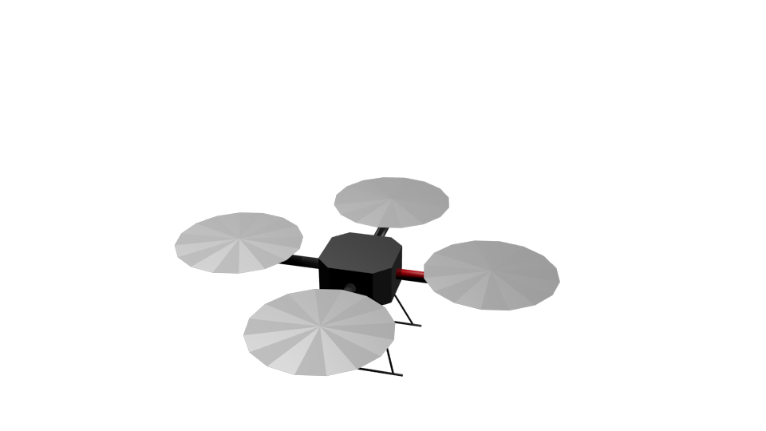

Quadrotor with dynamics
=======================

A simple **quadrotor** with ``Rigid Body`` physics.

Files
-----
- Blender: ``$MORSE_ROOT/data/robots/quadrotor_dynamic.blend``
- Python: ``$MORSE_ROOT/src/morse/robots/quadrotor_dynamic.py``

Adjustable parameters
---------------------

Use the **Properties >> Physics** panel in Blender to adjust the **Mass** of the
robot.
