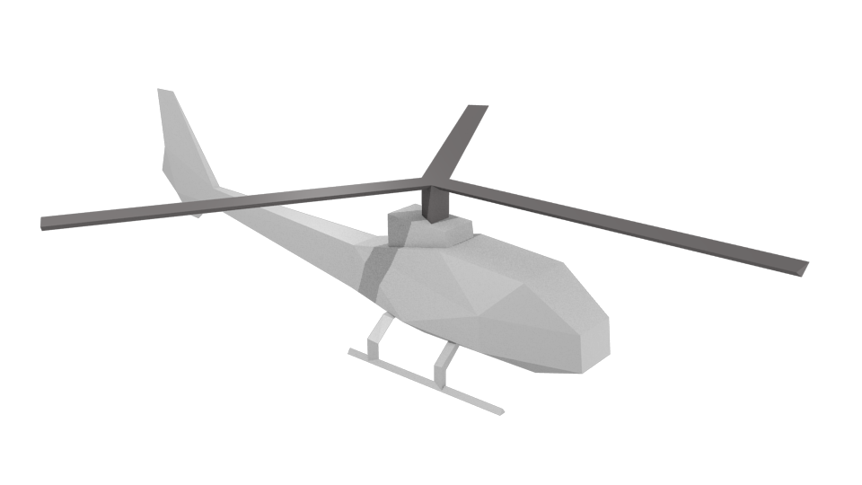

Yamaha RMAX platform
====================

The base of the **Yamaha RMAX** unmanned helicopter.

Files
-----
- Blender: ``$MORSE_ROOT/data/robots/rmax.blend``
- Python: ``$MORSE_ROOT/src/morse/robots/rmax.py``

Adjustable parameters
---------------------

The rotation of the rotor is fixed and only for show. Its speed can be adjusted
in the Logic panel in Blender (shown with :kbd:`F4`) when the rotor object is
selected.
