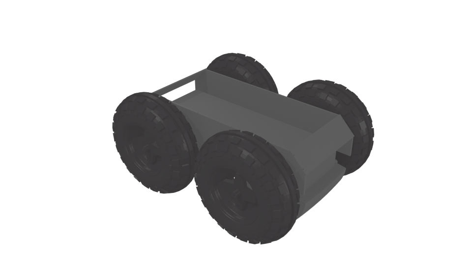

Segway RMP 400 platform
=======================

The base of the **MANA** robot at LAAS.

This robot uses the Physics Constraints in Blender to allow the wheels to
behave more realistically. The wheels turn as the robot moves, and they have
``Rigid Body`` physics, so that they can also have collisions with nearby
objects.

It has four differential drive wheels, with the pairs of wheels on each side
always moving at the same speed. Since the wheels of this robot use the
``Rigid Body`` physics, it must be controlled with the :doc:`v_omega_diff_drive
<../actuators/v_omega_diff_drive>` actuator.

Files
-----

- Blender: ``$MORSE_ROOT/data/robots/segwayrmp400.blend``
- Python: ``$MORSE_ROOT/src/morse/robots/segwayrmp400.py``

Adjustable parameters
---------------------

These parameters are inherent to the Blender model for the robot, and must be
modified directly in the Blender file:

- The **Mass** of the robot can be changed in the **Properties >> Physics**
  panel
- The **Friction** coefficient of the robot can be adjusted in the
  **Properties >> Material** panel

Configurable parameters
-----------------------

The robot itself has several properties that describe its physical behaviour.
None of these properties have an effect in the current version of the robot,
but may be used in future releases.
These can be changed using the Builder API:

- **HasSuspension**: (Boolean) flag that determines if the wheels move
  independently of the body of the robot. For the case of the Segway RMP 400,
  this should always be ``False``
- **HasSteering**: (Boolean) flag
  that determines if the wheels turn independently of the body of the robot.
  For the case of the Segway RMP 400, this should always be ``False``
- **Influence**: (double)
- **Friction**: (double)
- **FixTurningSpeed**:(double) Overwrite the value of the distance between
  wheels in the computations of the wheel speeds. This effectively changes the
  turning speed of the robot, and can be used to compensate for the slip of the
  wheels while turning.
  The real distance between wheels in the robot is 0.624m. By forcing a
  distance of 1.23m, the robot will turn over a smaller radius, as would a two
  wheeled differential drive robot.
  Leaving this value as 0.0 (the default) will use the real distance between
  wheels

