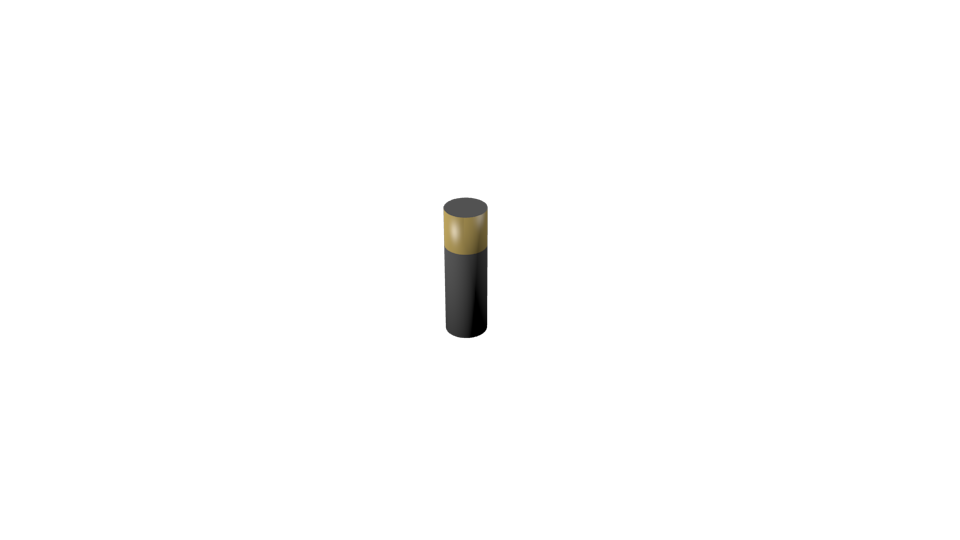

Battery sensor
==============

This sensor emulates the remaining charge of a battery on the robot.
It is meant to be used only as an informative measure, to be taken in
consideration by the planning algorithms. It does not prevent the robot
from working.

The charge of the battery decreases with time, using a predefined
**Discharge rate** specified as a property of the Blender object.
This rate is independent of the actions performed by the robot, and
only dependant on the time elapsed since the beginning of the simulation.

A planned feature is to allow for designated **Charging Zones** where
the battery will gradually recharge. However, this is not implemented yet.

Files
-----

- Blender: ``$MORSE_ROOT/data/sensors/battery.blend``
- Python: ``$MORSE_ROOT/src/morse/sensors/battery.py``

Local data
----------

- **charge**: (float) The percent of battery charge remaining. It starts
  with a value of 100, and gradually decreases to 0.

Configurable Parameters
-----------------------

The Empty object corresponding to this sensor has the following parameters
in the **Logic Editor** panel:

- **DischargingRate**: (float) The percent of the battery charge that is
  spent per second.

Applicable modifiers
--------------------

No available modifiers
