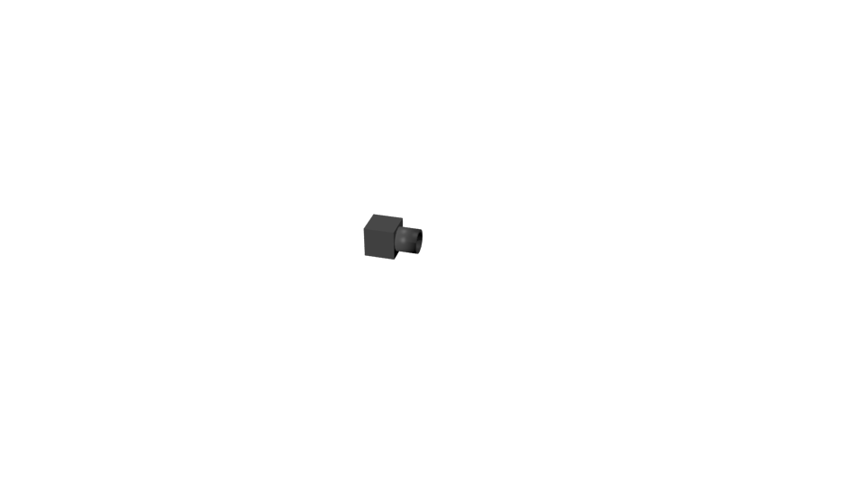

Depth camera sensor
===================

This sensor can be used to simulate laser range sensors. It uses the z-buffer of
a Blender camera to generate a depth image and then process it to produce a list
of 3D points, given with respect to the position of the camera.

The cameras make use of Blender's **bge.texture** module, which requires
a graphic card capable of GLSL shading.
Also, the 3D view window in Blender must be set to draw **Textured** objects.

This sensor requires the generation of z-buffer images instead of the usual
RGBA. For this reason, exporting the images will result in strange (and quite
Psychodelic) colours.

.. warning::
    Currently distributed builds of Blender do not export the z-buffer data.
    A patch has been developed to allow such functionality, but it is not yet
    included in the regular Blender distributions. To allow this functionality,
    you'll need to build Blender from the source code, and apply a patch
    included in the MORSE distribution, under the ``patches`` directory. Follow
    the instructions within to apply the patch.

The settings for the ``near`` and ``far`` planes of the camera are important
for this sensor. They will determine the resolution of the depth data
recovered. For best results, it is recommended to keep the ``near`` plane as
far as possible, and the ``far`` plane as close as possible. Reducing the range
between both will result in higher resolution, specially towards the ``far``
plane. For more information:
http://www.codermind.com/articles/Depth-buffer-tutorial.html

.. note::
    The streaming of data from this sensor can be toggled off and on by
    pressing the SPACE key during the simulation. This will affect all the
    video cameras on the scene.

    Toggling off the cameras can help make the simulation run faster,
    specially when there are several cameras. However, the lack of
    data on the stream may cause problems to some middlewares.

Files
-----

- Blender: ``$MORSE_ROOT/data/sensors/depth_camera.blend``
- Python: ``$MORSE_ROOT/src/morse/sensors/depth_camera.py``

Local data
----------

- **3D_points**: A list of lists. Each element of the list has the format
  ``[x, y, z]``, with the coordinates given with respect to the origin of
  the camera.
- **intrinsic_matrix**: The intrinsic calibration matrix, stored as a 3x3
  row major Matrix

Configurable parameters
-----------------------

The Empty object corresponding to this sensor has the following parameters:

- **capturing**: (Boolean) flag that determines whether the camera should
  generate an image. It can be toggled on or off by pressing the :kbd:`Space`.
  The default value should be `True`.
- **cam_width**: (int) generated image width in pixels. The default value is
  `128`.
- **cam_height**: (int) generated image height in pixels. The default value is
  `128`.
- **cam_focal**: (double) camera focal length as defined in Blender (note: in
  Blender this parameter unit is "millimeters". This is actually misleading, as
  there is no dimension associated to Blender units.) The default value is
  `35.0`.
- **cam_near**: (double) Adjust the `near_clipping` parameter of the camera
  (Anything closer to the camera than `near_clipping` is not displayed). The
  default value is `1.0` (meter).
- **cam_far**: (double) Adjust the `far_clipping` parameter of the camera
  (Anything further from the camera than `far_clipping` is not displayed). The
  default value is `20.0` (meter).
- **Vertical_Flip**: (Boolean) flag that determines whether the image should be 
  flipped. Default value is `False`.
- **retrieve_depth**: (Boolean) flag that determines whether the sensor generates
  z-buffer images or plain images. It should be set to `True` for this sensor
  to work properly. In this case, the images generated will not be really
  ``Visible``, since the pixels stored in the image will correspond to a single
  unsigned integer of 4 bytes instead of the usual 4 values of RGBA. Default
  value is `True`.
- **retrieve_zbuffer**: (Boolean) flag that determines whether the sensor
  generates a grayscale image for the z-buffer, to be exported as an image. In
  this case, the objects closer to the camera are shown in black, while those
  beyond the `far_clipping` plane are shown in white. Depth information is
  stored in a single byte, and copied for each of the R, G and B values, so the
  resolution is only of 256 different depth values. This option should only be
  used to show off.

Camera calibration matrix
-------------------------

The camera configuration parameters implicitly define a geometric camera in
blender units. Knowing that the **cam_focal** attribute is a value that
represents the distance in Blender unit at which the largest image dimension is
32.0 Blender units, the camera intrinsic calibration matrix is defined as

  +--------------+-------------+---------+-------+
  | **alpha_u**  |      0      | **u_0** | 0     |
  +--------------+-------------+---------+-------+
  |       0      | **alpha_v** | **v_0** | 0     |
  +--------------+-------------+---------+-------+
  |       0      |      0      |    1    |   0   |
  +--------------+-------------+---------+-------+

where:

- **alpha_u** == **alpha_v** = **cam_width** . **cam_focal** / 32 (we suppose
  here that **cam_width** > **cam_height**. If not, then use **cam_height** in
  the formula)
- **u_0** = **cam_height** / 2
- **v_0** = **cam_width** / 2

Services
--------

- **capture**: (asynchronous service) the method expects an integer **n** in
  input and answer back when the simulated camera has token **n** shots.

Configuring the camera to use z-buffer data
-------------------------------------------

An example for creating a properly configured dept_camera is given below:

.. code-block:: python

    from morse.builder import *

    d_camera = Sensor('depth_camera')
    d_camera.properties(cam_near = 2)
    d_camera.properties(cam_far = 15)
    d_camera.properties(retrieve_depth = True)

Applicable modifiers
--------------------

No camera modifiers available at the moment

Related components
------------------

Cameras can be parented to a :doc:`pan-tilt unit <../actuators/ptu>` so they
can be oriented during the simulation.
