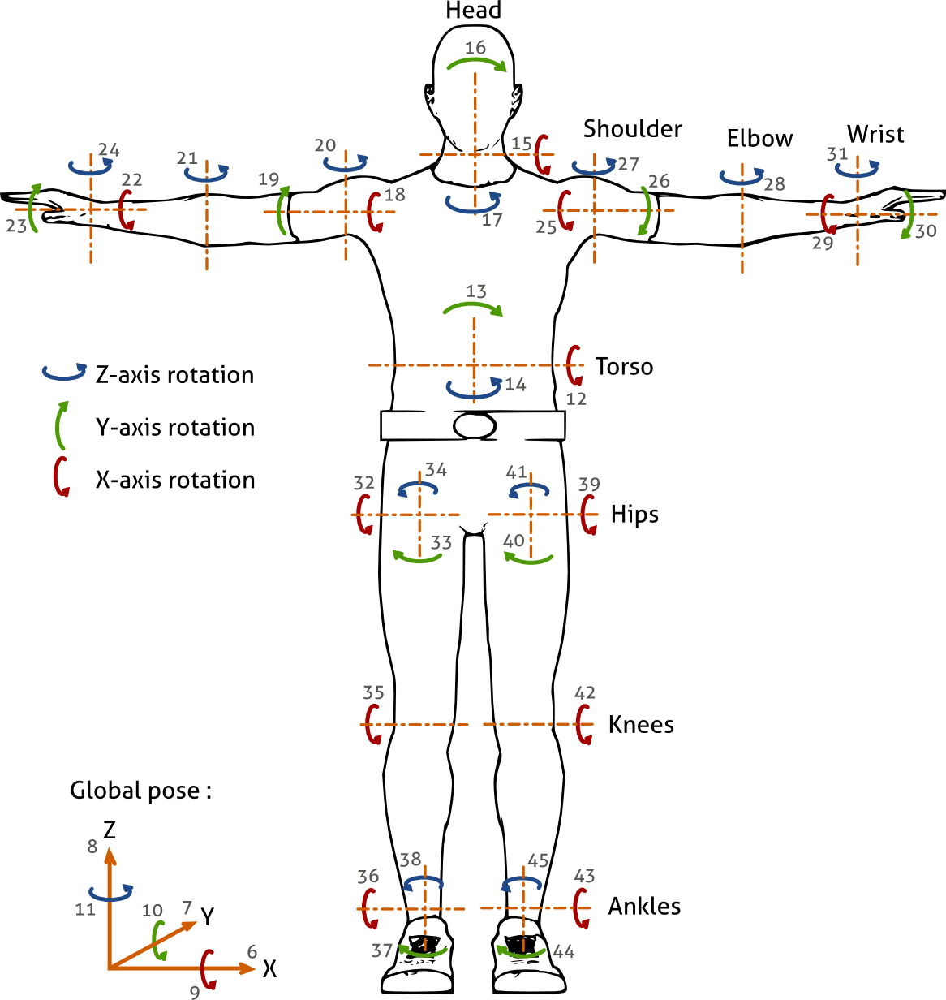

Human posture sensor
====================

This sensor collects the positions of the bones in the human armature
for the file ``$MORSE_ROOT/data/robots/human.blend``.

It stores the position and orientation of the general armature object, as
well as the local rotation of each individual bone. The rotation angles are
given in radians.

This sensor will only work for the ``human.blend`` model, as it uses
a specific naming convention for each of the bones.

You can also check to general documentation of the :doc:`human component <../others/human>`.

Files
-----

- Blender: ``$MORSE_ROOT/data/robots/human.blend``
- Python: ``$MORSE_ROOT/src/morse/sensors/human_posture.py``

Local data
----------

- **x**: (float) global X position of the armature in the scene
- **y**: (float) global Y position of the armature in the scene
- **z**: (float) global Z position of the armature in the scene
- **yaw**: (float) rotation angle with respect to the Z axis
- **pitch**: (float) rotation angle with respect to the Y axis
- **roll**: (float) rotation angle with respect to the X axis

- **dof_12**: (float) rotation around the X axis for the torso
- **dof_13**: (float) rotation around the Y axis for the torso
- **dof_14**: (float) rotation around the Z axis for the torso

- **dof_15**: (float) rotation around the X axis for the head
- **dof_16**: (float) rotation around the Y axis for the head
- **dof_17**: (float) rotation around the Z axis for the head

- **dof_18**: (float) rotation around the X axis for the right shoulder
- **dof_19**: (float) rotation around the Y axis for the right shoulder
- **dof_20**: (float) rotation around the Z axis for the right shoulder

- **dof_21**: (float) rotation around the Z axis for the right elbow

- **dof_22**: (float) rotation around the X axis for the right hand
- **dof_23**: (float) rotation around the Y axis for the right hand
- **dof_24**: (float) rotation around the Z axis for the right hand

- **dof_25**: (float) rotation around the X axis for the left shoulder
- **dof_26**: (float) rotation around the Y axis for the left shoulder
- **dof_27**: (float) rotation around the Z axis for the left shoulder

- **dof_28**: (float) rotation around the Z axis for the left elbow

- **dof_29**: (float) rotation around the X axis for the left hand
- **dof_30**: (float) rotation around the Y axis for the left hand
- **dof_31**: (float) rotation around the Z axis for the left hand

- **dof_32**: (float) rotation around the X axis for the right hip
- **dof_33**: (float) rotation around the Y axis for the right hip
- **dof_34**: (float) rotation around the Z axis for the right hip

- **dof_35**: (float) rotation around the Z axis for the right knee

- **dof_36**: (float) rotation around the X axis for the right foot
- **dof_37**: (float) rotation around the Y axis for the right foot
- **dof_38**: (float) rotation around the Z axis for the right foot

- **dof_39**: (float) rotation around the X axis for the left hip
- **dof_40**: (float) rotation around the Y axis for the left hip
- **dof_41**: (float) rotation around the Z axis for the left hip

- **dof_42**: (float) rotation around the Z axis for the left knee

- **dof_43**: (float) rotation around the X axis for the left foot
- **dof_44**: (float) rotation around the Y axis for the left foot
- **dof_45**: (float) rotation around the Z axis for the left foot

Applicable modifiers
--------------------

No applicable modifiers at the moment.

Related components
------------------

This sensor will only be useful for the armature of the human in the
``human.blend`` file. The human in this file is also considered as a
robot, with the sensor integrated into the armature. Check the general 
documentation of the :doc:`human component <../others/human>`.

It is possible to reuse this sensor in other human models, as long as they
use the same armature.
