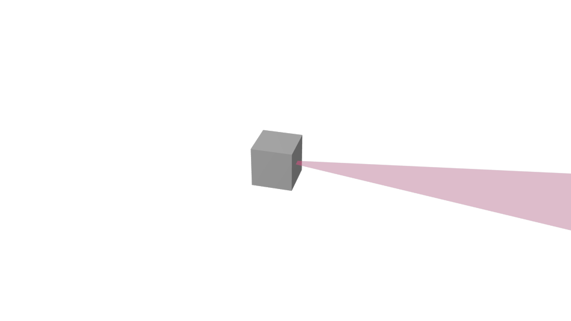

Infrared range scanner
======================

This sensor emulates an infrared range scanner, by generating a series of rays 
in predefined directions, and then computing whether they find any object within 
a certain distance of the sensor's origin.

.. note:: Objects in the scene with the **No collision** setting in their Game
  properties will not be detected by this sensor

This sensor can also be added directly from a Builder API script, without
requiring a Blender file. 
Yo do this by adding these lines into your script:

.. code-block:: python

  infrared = morse.builder.sensors.Infrared()

Files
-----

- Blender: ``$MORSE_ROOT/data/sensors/infrared.blend``
- Python: ``$MORSE_ROOT/src/morse/sensors/sick.py``

Properties
----------

-  Arc = 20°
-  Resolution = 1 ray/deg
-  Range = 2m
-  Frequency = 10 (6Hz)

The logic of this sensor is based on the :doc:`SICK laser range scanner <sick>`.
