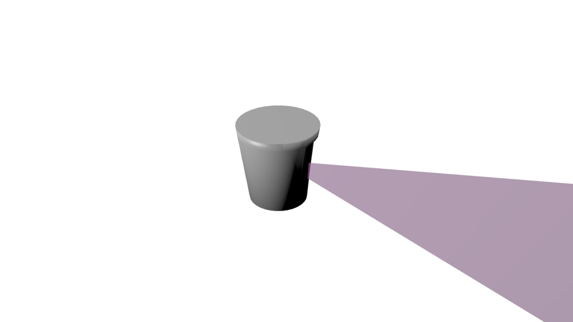

Velodyne laser range scanner
============================

This sensor emulates a rotating laser range scanner, by generating a series of
rays in predefined directions, and then computing whether they find any object
within a certain distance of the sensor's origin.
The sensor is constantly rotating around the Z axis, generating a point cloud
for the full environment around it.

.. note:: Objects in the scene with the **No collision** setting in their Game
  properties will not be detected by this sensor

Files
-----

- Blender: ``$MORSE_ROOT/data/sensors/velodyne.blend``
- Python: ``$MORSE_ROOT/src/morse/sensors/velodyne.py``

Local data
----------

- **point_list**: (list array) Array that stores the positions of the points
  found by the laser. The points are given with respect to the location of the
  sensor, and stored as lists of three elements. The number of points depends
  on the geometry of the arc parented to the sensor (see below).
- **range_list**: (float array) Array that stores the distance to the first
  obstacle detected by each ray. The order indexing of this array is the same
  as for **point_list**, so that the element in the same index of both lists
  will correspond to the measures for the same ray.

Configurable Parameters
-----------------------

The Empty object corresponding to this sensor has the following parameters
in the **Logic Editor** panel:

- **Visible_arc**: (Boolean) A toggle that determines whether the scanned area
  is displayed during the execution of the simulation or not. If the robot is
  also producing camera images, it is better to set this variable to False,
  otherwise the scanned area will also appear on the captured images.
- **laser_range**: (Float) The distance in meters from the center of the sensor
  to which it is capable of detecting other objects.
- **resolution**: (Float) The angle between each laser in the sensor. Expressed
  in degrees in decimal format. (i. e.), half a degree is expressed as 0.5.
  Used only for arc creation.
- **scan_window**: (Float) The full angle covered by the sensor. Expressed in
  degrees in decimal format. Used only for arc creation.

Number and angle of rays
++++++++++++++++++++++++

The number and direction of the rays emitted by the sensor is determined by the
use of a semicircle object parented to the sensor. The sensor will cast rays
from the center of the sensor in the direction of each of the vertices in the
semicircle.
There is a Python script that can be used to create a new arc with the
parameters of **resolution** and **scan_window** specified for the sensor.
The script is called ``create_arc.py`` and is included in the Blender file for
the sensor. To run it, specify the parameters desired, then in a Text Window
select the script, place the mouse cursor inside the Text Window and press
:kbd:`Alt-p`. This will generate a new arc object with the correct geometry, and with
an adequate name. The arc is created horizontal. To properly emulate the
Velodyne sensor, the arc must be rotated 90 degrees around the X axis to become
vertical, and then rotated approximately 12 degrees around the Y axis to be in the
proper angle. At this point it is only necessary to assign a material to
the arc (you can use the **RayMat** material used in other examples).

The new arc object will have the following characteristics (all of them are
correctly configured by the ``create_arc.py`` script):

- Name: Its name must begin with 'Arc\_', for the Velodyne Module to recognize it.
  The currently used method is to name the arcs according to the number of
  degrees it covers, for example: Arc_180, Arc_16, Arc_360
- Normals: The scan arc of this sensor is vertical. The faces of the arc can only
  have one normal vector, and they are only visible from the side where this vector
  is positive. For this reason, the arc is not always visible as it turns.
- Physics: Make sure that on the **Physics Properties** panel this object is
  set to **No collision**, otherwise it will push objects around

When adding the velodyne sensor to a robot, make sure to link in the corresponding
arc object.

Rotation speed
++++++++++++++

The turning speed of the sensor is currently defined using the **Logic Bricks**
of the Empty object representing the sensor. Change the value of Rot Z in the
**Motion Actuator** to modify the rotation speed.
