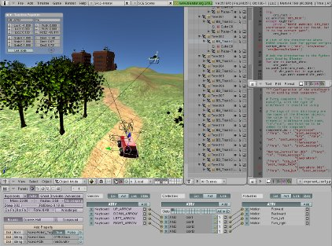

Introducing the Modular OpenRobots Simulation Engine 
====================================================

Welcome to the official documentation for the MORSE project.

For an global description of the project, consult this article_
submitted to the ICRA 2011 conference.

This first section will help you to find your way into the MORSE documentation.

.. _article: http://homepages.laas.fr/gechever/Documents/paper-icra.pdf

What is MORSE? 
--------------

.. image:: ../../media/simu_render_indoors.jpg
   :width: 300
   :align: center
.. Introducing MORSE

- A versatile simulator for **generic mobile robots simulation** (single or multi robots),
- Enabling **realistic** and **dynamic** environments (with other interacting agents -humans- or objects), 
- Don't reinvent the wheel: critical components reused from other open source projects (**Blender** for 3D rendering + physical simulation + UI, dedicated robotic middlewares for communications + robot hardware support),
- **Seamless workflow**: since the simulator rely on Blender for both modeling and the real time 3D engine, creating and modifying a simulated scene is straightforward.
- Entirely scriptable in **Python**,
- Adaptable to various **level of simulation realism** (for instance, we may want to simulate exteroceptive sensors like cameras in certain cases and access directly to a higher level representation of the world -like labeled artifacts- in other cases),
- Currently compatible with **YARP** and LAAS OpenRobots robotics frameworks,
- Fully open source, BSD-compatible.
  

.. Introducing MORSE

Getting started 
---------------

#. :doc:`Install MORSE <installation>`
#. :doc:`Check the MORSE command reference <basic_morse>` 
#. :doc:`Jump to the tutorial <tutorial>`

The MORSE Workflow 
------------------

Discover the MORSE workflow: how to build a complete simulation scenario, from 
the creation of a custom robot with predefined sensors and actuators to the 
complete scene, including other robots or humans.

:doc:`Go to: the typical MORSE workflow <user_workflow>`

Components library & Supported middlewares 
------------------------------------------

- MORSE offers a set of predefined sensors and controllers that cover basic simulation needs in robotics. To know how to add new components, please refer to the developer documentation.

The following page lists all the currently existing components and their properties:

:doc:`Go to: the MORSE component library <component_library>`

- The output (or input) of the simulator can be altered (for instance to add noise) by so called modifiers.

:doc:`Go to: Data modifiers <modifier_introduction>`

- MORSE relies on *middlewares* to integrate in your robotic architecture.

We currently support only `YARP <http://eris.liralab.it/yarp/>`_, 
`pocolibs <https://softs.laas.fr/openrobots/wiki/pocolibs>`_ and a simple 
text-based socket protocol. More middlewares are expected to be added in the 
next versions.

:doc:`Go to: Middleware support <supported_middlewares>`

Tips and how-tos 
----------------

- :doc:`How to efficiently add complex bounding boxes to your objects <user/tips/bounding_boxes>`

Advanced tutorials 
------------------

:doc:`List of all tutorials <user/advanced_tutorials/advanced_tutorials>`

Setting up a YARP-based simulation 
++++++++++++++++++++++++++++++++++

This tutorial shows a simple scenario with Yarp: Simple dummy autonomous navigation towards a user-given target (x,y). 
The robots becomes red when it intersects obstacles or bounces on them. Use the same example as the quick start ? 
(sole difference: the goal is given through YARP, sensor data are exported with YARP -- maybe add a camera, since it is trivial to display an image with YARP).

:doc:`Go to: YARP-based simulation tutorial <user/advanced_tutorials/yarp_tutorial>`

On the road-map
---------------

The first release of MORSE contains only a subset of the final simulator specification.

Amongst the planned features:

- Support for arms simulation, based on inverse kinematics. This has been separately developped by the Leuven's university and will be merge into MORSE over the next releases,
- Raw sockets interface + full compatiblity with the ROS robotics framework (other robotics framework are planned as well. Let us know if you want to contribute in this area),
- Developement of the user interface,
- Scalablity (both in term of simulation capacity and ease of deployment),
- Multi-node simulations (several Blender nodes can be started on several computer and automaticaly synchronise, which should allow simulations of tenth of robots in the same scene),
- Dedicated supervision node that would allow to: observe the simulation, display logs and metrics, start/stop robots, dynamically alter the scene (like moving an obstacle in front of a robot, etc.).

