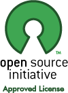

What is MORSE?
==============

.. image:: ../media/simu_render_indoors.jpg
   :width: 300
   :align: center
.. Introducing MORSE

MORSE is a versatile simulator for robotics
-------------------------------------------

MORSE is an generic simulator for academic robotics. It focuses on realistic
simulation of small to large environments, indoor or outdoor, with one to over
a dozen of autonomous robots.

MORSE provides out of the box a set of standard sensors (cameras, laser
scanner, GPS, odometry,...), actuators (speed controllers, high-level waypoints
controllers, generic joint controllers) and robotic bases (ATRV, generic 4
wheel vehicle, PR2,...). New ones can easily be added.

One of the main design choice for MORSE is the ability to control the *degree
of realism* of the simulation: if you are working on vision, you need accurate
camera sensors, but may not care about the realism of your motion controller,
and you may find a waypoint controller good enough (and easier to use). On the
contrary, if you work on robot supervision, you may prefer skip the perception
stack and directly work with objects ID and positions.

.. image:: ../media/caylus.jpg
   :width: 400
   :align: center
.. MORSE used for simulation of ground-air multi-robot cooperation

MORSE lets you define how realistic the different components of you robot need
to be to fit your needs.

MORSE has a powerful workflow
-----------------------------

MORSE has an original workflow: since it uses Blender and the Blender Game
Engine as runtime, it benefits from the tight integration of these two tools.

You build your simulation in Blender by assembling together components to
create one or several robots (like an empty ATRV robot base with a camera, a
laser scanner and a waypoints actuator - once complete, you can of course save
it) and an environment (like an indoor lab room with tables and chairs, or an
outdoor environment with a village, etc. A couple of them are provided to start
with).

.. image:: ../media/morse_interface.jpg
   :width: 300
   :align: center
.. MORSE interface

Then, switching forth and back from the edit mode (where you build your robot
and 3D environment) to the simulation itself is instantaneous and a matter of
pressing the ``P`` or ``Esc`` key. Debugging or tuning your simulation scenario
is a breeze.

And for people who do not like too much GUIs, MORSE also provides a complete Python
API to programatically create your environments and robots, and run the
simulation from the command line.

Once started, robots, sensors, actuators are accessible from outside through your
usual middleware. In most cases, you can just run your code as you would do it on the
real robot.

MORSE adapts to your architecture
---------------------------------

MORSE do not make any assumption on your architecture. MORSE currently supports
out of the box 4 common open-source middlewares (ROS, YARP, Pocolibs and MOOS)
plus offers a generic socket-based communication channel.

MORSE offers a large set of standard sensors and actuators. To even better
adapt to your specific need, MORSE provides a lightweigthed *overlay* mechanism
to quickly change the name and types of exchanged data flows.

You should hopefully be able to integrate MORSE in your own architecture
without any modifications to your existing components.

Lastly, MORSE benefits from Blender import/export capabilities: existing models 
in many 3D formats (Collada, DXF, 3DS Max, VRML... to name a few) can be used 
to build robots and environments.

MORSE is a realistic simulator
------------------------------

MORSE rendering is based on the `Blender Game Engine
<http://www.blender.org>`_.  The OpenGL-based Game Engine supports shaders,
provides advanced lightning options, supports multi-texturing, and use the
state-of-the-art `Bullet <http://bulletphysics.org>`_ library for physics
simulation.

This enables MORSE users to create rich simulation environments, visually and
physically plausible.

MORSE is scalable
-----------------

MORSE can simulate complex robots in real time.

MORSE has also been designed to be able to handle over a dozen of robots in
joint simulation scenarii: to this end, MORSE can be run as a distributed
network of :doc:`simulation nodes <multinode>`. Each node automatically synchronizes with the
others (however, due to latencies, do not expect to simulate accurate physical
interactions in the distributed mode).

.. image:: ../media/ocean.jpg
   :width: 300
   :align: center
.. Multi-robot simulation: one helicopter cooperates with a submarine
   for mine hunting.

MORSE has specific features for human-robot interaction simulation
------------------------------------------------------------------

While designed as a generic simulation software, MORSE features several tools
dedicated to human-robot interaction (HRI) simulation. MORSE provides a
complete human rig, that can be controlled in first-person perspective.

In this mode, the user can look around, pick and place objects, move them, etc.
The robot can access in return to the full human posture (similar to the Kinect
output).

.. image:: ../media/hri.jpg
   :width: 300
   :align: center
.. MORSE used in a human-robot interaction scenario

MORSE is easy to extend
-----------------------

MORSE is mostly written in Python: except for computation intensive processes
(like 3D rendering or physics simulation), MORSE is a purely Python
application. This enable easy and fast modification of the source code.

.. image:: ../media/python-powered.png
   :align: center
.. MORSE extensively uses Python

Besides, MORSE has been designed from the beginning to be modular: adding a new
sensor, a new actuator, a post-processing (like applying a noise function),
adding new services, or even a complete communication middleware is easy and
documented.

And do not worry: we also provide examples of how to build and link to custom C
module when computational power is required.

MORSE is well documented
------------------------

Unlike numerous open-source projects, MORSE has a complete and up-to-date
online documentation, both for the users and the developers: `MORSE
documentation <http://www.openrobots.org/morse/doc>`_. The PDF version of the
manual has well over 100 pages. 

Several :doc:`tutorials <tutorials>` are also available, for a quick start.

.. image:: ../media/documentation.jpg
   :width: 300
   :align: center
.. MORSE documentation

MORSE is easy to install
------------------------

MORSE has only two dependencies: Python (plus Sphinx if you want to build the
documentation on your computer) and Blender. While requiring fairly recent
versions of these software, an up-to-date Linux distribution should provide out
of the box all required dependencies.

:doc:`MORSE installation <user/installation>` is based on CMake, and allows you to only install support
for parts relevant to your needs (why installing YARP support if you are using
ROS?).

MORSE is also available as a `robotpkg <http://robotpkg.openrobots.org>`_
package: ``robotpkg`` is a package manager for robotics related software that
will take care automatically of all dependencies required by MORSE.

MORSE is open-source
--------------------

.. MORSE is an open-source project

MORSE and all the libraries it relies on are open-source projects.

This means that you can not only use it at no cost, but also access to the
source code to modify it if you wish so.

MORSE itself is licensed under a permissive BSD license: you can use it for any
purposes, without having to share your modifications back.

This also means that MORSE follows a open development process: you can fork
MORSE source code on `GitHub <http://github.com/laas/morse>`_ and everybody is
invited to propose new features, report bugs and submit patches.

MORSE is driven by an active community
--------------------------------------

MORSE is used by over 15 robotic labs in the world, an its
mailing-lists are an always fast way to get answers.

MORSE is also based on `Blender <http://www.blender.org>`_ for modelling, 3D rendering
with shader support, import/export of 3D models, and `Bullet
<http://bulletphysics.org>`_ for physics simulation.

These two huge open-source projects are very active and are supported by large
communities of users and developers.

This means tons of tutorials, code examples, reusable snippets, etc.

This also ensures that, even if the MORSE core team would disappear, you would
still be able to ask for support!

MORSE also integrates with other large open-source projects like `ROS <http://www.ros.org>`,
which further anchors it into the open-source robotics community.

MORSE is driven by academics requirements
-----------------------------------------

MORSE is born at `LAAS-CNRS <http://www.laas.fr>`_, a public French laboratory,
one of the biggest in robotics.

Currently, over five universities and institutes (in Germany, USA, France,
Belgium) have joined the effort and collaboratively take part in assuring the future of
MORSE.

Our close interactions with academic research in robotics worldwide guarantees
that many innovative requirements end up in our roadmap without much delay.

Check here :doc:`MORSE related publications and workshop <media>`.

But even MORSE has its limitations!
-----------------------------------

Last but not least, MORSE has some important limitations you must be aware of
when assessing simulation solutions:

- MORSE was never meant to be a physically accurate simulator: while we rely on
  a state-of-the-art physics engine (Bullet), do not expect to accurately
  simulate robot arm dynamics or fine grasping. Other projects are doing that
  much better (like `OpenGrasp <http://opengrasp.sourceforge.net/>`_ for grasping).
- While on-going efforts try to tackle this issue, we do not consider MORSE to have a
  good enough temporal accuracy and time synchronization capabilities for
  application like hybrid simulation (where some robots are simulated while
  others are physically operated).
- MORSE is mostly developed and supported on Linux. MORSE is known to also run
  on MacOSX and Microsoft Windows, but only limited support can be provided for
  these platforms.
- As a not-for-profit, academic project, we do not offer any professional
  support beyond the documentation and the public mailing-lists. However,
  nothing is stopping third party companies to start providing commercial
  services around MORSE.
